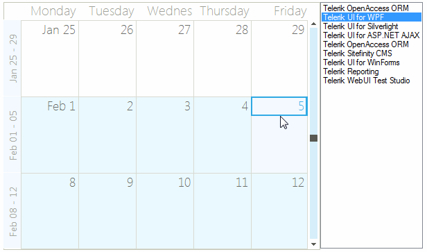
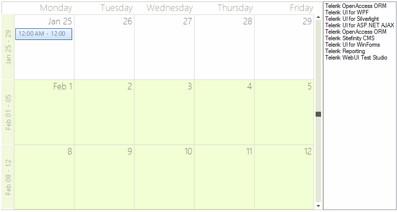

# Drag and Drop from Another Control

>tip Similar approach is demonstrated in the *Demos, section Scheduler >> Drag&Drop.* 
>

__RadScheduler__ supports drag and drop and it can be implemented so that appointments are dragged from another control, in our case a ListBox. It is necessary to set the __AllowDrop__ property to *true*.

## Drag and Drop from ListBox to RadScheduler

Firstly, we should start the drag and drop operation using the ListBox.__MouseMove__ event when the left mouse button is pressed. Afterwards, allow dragging over the __RadScheduler__ via the __Effect__ argument of the __DragEventArgs__ in the RadScheduler.__DragEnter__ event handler:

#### Handle ListBox MouseMove

{{source=..\SamplesCS\Scheduler\AppointmentsAndDialogues\DragDropFromControl.cs region=ListBoxToSchedulerStart}} 
{{source=..\SamplesVB\Scheduler\AppointmentsAndDialogues\DragDropFromControl.vb region=ListBoxToSchedulerStart}} 

````C#
        
void listBox1_MouseMove(object sender, MouseEventArgs e)
{
    if (e.Button != MouseButtons.Left)
        return;
    
    if (this.isDragging)
        return;
    
    Point currentPosition = e.Location;
    if ((Math.Abs((currentPosition.X - this.mouseDownPosition.X)) >= SystemInformation.DragSize.Width) ||
        (Math.Abs((currentPosition.Y - this.mouseDownPosition.Y)) >= SystemInformation.DragSize.Height))
    {
        this.isDragging = true;
        DragObject dragObject = new DragObject();
        int index = this.listBox1.IndexFromPoint(e.X, e.Y);
        if (index > -1 && index < this.listBox1.Items.Count)
        {
            string itemText = this.listBox1.Items[index].ToString(); 
                
            if (itemText != string.Empty)
            {
                dragObject.Values.Add(AppointmentFields.Summary, itemText);
                dragObject.Status = AppointmentFields.Summary;
                //start the drag and drop operation
                (sender as ListBox).DoDragDrop(dragObject, DragDropEffects.Copy);
            }
        }
    }
}
    
private void radScheduler1_DragEnter(object sender, DragEventArgs e)
{
    DragObject dragObject = e.Data.GetData(typeof(DragObject)) as DragObject;
    //allow dragging over the RadScheduler
    e.Effect = dragObject == null ? DragDropEffects.None : DragDropEffects.Copy;
}

````
````VB.NET
Private Sub listBox1_MouseMove(sender As Object, e As MouseEventArgs)
    If e.Button <> MouseButtons.Left Then
        Return
    End If
    If Me.isDragging Then
        Return
    End If
    Dim currentPosition As Point = e.Location
    If (Math.Abs((currentPosition.X - Me.mouseDownPosition.X)) >= SystemInformation.DragSize.Width) OrElse (Math.Abs((currentPosition.Y - Me.mouseDownPosition.Y)) >= SystemInformation.DragSize.Height) Then
        Me.isDragging = True
        Dim dragObject As New DragObject()
        Dim index As Integer = Me.ListBox1.IndexFromPoint(e.X, e.Y)
        If index > -1 AndAlso index < Me.ListBox1.Items.Count Then
            Dim itemText As String = Me.ListBox1.Items(index).ToString()
            If itemText <> String.Empty Then
                dragObject.Values.Add(AppointmentFields.Summary, itemText)
                dragObject.Status = AppointmentFields.Summary
                'start the drag and drop operation
                TryCast(sender, ListBox).DoDragDrop(dragObject, DragDropEffects.Copy)
            End If
        End If
    End If
End Sub
Private Sub radScheduler1_DragEnter(sender As Object, e As DragEventArgs)
    Dim dragObject As DragObject = TryCast(e.Data.GetData(GetType(DragObject)), DragObject)
    'allow dragging over the RadScheduler
    e.Effect = If(dragObject Is Nothing, DragDropEffects.None, DragDropEffects.Copy)
End Sub

````

{{endregion}} 

In order to use this feature, we will need to find the scheduler cell when the item is dropped onto the scheduler surface. Once you have the scheduler cell you can get the date and create an appointment for it.

>caption Figure 1: Dragging from a ListBox


In the RadScheduler __DragDrop__ event handler you need to get the location of the mouse and convert it to a point that the scheduler can use to get the cell element underneath the mouse. This __MonthCellElement__ is passed to a private method __GetCellAppointment()__ that we will write next.

#### Handle RadScheduler DragDrop

{{source=..\SamplesCS\Scheduler\AppointmentsAndDialogues\DragDropFromControl.cs region=dropToCell}} 
{{source=..\SamplesVB\Scheduler\AppointmentsAndDialogues\DragDropFromControl.vb region=dropToCell}} 

````C#
        
private Point mouseDownPosition;
private bool isDragging;
    
private void radScheduler1_DragDrop(object sender, DragEventArgs e)
{
    Point point = this.radScheduler1.PointToClient(new Point(e.X, e.Y));
    SchedulerCellElement schedulerCell = SchedulerUIHelper.GetCellAtPoint(point, this.radScheduler1);
        
    if (schedulerCell != null)
    {
        DragObject dragObject = e.Data.GetData(typeof(DragObject)) as DragObject;
        if (dragObject != null)
        {
            this.radScheduler1.Appointments.BeginUpdate();
            Appointment appointment = CreateAppointment(schedulerCell.Date, dragObject);
            this.radScheduler1.Appointments.Add(appointment);
            this.radScheduler1.Appointments.EndUpdate();
        }
    }
    
    this.mouseDownPosition = Point.Empty;
    this.isDragging = false;
}

````
````VB.NET
Private mouseDownPosition As Point
Private isDragging As Boolean
Private Sub radScheduler1_DragDrop(sender As Object, e As DragEventArgs)
    Dim point As Point = Me.RadScheduler1.PointToClient(New Point(e.X, e.Y))
    Dim schedulerCell As SchedulerCellElement = SchedulerUIHelper.GetCellAtPoint(point, Me.RadScheduler1)
    If schedulerCell IsNot Nothing Then
        Dim dragObject As DragObject = TryCast(e.Data.GetData(GetType(DragObject)), DragObject)
        If dragObject IsNot Nothing Then
            Me.RadScheduler1.Appointments.BeginUpdate()
            Dim appointment As Appointment = CreateAppointment(schedulerCell.[Date], dragObject)
            Me.RadScheduler1.Appointments.Add(appointment)
            Me.RadScheduler1.Appointments.EndUpdate()
        End If
    End If
    Me.mouseDownPosition = Point.Empty
    Me.isDragging = False
End Sub

````

{{endregion}} 

The helper method __CreateAppointment()__ creates an appontment starting at the cell where the ListBox item is dropped. This appointment gets its data from the dragged item.

#### Create Appointment

{{source=..\SamplesCS\Scheduler\AppointmentsAndDialogues\DragDropFromControl.cs region=createAppointment}} 
{{source=..\SamplesVB\Scheduler\AppointmentsAndDialogues\DragDropFromControl.vb region=createAppointment}} 

````C#
    
private Appointment CreateAppointment(DateTime currentDate, DragObject dragObject)
{
    Appointment appointment = new Appointment();
    DateTime startDate = currentDate;
    DateTime endDate = currentDate.AddHours(1);
    switch (dragObject.Status)
    {
        case AppointmentFields.Summary:
            appointment.Summary = dragObject.Values[dragObject.Status] as string;
            break;
        case AppointmentFields.Row:
            appointment.Summary = dragObject.Values[AppointmentFields.Summary] as string;
            appointment.Description = dragObject.Values[AppointmentFields.Description] as string;
            appointment.BackgroundId = (int)dragObject.Values[AppointmentFields.Background];
            appointment.StatusId = (int)dragObject.Values[AppointmentFields.Status];
            appointment.Location = dragObject.Values[AppointmentFields.Location] as string;
            
            startDate = (DateTime)dragObject.Values[AppointmentFields.Start];
            endDate = (DateTime)dragObject.Values[AppointmentFields.End];
            
            TimeSpan range = endDate - startDate;
            endDate = currentDate + range;
            startDate = currentDate;
    
            break;
    }
    appointment.Start = startDate;
    appointment.End = endDate;
    return appointment;
}

````
````VB.NET
Private Function CreateAppointment(currentDate As DateTime, dragObject As DragObject) As Appointment
    Dim appointment As New Appointment()
    Dim startDate As DateTime = currentDate
    Dim endDate As DateTime = currentDate.AddHours(1)
    Select Case dragObject.Status
        Case AppointmentFields.Summary
            appointment.Summary = TryCast(dragObject.Values(dragObject.Status), String)
            Exit Select
        Case AppointmentFields.Row
            appointment.Summary = TryCast(dragObject.Values(AppointmentFields.Summary), String)
            appointment.Description = TryCast(dragObject.Values(AppointmentFields.Description), String)
            appointment.BackgroundId = CInt(dragObject.Values(AppointmentFields.Background))
            appointment.StatusId = CInt(dragObject.Values(AppointmentFields.Status))
            appointment.Location = TryCast(dragObject.Values(AppointmentFields.Location), String)
            startDate = DirectCast(dragObject.Values(AppointmentFields.Start), DateTime)
            endDate = DirectCast(dragObject.Values(AppointmentFields.[End]), DateTime)
            Dim range As TimeSpan = endDate - startDate
            endDate = currentDate + range
            startDate = currentDate
            Exit Select
    End Select
    appointment.Start = startDate
    appointment.[End] = endDate
    Return appointment
End Function

````

{{endregion}} 

## Drag and Drop from RadScheduler to ListBox

In order to enable dragging an appointment from __RadScheduler__ and dropping it onto the ListBox, it is necessary to set the ListBox.__AllowDrop__ property to *true*. Use the RadScheduler.__MouseMove__ event to start the drag and drop operation. In the ListBox.__DragOver__ event you should allow the drop operation:

#### Handle RadScheduler MouseMove

{{source=..\SamplesCS\Scheduler\AppointmentsAndDialogues\DragDropFromControl.cs region=SchedulerToListBoxStart}} 
{{source=..\SamplesVB\Scheduler\AppointmentsAndDialogues\DragDropFromControl.vb region=SchedulerToListBoxStart}} 

````C#
    
private void radScheduler1_MouseMove(object sender, MouseEventArgs e)
{
    if (e.Button != MouseButtons.Left)
        return;
        
    if (this.isDragging)
        return;
    
    AppointmentElement appointmentElement = this.radScheduler1.ElementTree.GetElementAtPoint(e.Location) as AppointmentElement;
    if (appointmentElement == null)
    {
        return;
    }
    
    this.isDragging = true;
    DragObject dragObject = new DragObject();
    dragObject.Values.Add(AppointmentFields.Summary, appointmentElement.Appointment.Summary);
    dragObject.Status = AppointmentFields.Summary;
    //start drag and drop operation
    (sender as RadScheduler).DoDragDrop(dragObject, DragDropEffects.Copy);
}
    
private void listBox1_DragOver(object sender, DragEventArgs e)
{
    DragObject dragObject = e.Data.GetData(typeof(DragObject)) as DragObject;   
    //allow dragging over the ListBox
    e.Effect = dragObject == null ? DragDropEffects.None : DragDropEffects.Copy;
}

````
````VB.NET
Private Sub radScheduler1_MouseMove(sender As Object, e As MouseEventArgs)
    If e.Button <> MouseButtons.Left Then
        Return
    End If
    If Me.isDragging Then
        Return
    End If
    Dim appointmentElement As AppointmentElement = TryCast(Me.RadScheduler1.ElementTree.GetElementAtPoint(e.Location), AppointmentElement)
    If appointmentElement Is Nothing Then
        Return
    End If
    Me.isDragging = True
    Dim dragObject As New DragObject()
    dragObject.Values.Add(AppointmentFields.Summary, appointmentElement.Appointment.Summary)
    dragObject.Status = AppointmentFields.Summary
    'start drag and drop operation
    TryCast(sender, RadScheduler).DoDragDrop(dragObject, DragDropEffects.Copy)
End Sub
Private Sub listBox1_DragOver(sender As Object, e As DragEventArgs)
    Dim dragObject As DragObject = TryCast(e.Data.GetData(GetType(DragObject)), DragObject)
    'allow dragging over the ListBox
    e.Effect = If(dragObject Is Nothing, DragDropEffects.None, DragDropEffects.Copy)
End Sub

````

{{endregion}}

Finally, perform the exact drag and drop operation via inserting a new item in the ListBox in the __DragDrop__ event:

#### Handle ListBox MouseMove

{{source=..\SamplesCS\Scheduler\AppointmentsAndDialogues\DragDropFromControl.cs region=SchedulerToListBoxDrop}} 
{{source=..\SamplesVB\Scheduler\AppointmentsAndDialogues\DragDropFromControl.vb region=SchedulerToListBoxDrop}} 

````C#
private void listBox1_DragDrop(object sender, DragEventArgs e)
{
    Point point = this.listBox1.PointToClient(new Point(e.X, e.Y));
    DragObject dragObject = e.Data.GetData(typeof(DragObject)) as DragObject;
    if (dragObject != null)
    {
        string itemText = dragObject.Values[AppointmentFields.Summary] as string;
        if (!this.listBox1.Items.Contains(itemText))
        {
            int index = this.listBox1.IndexFromPoint(point);
            if (index > -1 && index < this.listBox1.Items.Count)
            {
                this.listBox1.Items.Insert(index, itemText);
            }
            else
            {
                this.listBox1.Items.Add(itemText);
            }
        }
    }
        
    this.isDragging = false;
}

````
````VB.NET
Private Sub listBox1_DragDrop(sender As Object, e As DragEventArgs)
    Dim point As Point = Me.ListBox1.PointToClient(New Point(e.X, e.Y))
    Dim dragObject As DragObject = TryCast(e.Data.GetData(GetType(DragObject)), DragObject)
    If dragObject IsNot Nothing Then
        Dim itemText As String = TryCast(dragObject.Values(AppointmentFields.Summary), String)
        If Not Me.ListBox1.Items.Contains(itemText) Then
            Dim index As Integer = Me.ListBox1.IndexFromPoint(point)
            If index > -1 AndAlso index < Me.ListBox1.Items.Count Then
                Me.ListBox1.Items.Insert(index, itemText)
            Else
                Me.ListBox1.Items.Add(itemText)
            End If
        End If
    End If
    Me.isDragging = False
End Sub

````

{{endregion}} 

>caption Figure 2: Dragging from a RadScheduler


# See Also

* [Views]()
* [Working with Appointments]()
* [Formatting Appointments]()
* [Scheduler Element Provider]()
