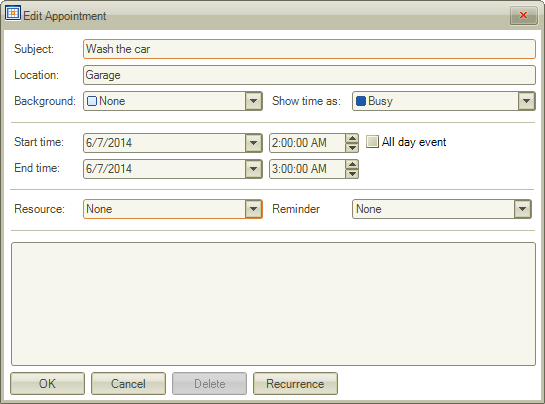
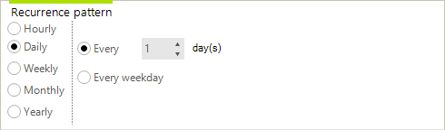
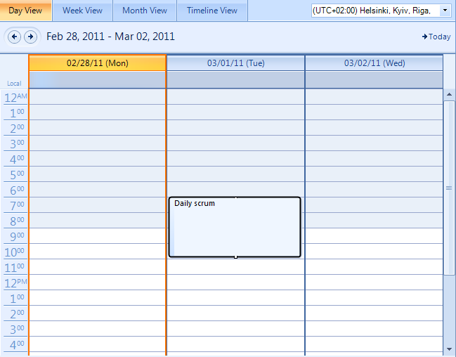

# Adding Appointments

Much like Microsoft Outlook, RadScheduler for WinForms offers several ways of creating new appointments:

* By double-clicking on the scheduler surface.

* By using the context menu.

>note You can prohibit end-users from creating, moving, resizing, and copying scheduled appointments.
>

## Adding an appointment by double-clicking on the scheduler surface

1. In the scheduler surface, select the __start time__ when you want the appointment to occur.
            

1. Double-click on the time and an “Edit Appointment Dialog” will appear. 
    

1. In the dialog the end user can do the following:

    - Enter or change the appointment __Subject__

    - Enter or change the appointment __Location__ by typing in the edit control.
                    

    - Change the appointment __Background__

    - Change the __starting and ending times__ of the appointment. You can type in new dates/times, or, to change the date, you can press on the drop down button to bring up a calendar control;
                    

    - Specify that the appointment is an __all-day event__ using the "All day event" check box. If you specify an all-day event, you do not need to specify starting and ending times.
                    

    - Enter values for any __resources__. In the edit form shown above, you can enter a user, materials, and topics for the appointment.
                    

    - Change the appointment __Status__.
                    

    - Enter or change the __Description__

    - To create a recurring appointment, press the Recurrence button and the "Edit Recurrence Dialog" will appear.
       

    - In the __recurrence dialog__ you can do the following:

    - Specify appointment hours and duration
     
	

    	- Specify how often the appointment recurs. Recurrence can be Daily, Weekly, Monthly, or Yearly.

    	- Specify the duration between the occurrences of a recurring appointment

    	- Specify when the recurrence ends
    	
        

    - When you are ready press the Ok button to accept the changes or press the Cancel button to cancel them.

## Adding an appointment by double-clicking on the scheduler surface

1. In the scheduler surface, with the moust select the duration of the appointment (drag the selection from the starting time to the end time) when you want the appointment to occur.

1. Right-click on the selection to invoke the context menu. Select the desired option.

## Adding an appointment through inline editors

The __RadScheduler__ supports inline editors. Their purpose is to create an appointment without using the EditAppointmentDialog form. When the user selects a cell or sequence of cells and start typing in them the __RadScheduler__ creates a temp appointment in the active view. This appointment will be added to __RadScheduler__ if the user presses button “Enter” or the active editor looses its focus.

## Logical View

The logical view functionality keeps the settings that are applied to the current view and applies the settings which are equal for the different views (for example DefaultTimeZone). The view state will be persisted automatically when switching to a different view.
        
