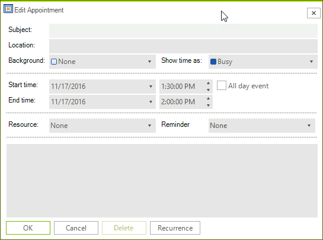
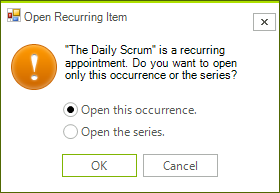
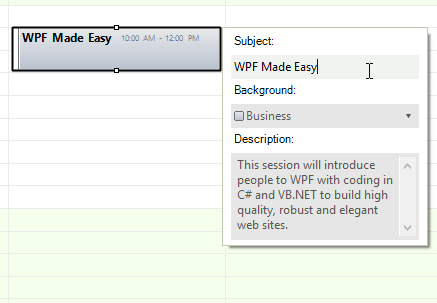
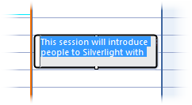

# Editing Appointments 

<table><th><tr><td>

RELATED VIDEOS</td><td></td></tr></th><tr><td>

[In-Place Editors with RadScheduler for WinForms](http://tv.telerik.com/watch/winforms/in-place-editors-with-radscheduler-for-winforms)

In this video, you will learn how to use the new in-place editors feature of RadScheduler for WinForms.
            </td><td></td></tr></table>

RadScheduler offers two options to edit an appointment:

* Edit an appointment using an Edit Appointment Dialog

* Edit an appointment using an in-place editor

When a change in an appointment's property occurs, the __AppointmentChanged__ event is fired.
         The __AppointmentChangedEventArgs__ gives you access to the exact __Appointment__ and the __PropertyName__
        that has been modified.
      

## Using EditAppointmentDialog

The EditAppointmentDialog allows for editing all the properties that an appointment exposes.
          To edit an appointment once it has been created:
        

1. Double-click an appointment and the "Editor Appointment Dialog" is shown if the appointment is not recurring.

1. If the appointment is recurring, the "Editing a recurring appointment" pop-up appears, where you can specify whether you
              want to edit only the selected occurrence of the appointment, or edit the entire series:
            Choose which you want to edit and press OK to open the "Editor Appointment Dialog". You can also press Cancel to cancel the edit entirely.
            

1. To change the recurrence rules press the Recurrence button in the "Editor Appointment Dialog" and the "Edit Recurrence Dialog" will appear.
              Make the desired changes to the appointment and click OK to save the changes or Cancel to cancel them.
            

1. Exceptions to recurring appointments
              When you edit a single instance of a recurring appointment, you create an exception.
              This indicates that the appointment is still part of a recurring sequence, but that it differs in
              some details from the master recurring appointment. Exceptions can reflect any change to the appointment including its subject,
              time, duration, or any custom resources or attributes.
            

## 
        Using In-place editors
      

In-place editors provide a quick and easy way to edit a small number of the appointment's properties. There are
          three options for the behavior of the in-place editor:
        

* The in-place editor opens in the area of the appointment.
              By default this editor edits the Summary (subject) property of the appointment in which it is opened.
            

#### __[C#]__

{{source=..\SamplesCS\Scheduler\EndUserFunctionality\EditingAppointments.cs region=editorViewModeEditor}}
	            this.radScheduler1.SchedulerElement.EditorManager.EditorViewMode = SchedulerEditorViewMode.Editor;
	{{endregion}}

#### __[VB.NET]__

{{source=..\SamplesVB\Scheduler\EndUserFunctionality\EditingAppointments.vb region=editorViewModeEditor}}
	        Me.RadScheduler1.SchedulerElement.EditorManager.EditorViewMode = SchedulerEditorViewMode.Editor
	        '#End Region
	
	        '#Region "editorViewModeEditorDialog"
	        Me.RadScheduler1.SchedulerElement.EditorManager.EditorViewMode = SchedulerEditorViewMode.EditorDialog
	        '#End Region
	
	        '#Region "editorViewModeEditorNone"
	        Me.RadScheduler1.SchedulerElement.EditorManager.EditorViewMode = SchedulerEditorViewMode.None
	        '#End Region
	
	        AddHandler RadScheduler1.EditorRequired, AddressOf radScheduler1_EditorRequired
	    End Sub
	
	    '#Region "editorRequired"
	    Private Sub radScheduler1_EditorRequired(ByVal sender As Object, ByVal e As SchedulerEditorRequiredArgs)
	        e.Editor = New CustomSchedulerTextBoxEditor()
	    End Sub
	    '#End Region
	End Class

* The in-place editor behaves as a composite dialog editor that appears next to the appointment in the view.
              This editor allows for editing more properties of the appointment at once.
            

#### __[C#]__

{{source=..\SamplesCS\Scheduler\EndUserFunctionality\EditingAppointments.cs region=editorViewModeEditorDialog}}
	            this.radScheduler1.SchedulerElement.EditorManager.EditorViewMode = SchedulerEditorViewMode.EditorDialog;
	{{endregion}}

#### __[VB.NET]__

{{source=..\SamplesVB\Scheduler\EndUserFunctionality\EditingAppointments.vb region=editorViewModeEditorDialog}}
	        Me.RadScheduler1.SchedulerElement.EditorManager.EditorViewMode = SchedulerEditorViewMode.EditorDialog
	        '#End Region
	
	        '#Region "editorViewModeEditorNone"
	        Me.RadScheduler1.SchedulerElement.EditorManager.EditorViewMode = SchedulerEditorViewMode.None
	        '#End Region
	
	        AddHandler RadScheduler1.EditorRequired, AddressOf radScheduler1_EditorRequired
	    End Sub
	
	    '#Region "editorRequired"
	    Private Sub radScheduler1_EditorRequired(ByVal sender As Object, ByVal e As SchedulerEditorRequiredArgs)
	        e.Editor = New CustomSchedulerTextBoxEditor()
	    End Sub
	    '#End Region
	End Class

* All in-place editors are disabled. This is the default behavior.

#### __[C#]__

{{source=..\SamplesCS\Scheduler\EndUserFunctionality\EditingAppointments.cs region=editorViewModeEditorNone}}
	            this.radScheduler1.SchedulerElement.EditorManager.EditorViewMode = SchedulerEditorViewMode.None;
	{{endregion}}

#### __[VB.NET]__

{{source=..\SamplesVB\Scheduler\EndUserFunctionality\EditingAppointments.vb region=editorViewModeEditorNone}}
	        Me.RadScheduler1.SchedulerElement.EditorManager.EditorViewMode = SchedulerEditorViewMode.None
	        '#End Region
	
	        AddHandler RadScheduler1.EditorRequired, AddressOf radScheduler1_EditorRequired
	    End Sub
	
	    '#Region "editorRequired"
	    Private Sub radScheduler1_EditorRequired(ByVal sender As Object, ByVal e As SchedulerEditorRequiredArgs)
	        e.Editor = New CustomSchedulerTextBoxEditor()
	    End Sub
	    '#End Region
	End Class

## 
        Customizing the in-place editors
      

You are able to change the default editors in the EditorRequired event of the RadScheduler.
          For example, if you want to modify the Description value instead of the Summary value, you should
          inherit RadSchedulerTextBoxEditor and override two of its methods - BeginEditorEdit and Save.
        

#### __[C#]__

{{source=..\SamplesCS\Scheduler\EndUserFunctionality\CustomSchedulerTextBoxEditor.cs region=customSchedulerTextBoxEditor}}
	    public class CustomSchedulerTextBoxEditor : RadSchedulerTextBoxEditor
	    {
	        public override void BeginEditorEdit(IEditorManager editorManager, IEvent appointment)
	        {
	            base.BeginEditorEdit(editorManager, appointment);
	
	            this.Value = this.Value = appointment.Description;
	        }
	
	        public override void Save()
	        {
	            if (this.appointment.Description == this.Value.ToString())
	            {
	                return;
	            }
	
	            this.appointment.Description = this.Value.ToString();
	
	            if (this.appointment.MasterEvent != null &&
	                !this.appointment.MasterEvent.Exceptions.Contains(this.appointment))
	            {
	                this.appointment.MasterEvent.Exceptions.Add(this.appointment);
	            }
	        }
	    }
	{{endregion}}

#### __[VB.NET]__

{{source=..\SamplesVB\Scheduler\EndUserFunctionality\CustomSchedulerTextBoxEditor.vb region=customSchedulerTextBoxEditor}}
	Public Class CustomSchedulerTextBoxEditor
	    Inherits RadSchedulerTextBoxEditor
	    Public Overrides Sub BeginEditorEdit(ByVal editorManager As IEditorManager, ByVal appointment As IEvent)
	        MyBase.BeginEditorEdit(editorManager, appointment)
	
	        Me.Value = appointment.Description
	        Me.Value = Me.Value
	    End Sub
	
	    Public Overrides Sub Save()
	        If Me.appointment.Description = Me.Value.ToString() Then
	            Return
	        End If
	
	        Me.appointment.Description = Me.Value.ToString()
	
	        If Me.appointment.MasterEvent IsNot Nothing AndAlso (Not Me.appointment.MasterEvent.Exceptions.Contains(Me.appointment)) Then
	            Me.appointment.MasterEvent.Exceptions.Add(Me.appointment)
	        End If
	    End Sub
	End Class
	'#End Region

After creating the custom editor that edits Description property of the appointment, you should
          replace the default editor. This has to be done on EditorRequired event of RadScheduler.
        

#### __[C#]__

{{source=..\SamplesCS\Scheduler\EndUserFunctionality\EditingAppointments.cs region=editorRequired}}
	        void radScheduler1_EditorRequired(object sender, SchedulerEditorRequiredArgs e)
	        {
	            e.Editor = new CustomSchedulerTextBoxEditor();
	        }
	{{endregion}}

#### __[VB.NET]__

{{source=..\SamplesVB\Scheduler\EndUserFunctionality\EditingAppointments.vb region=editorRequired}}
	    Private Sub radScheduler1_EditorRequired(ByVal sender As Object, ByVal e As SchedulerEditorRequiredArgs)
	        e.Editor = New CustomSchedulerTextBoxEditor()
	    End Sub
	    '#End Region
	End Class

The result is shown on the screenshot below:
        

In this the EditorRequired event you can also change the in-place editor dialog if the editor mode is EditorDialog.
