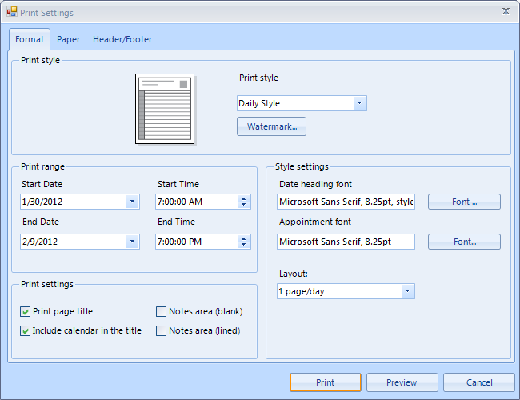

# Print Support

## 

The SchedulerPrintSettingsDialog allows the end user to edit the print style settings of RadScheduler, settings of the printed paper and the header and footer of the printed document. It inherits from [RadPrintSettingsDialog]() adding some specific to RadScheduler settings to the first tab. The other two tabs,namely __Paper__ and __Header/Footer__, are described in the [RadPrintSettingsDialog article.]()

The first page of the dialog contains four sections which allow you to change or edit the current [PrintStyle]() of RadScheduler:
  		

* In the __Print style__ group box there is a simplified preview of the result along witha drop down to select the current print style and a button which opens the [WatermarkPreview dialog.]()

* In the __Print range__ group box you can setup the date and time range in which appointments should be printed.
  			

* In the __Print settings__ group box you can enable or disable displaying some of the visual parts of the pages.
          	

* In the last group box - __Style settings__ - you can set settings, specific to the selected [PrintStyle.]()
