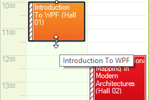
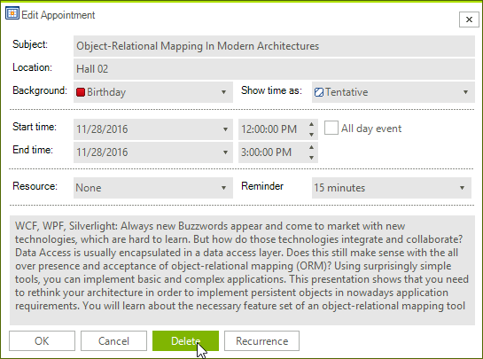
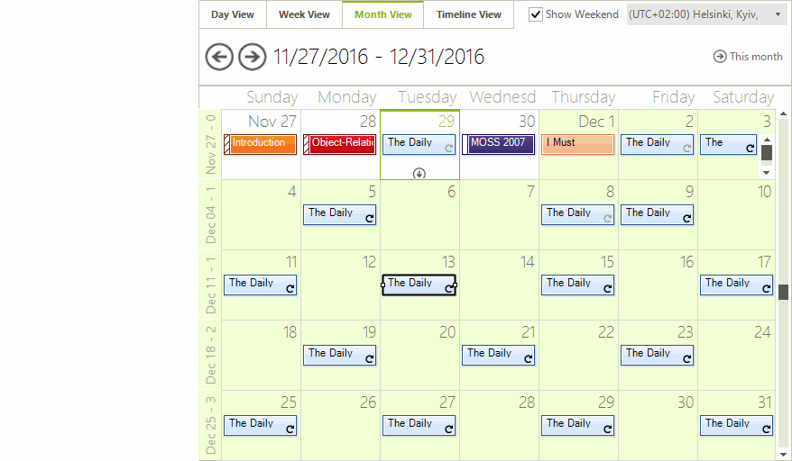

# Resizing, Moving, and Deleting Appointments

You can make simple changes to the appointments that RadScheduler displays without bringing up the edit form or in-line editor.

## Resizing Appointments

To change the duration of an appointment, select the appointment and move the cursor to the top/bottom (in Day view and Week view) or left/right (in Month view and Timeline view) part of the rectangle and pull it to resize the appointment. This will change the appointment's time and/or date of occurrence, which will automatically be reflected in the appointment. 

It is also allowed to resize a recurring appointment. This would lead to automatically creating an exception.

## Moving Appointments

You can drag and drop an appointment to another time slot and/or day (depending on the view), thus effectively changing the time and/or date of its occurrence. Simply click on an appointment, hold the moue button down, drag it to a new location, and release the mouse. The appointment will automatically adjust its start and end times. 

When you start moving an appointment a feedback alpha blended form is shown as a visual indicator. It shows what will be the start and end time of the dragged appointment.

You can drag a recurring appointment and drop it onto a new time slot as well. As a result an exception appointment would be created if the new location is valid. The user should confirm the creation of an exception appointment.

## Deleting Appointments

The user can delete an appointment:

1. By selecting the appointment in the scheduler and hitting the DELETE key.

1. By double clicking on the appointment to open the "Edit Appointment Dialog" and pressing the Delete button to remove it from the RadScheduler’s Appointments collection.

When you try to delete a recurring appointment, you are asked to confirm whether the delete operation should affect the whole series or just the selected appointment.

