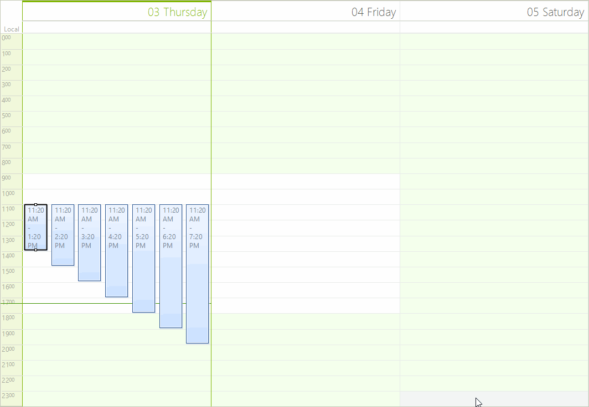

# Input behavior

The __SchedulerInputBehavior__ is responsible for processing the keyboard and mouse input in RadScheduler. 

## 

Below are the methods which handle the respective events:

* HandleMouseDown

* HandleMouseMove

* HandleMouseUp

* HandleMouseDown

* HandleNavigationKey

* HandleMouseWheel

* HandleMouseEnter

* HandleMouseLeave

* HandleCellElementDoubleClick

* HandleAppointmentElementDoubleClick

* HandleCellElementKeyPress

Every one of these methods can be overridden and the instance of the __SchedulerInputBehavior__ used 
          in RadScheduler can be replaced with a custom one. This allows you to modify the default behavior 
          of RadScheduler. The following example demonstrates how to modify 
          the default behavior to allow moving appointments via CTRL + arrow keys. 
          In order to accomplish this, we will need to create a descendant of SchedulerInputBehavior and override the HandleKeyDown method:
        

#### __[C#] __

{{source=..\SamplesCS\Scheduler\Fundamentals\InputBehavior.cs region=Behavior}}
	    public class MySchedulerInputBehavior : SchedulerInputBehavior
	    {
	        public MySchedulerInputBehavior(RadScheduler scheduler)
	            : base(scheduler)
	        {
	        }
	
	        public override bool HandleKeyDown(KeyEventArgs args)
	        {
	            bool isControl = (args.Modifiers & Keys.Control) == Keys.Control;
	            IEvent selectedAppointment = this.Scheduler.SelectionBehavior.SelectedAppointment;
	            if (isControl && selectedAppointment != null)
	            {
	                if ((args.KeyData & Keys.Up) == Keys.Up)
	                {
	                    selectedAppointment.Start = selectedAppointment.Start.AddHours(-1);
	                    selectedAppointment.End = selectedAppointment.End.AddHours(-1);
	                }
	                else if ((args.KeyData & Keys.Down) == Keys.Down)
	                {
	                    selectedAppointment.Start = selectedAppointment.Start.AddHours(1);
	                    selectedAppointment.End = selectedAppointment.End.AddHours(1);
	                }
	            }
	
	            return base.HandleKeyDown(args);
	        }
	    }
	{{endregion}}

#### __[VB.NET] __

{{source=..\SamplesVB\Scheduler\Fundamentals\InputBehavior.vb region=Behavior}}
	Public Class MySchedulerInputBehavior
	    Inherits SchedulerInputBehavior
	    Public Sub New(scheduler As RadScheduler)
	        MyBase.New(scheduler)
	    End Sub
	
	    Public Overrides Function HandleKeyDown(args As KeyEventArgs) As Boolean
	        Dim isControl As Boolean = (args.Modifiers And Keys.Control) = Keys.Control
	        Dim selectedAppointment As IEvent = Me.Scheduler.SelectionBehavior.SelectedAppointment
	        If isControl AndAlso selectedAppointment IsNot Nothing Then
	            If (args.KeyData And Keys.Up) = Keys.Up Then
	                selectedAppointment.Start = selectedAppointment.Start.AddHours(-1)
	                selectedAppointment.[End] = selectedAppointment.[End].AddHours(-1)
	            ElseIf (args.KeyData And Keys.Down) = Keys.Down Then
	                selectedAppointment.Start = selectedAppointment.Start.AddHours(1)
	                selectedAppointment.[End] = selectedAppointment.[End].AddHours(1)
	            End If
	        End If
	
	        Return MyBase.HandleKeyDown(args)
	    End Function
	End Class
	{{endregion}}

Now we need to assign this new input behavior to the __SchedulerInputBehavior__ property of RadScheduler:
        

#### __[C#] __

{{source=..\SamplesCS\Scheduler\Fundamentals\InputBehavior.cs region=SetBehavior}}
	            scheduler.SchedulerInputBehavior = new MySchedulerInputBehavior(scheduler);
	{{endregion}}

#### __[VB.NET] __

{{source=..\SamplesVB\Scheduler\Fundamentals\InputBehavior.vb region=SetBehavior}}
	        scheduler.SchedulerInputBehavior = New MySchedulerInputBehavior(scheduler)
	{{endregion}}

You can see the result below:
        
