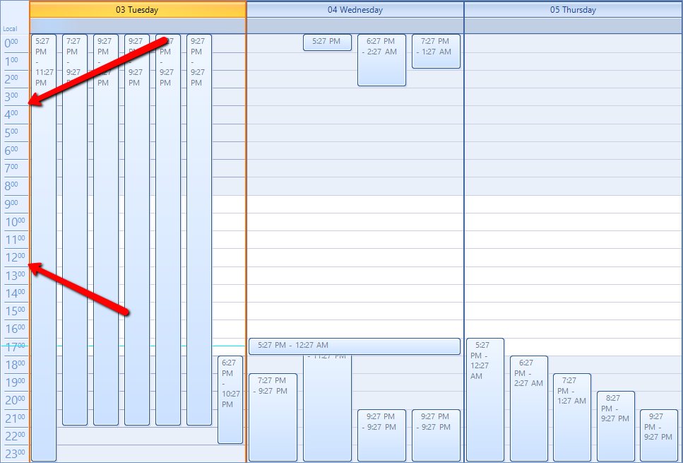
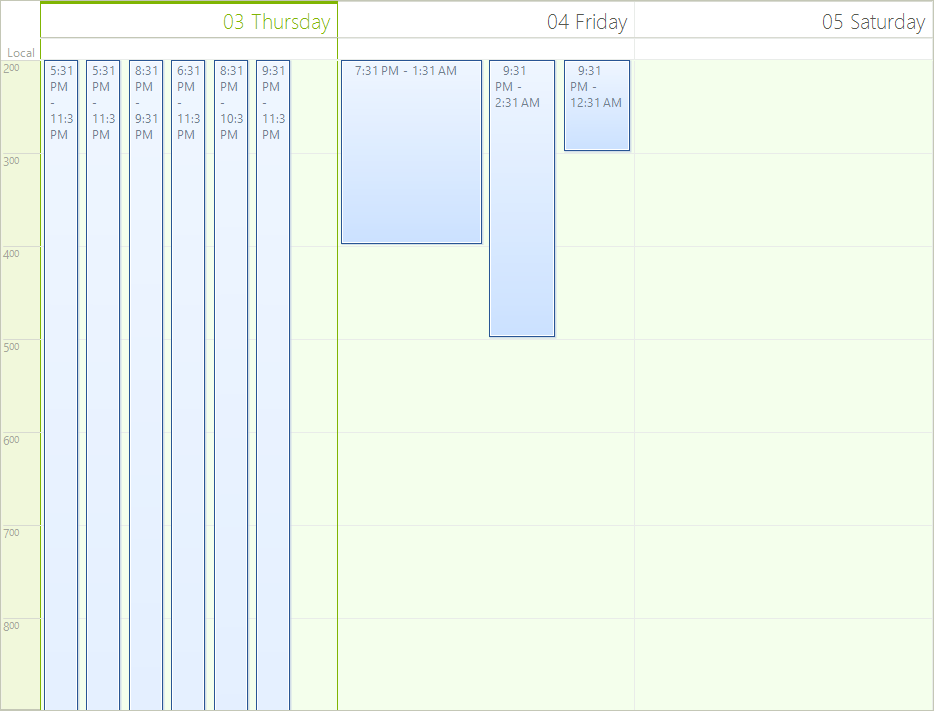
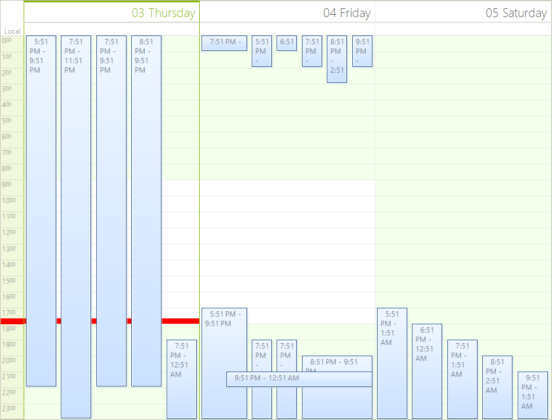
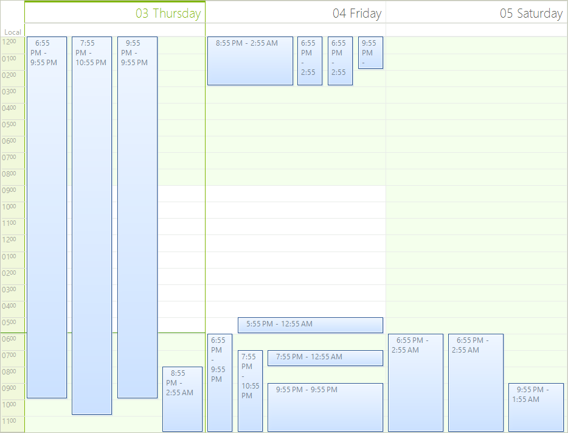
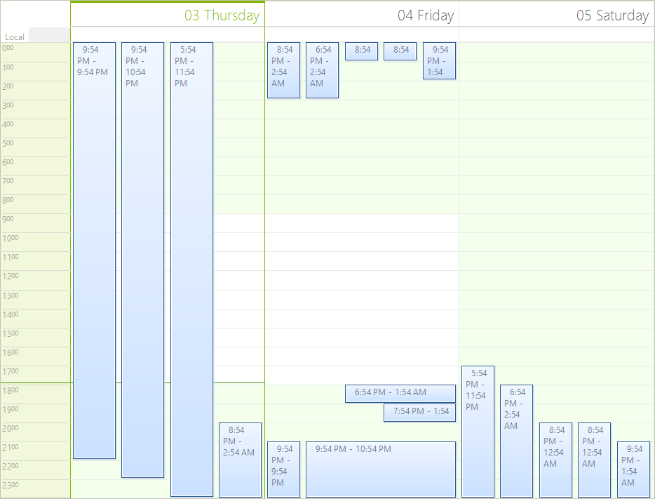

# Scheduler Ruler

The ruler in RadScheduler is used to show the time intervals of the current view.

## 

The ruler has various properties which can be used to modify its appearance. Below you can see examples for the most useful of these properties.

The ruler can be accessed as follows:

#### __[C#] __

{{region GetRuller}}
	            RulerPrimitive ruler = (this.scheduler.SchedulerElement.ViewElement as SchedulerDayViewElement).DataAreaElement.Ruler;
	{{endregion}}

#### __[VB.NET] __

{{region GetRuller}}
	        Dim ruler As RulerPrimitive = TryCast(Me.scheduler.SchedulerElement.ViewElement, SchedulerDayViewElement).DataAreaElement.Ruler
	        '#End Region
	
	        '#Region "TimePointerStyle"
	        ruler.TimePointerStyle = RulerCurrentTimePointer.Arrow
	        '#End Region
	
	        '#Region "StartEndScale"
	        ruler.StartScale = 2
	        ruler.EndScale = 9
	        '#End Region
	
	        '#Region "RangeFactor"
	        ruler.RangeFactor = ScaleRange.Hour
	        '#End Region
	
	        '#Region "CurrentTimePointerWidthAndColor"
	        ruler.CurrentTimePointerWidth = 10
	        ruler.CurrentTimePointerColor = Color.Red
	        '#End Region
	
	        '#Region "RulerWidth"
	        ruler.RulerWidth = 100
	        '#End Region
	
	        '#Region "FormatStrings"
	        ruler.FormatStrings = New RulerFormatStrings("hh", "mm", "hh", "mm")
	        '#End Region
	
	        '#Region "RulerFormattingSubscribe"
	        '#End Region
	
	        AddHandler Me.scheduler.RulerTextFormatting, AddressOf Scheduler_RulerTextFormatting
	    End Sub
	
	#Region "RulerFormattingHandler"
	    Private Sub Scheduler_RulerTextFormatting(sender As Object, e As RulerTextFormattingEventArgs)
	        If e.Text.Length = 1 Then
	            e.Text = "0" & e.Text
	        End If
	    End Sub
	#End Region
	
	    Public Sub LoadAppointments(scheduler As RadScheduler)
	        Dim addDays As Integer = 0
	        For i As Integer = 0 To rnd.[Next](15, 30) - 1
	            Dim app As New Appointment(DateTime.Now.AddDays(addDays).AddHours(rnd.[Next](0, 5)), DateTime.Now.AddHours(rnd.[Next](4, 10)), "")
	            scheduler.Appointments.Add(app)
	
	            If i Mod 5 = 0 Then
	                addDays += 1
	            End If
	        Next
	    End Sub
	End Class

* __TimePointerStyle__ - Sets the style of the pointer which shows the current time. Can be *Arrow, Line or SimpleLine*.
          

#### __[C#] __

{{region TimePointerStyle}}
	            ruler.TimePointerStyle = RulerCurrentTimePointer.Arrow;
	{{endregion}}

#### __[VB.NET] __

{{region TimePointerStyle}}
	        ruler.TimePointerStyle = RulerCurrentTimePointer.Arrow
	        '#End Region
	
	        '#Region "StartEndScale"
	        ruler.StartScale = 2
	        ruler.EndScale = 9
	        '#End Region
	
	        '#Region "RangeFactor"
	        ruler.RangeFactor = ScaleRange.Hour
	        '#End Region
	
	        '#Region "CurrentTimePointerWidthAndColor"
	        ruler.CurrentTimePointerWidth = 10
	        ruler.CurrentTimePointerColor = Color.Red
	        '#End Region
	
	        '#Region "RulerWidth"
	        ruler.RulerWidth = 100
	        '#End Region
	
	        '#Region "FormatStrings"
	        ruler.FormatStrings = New RulerFormatStrings("hh", "mm", "hh", "mm")
	        '#End Region
	
	        '#Region "RulerFormattingSubscribe"
	        '#End Region
	
	        AddHandler Me.scheduler.RulerTextFormatting, AddressOf Scheduler_RulerTextFormatting
	    End Sub
	
	#Region "RulerFormattingHandler"
	    Private Sub Scheduler_RulerTextFormatting(sender As Object, e As RulerTextFormattingEventArgs)
	        If e.Text.Length = 1 Then
	            e.Text = "0" & e.Text
	        End If
	    End Sub
	#End Region
	
	    Public Sub LoadAppointments(scheduler As RadScheduler)
	        Dim addDays As Integer = 0
	        For i As Integer = 0 To rnd.[Next](15, 30) - 1
	            Dim app As New Appointment(DateTime.Now.AddDays(addDays).AddHours(rnd.[Next](0, 5)), DateTime.Now.AddHours(rnd.[Next](4, 10)), "")
	            scheduler.Appointments.Add(app)
	
	            If i Mod 5 = 0 Then
	                addDays += 1
	            End If
	        Next
	    End Sub
	End Class

* __Start__ and __EndScale__ - Sets the time when the ruler starts and ends.
            

#### __[C#] __

{{region StartEndScale}}
	            ruler.StartScale = 2;
	            ruler.EndScale = 9;
	{{endregion}}

#### __[VB.NET] __

{{region StartEndScale}}
	        ruler.StartScale = 2
	        ruler.EndScale = 9
	        '#End Region
	
	        '#Region "RangeFactor"
	        ruler.RangeFactor = ScaleRange.Hour
	        '#End Region
	
	        '#Region "CurrentTimePointerWidthAndColor"
	        ruler.CurrentTimePointerWidth = 10
	        ruler.CurrentTimePointerColor = Color.Red
	        '#End Region
	
	        '#Region "RulerWidth"
	        ruler.RulerWidth = 100
	        '#End Region
	
	        '#Region "FormatStrings"
	        ruler.FormatStrings = New RulerFormatStrings("hh", "mm", "hh", "mm")
	        '#End Region
	
	        '#Region "RulerFormattingSubscribe"
	        '#End Region
	
	        AddHandler Me.scheduler.RulerTextFormatting, AddressOf Scheduler_RulerTextFormatting
	    End Sub
	
	#Region "RulerFormattingHandler"
	    Private Sub Scheduler_RulerTextFormatting(sender As Object, e As RulerTextFormattingEventArgs)
	        If e.Text.Length = 1 Then
	            e.Text = "0" & e.Text
	        End If
	    End Sub
	#End Region
	
	    Public Sub LoadAppointments(scheduler As RadScheduler)
	        Dim addDays As Integer = 0
	        For i As Integer = 0 To rnd.[Next](15, 30) - 1
	            Dim app As New Appointment(DateTime.Now.AddDays(addDays).AddHours(rnd.[Next](0, 5)), DateTime.Now.AddHours(rnd.[Next](4, 10)), "")
	            scheduler.Appointments.Add(app)
	
	            If i Mod 5 = 0 Then
	                addDays += 1
	            End If
	        Next
	    End Sub
	End Class

* __RangeFactor__ - The range factor determines whether the units in the ruler will be devided in *FiveMinutes, HalfHour, Hour, QuarterHour, SixMinutes or TenMinutes*.
            

#### __[C#] __

{{region RangeFactor}}
	            ruler.RangeFactor = ScaleRange.Hour;
	{{endregion}}

#### __[VB.NET] __

{{region RangeFactor}}
	        ruler.RangeFactor = ScaleRange.Hour
	        '#End Region
	
	        '#Region "CurrentTimePointerWidthAndColor"
	        ruler.CurrentTimePointerWidth = 10
	        ruler.CurrentTimePointerColor = Color.Red
	        '#End Region
	
	        '#Region "RulerWidth"
	        ruler.RulerWidth = 100
	        '#End Region
	
	        '#Region "FormatStrings"
	        ruler.FormatStrings = New RulerFormatStrings("hh", "mm", "hh", "mm")
	        '#End Region
	
	        '#Region "RulerFormattingSubscribe"
	        '#End Region
	
	        AddHandler Me.scheduler.RulerTextFormatting, AddressOf Scheduler_RulerTextFormatting
	    End Sub
	
	#Region "RulerFormattingHandler"
	    Private Sub Scheduler_RulerTextFormatting(sender As Object, e As RulerTextFormattingEventArgs)
	        If e.Text.Length = 1 Then
	            e.Text = "0" & e.Text
	        End If
	    End Sub
	#End Region
	
	    Public Sub LoadAppointments(scheduler As RadScheduler)
	        Dim addDays As Integer = 0
	        For i As Integer = 0 To rnd.[Next](15, 30) - 1
	            Dim app As New Appointment(DateTime.Now.AddDays(addDays).AddHours(rnd.[Next](0, 5)), DateTime.Now.AddHours(rnd.[Next](4, 10)), "")
	            scheduler.Appointments.Add(app)
	
	            If i Mod 5 = 0 Then
	                addDays += 1
	            End If
	        Next
	    End Sub
	End Class

* __CurrentTimePointerWidth__ and __CurrentTimePointerColor__ - Sets the size and the color of the pointer which shows the current time.
            

#### __[C#] __

{{region CurrentTimePointerWidthAndColor}}
	            ruler.CurrentTimePointerWidth = 10;
	            ruler.CurrentTimePointerColor = Color.Red;
	{{endregion}}

#### __[VB.NET] __

{{region CurrentTimePointerWidthAndColor}}
	        ruler.CurrentTimePointerWidth = 10
	        ruler.CurrentTimePointerColor = Color.Red
	        '#End Region
	
	        '#Region "RulerWidth"
	        ruler.RulerWidth = 100
	        '#End Region
	
	        '#Region "FormatStrings"
	        ruler.FormatStrings = New RulerFormatStrings("hh", "mm", "hh", "mm")
	        '#End Region
	
	        '#Region "RulerFormattingSubscribe"
	        '#End Region
	
	        AddHandler Me.scheduler.RulerTextFormatting, AddressOf Scheduler_RulerTextFormatting
	    End Sub
	
	#Region "RulerFormattingHandler"
	    Private Sub Scheduler_RulerTextFormatting(sender As Object, e As RulerTextFormattingEventArgs)
	        If e.Text.Length = 1 Then
	            e.Text = "0" & e.Text
	        End If
	    End Sub
	#End Region
	
	    Public Sub LoadAppointments(scheduler As RadScheduler)
	        Dim addDays As Integer = 0
	        For i As Integer = 0 To rnd.[Next](15, 30) - 1
	            Dim app As New Appointment(DateTime.Now.AddDays(addDays).AddHours(rnd.[Next](0, 5)), DateTime.Now.AddHours(rnd.[Next](4, 10)), "")
	            scheduler.Appointments.Add(app)
	
	            If i Mod 5 = 0 Then
	                addDays += 1
	            End If
	        Next
	    End Sub
	End Class

* __RulerFormatStrings__ and the __RulerTextFormatting__ event - They are used to format the text in the ruler. For example here is how to display the hours in a 12 hours format:
            

#### __[C#] __

{{region FormatStrings}}
	            ruler.FormatStrings = new RulerFormatStrings("hh", "mm", "hh", "mm");
	{{endregion}}

#### __[VB.NET] __

{{region FormatStrings}}
	        ruler.FormatStrings = New RulerFormatStrings("hh", "mm", "hh", "mm")
	        '#End Region
	
	        '#Region "RulerFormattingSubscribe"
	        '#End Region
	
	        AddHandler Me.scheduler.RulerTextFormatting, AddressOf Scheduler_RulerTextFormatting
	    End Sub
	
	#Region "RulerFormattingHandler"
	    Private Sub Scheduler_RulerTextFormatting(sender As Object, e As RulerTextFormattingEventArgs)
	        If e.Text.Length = 1 Then
	            e.Text = "0" & e.Text
	        End If
	    End Sub
	#End Region
	
	    Public Sub LoadAppointments(scheduler As RadScheduler)
	        Dim addDays As Integer = 0
	        For i As Integer = 0 To rnd.[Next](15, 30) - 1
	            Dim app As New Appointment(DateTime.Now.AddDays(addDays).AddHours(rnd.[Next](0, 5)), DateTime.Now.AddHours(rnd.[Next](4, 10)), "")
	            scheduler.Appointments.Add(app)
	
	            If i Mod 5 = 0 Then
	                addDays += 1
	            End If
	        Next
	    End Sub
	End Class

The RulerTextFormatting event can be used to manually format the text. You can prepend a "0" in front of the text if it contains only one digit:
            

#### __[C#] __

{{region RulerFormattingSubscribe}}
	            this.scheduler.RulerTextFormatting += Scheduler_RulerTextFormatting;
	{{endregion}}

#### __[VB.NET] __

{{region RulerFormattingSubscribe}}
	        '#End Region
	
	        AddHandler Me.scheduler.RulerTextFormatting, AddressOf Scheduler_RulerTextFormatting
	    End Sub
	
	#Region "RulerFormattingHandler"
	    Private Sub Scheduler_RulerTextFormatting(sender As Object, e As RulerTextFormattingEventArgs)
	        If e.Text.Length = 1 Then
	            e.Text = "0" & e.Text
	        End If
	    End Sub
	#End Region
	
	    Public Sub LoadAppointments(scheduler As RadScheduler)
	        Dim addDays As Integer = 0
	        For i As Integer = 0 To rnd.[Next](15, 30) - 1
	            Dim app As New Appointment(DateTime.Now.AddDays(addDays).AddHours(rnd.[Next](0, 5)), DateTime.Now.AddHours(rnd.[Next](4, 10)), "")
	            scheduler.Appointments.Add(app)
	
	            If i Mod 5 = 0 Then
	                addDays += 1
	            End If
	        Next
	    End Sub
	End Class

#### __[C#] __

{{region RulerFormattingHandler}}
	        void Scheduler_RulerTextFormatting(object sender, RulerTextFormattingEventArgs e)
	        {
	            if (e.Text.Length == 1)
	            {
	                e.Text = "0" + e.Text;
	            }
	        }
	{{endregion}}

#### __[VB.NET] __

{{region RulerFormattingHandler}}
	    Private Sub Scheduler_RulerTextFormatting(sender As Object, e As RulerTextFormattingEventArgs)
	        If e.Text.Length = 1 Then
	            e.Text = "0" & e.Text
	        End If
	    End Sub
	#End Region
	
	    Public Sub LoadAppointments(scheduler As RadScheduler)
	        Dim addDays As Integer = 0
	        For i As Integer = 0 To rnd.[Next](15, 30) - 1
	            Dim app As New Appointment(DateTime.Now.AddDays(addDays).AddHours(rnd.[Next](0, 5)), DateTime.Now.AddHours(rnd.[Next](4, 10)), "")
	            scheduler.Appointments.Add(app)
	
	            If i Mod 5 = 0 Then
	                addDays += 1
	            End If
	        Next
	    End Sub
	End Class

* __RulerWidth__ - Sets the width of the ruler.
            

#### __[C#] __

{{region RulerWidth}}
	            ruler.RulerWidth = 100;
	{{endregion}}

#### __[VB.NET] __

{{region RulerWidth}}
	        ruler.RulerWidth = 100
	        '#End Region
	
	        '#Region "FormatStrings"
	        ruler.FormatStrings = New RulerFormatStrings("hh", "mm", "hh", "mm")
	        '#End Region
	
	        '#Region "RulerFormattingSubscribe"
	        '#End Region
	
	        AddHandler Me.scheduler.RulerTextFormatting, AddressOf Scheduler_RulerTextFormatting
	    End Sub
	
	#Region "RulerFormattingHandler"
	    Private Sub Scheduler_RulerTextFormatting(sender As Object, e As RulerTextFormattingEventArgs)
	        If e.Text.Length = 1 Then
	            e.Text = "0" & e.Text
	        End If
	    End Sub
	#End Region
	
	    Public Sub LoadAppointments(scheduler As RadScheduler)
	        Dim addDays As Integer = 0
	        For i As Integer = 0 To rnd.[Next](15, 30) - 1
	            Dim app As New Appointment(DateTime.Now.AddDays(addDays).AddHours(rnd.[Next](0, 5)), DateTime.Now.AddHours(rnd.[Next](4, 10)), "")
	            scheduler.Appointments.Add(app)
	
	            If i Mod 5 = 0 Then
	                addDays += 1
	            End If
	        Next
	    End Sub
	End Class

