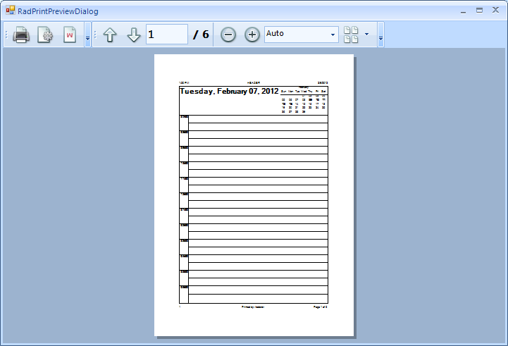

# Print Support

| RELATED VIDEOS |  |
| ------ | ------ |
|[Getting Started with Printing for RadScheduler](http://tv.telerik.com/watch/winforms/getting-started-with-printing-for-radscheduler)<br>This video demonstrates how to use the new Print features of RadScheduler. It includes a tour of new end-user printing features as well as how to accomplish it programmatically.||

The printing support of RadScheduler, allows the end user to directly pass the RadScheduler data to the printer. Common features of the printing support in Telerik UI for WinForms suite are:

* Page headers and footers

* Watermark

* Paper size settings

* Print preview dialogs

RadScheduler supports four print styles, similar to the Outlook ones: DailyStyle, WeeklyStyle, MonthlyStyle and DetailsStyle. In all modes, you can add to your pages an area for handwritten notes or a date header with calendar that shows the busy days.
      

You can also print a single view on two pages which will grant you more available space and allow you to organize the printouts in a folder or notebook.
      

## Printing

The RadScheduler has two public methods available for printing – __Print()__ and __PrintPreview()__ methods. The first method will directly send a print job to the default printer with the settings currently saved in the __PrintStyle__  property. This method has one overload available which can show a system __PrintDialog__ with the available printers and their options.

{{source=..\SamplesCS\Scheduler\Print support\SchedulerPrintSupport.cs region=print}} 
{{source=..\SamplesVB\Scheduler\Print support\SchedulerPrintSupport.vb region=print}} 

````C#
this.radScheduler1.Print();
this.radScheduler1.Print(true);

````
````VB.NET
Me.RadScheduler1.Print()
Me.RadScheduler1.Print(True)

````

{{endregion}} 


The other available method is __PrintPreview()__. It opens a new RadPrintPreviewDialog which is discussed in details [here.]()

{{source=..\SamplesCS\Scheduler\Print support\SchedulerPrintSupport.cs region=PrintPreview}} 
{{source=..\SamplesVB\Scheduler\Print support\SchedulerPrintSupport.vb region=PrintPreview}} 

````C#
this.radScheduler1.PrintPreview();

````
````VB.NET
Me.RadScheduler1.PrintPreview()

````

{{endregion}} 


