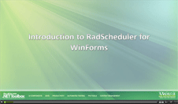

# Scheduler

<table><th><tr><td>

RELATED VIDEOS</td><td></td></tr></th><tr><td>[Introduction to RadScheduler for WinForms](http://tv.telerik.com/winforms/radscheduler/introduction-radscheduler-winforms)

In this webinar, Telerik Developer Support Specialist Robert Shoemate will introduce RadScheduler and demonstrate how to utilize its powerful feature set in your own applications. By attending this webinar, you will learn about features such as codeless data binding, adding custom fields, and UI customization. (Runtime: 55:58)
            		</td><td>

</td></tr><tr><td>[Using RadScheduler for WinForms](http://tv.telerik.com/winforms/radscheduler/scheduler)

Have you had a need to build scheduler functionality into your applications? If so, then this webinar is for you, where Telerik Evangelist John Kellar shows a variety of features like iCal support, multiple view options, strong data binding support, and an out of the box appointment dialogs. (Runtime: 32:46)
            		</td><td>

</td></tr></table>

## Features

* [Day, MultiDay, Week, WorkWeek, Month and Timeline Views]()

* [Powerful Data Binding]()

* [Familiar User Interface and Navigation]()

* [Appointment Capabilities]()

* [End User Capabilities]()

* [Custom Resources and Resource Grouping]()

* [Data Exchange in iCalendar Format]()

* [UI Localization]()

* [Appearance]()
