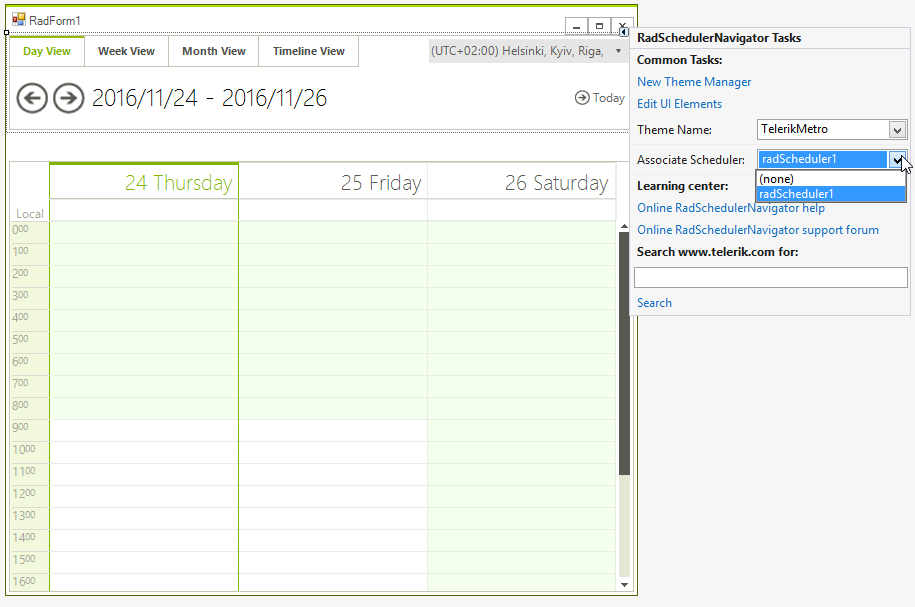

# Getting Started

## 

The __RadSchedulerNavigator__ control is used with a
          __RadScheduler__ control and represents a navigation tool
          that makes using the __RadScheduler__ easier.
        

To use the __RadSchedulerNavigator__ control you should add it
          to your form and also add a __RadScheduler__ control. After that,
          either by using the *Associate Scheduler* action in the Smart Tag of the
          Scheduler Navigator or by using the __AssociatedScheduler__
          property in the Property Grid of the Visual Studio Designer, you can bind the
          __RadSchedulerNavigator__ to a __RadScheduler__
          control:
        
