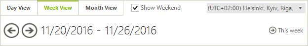
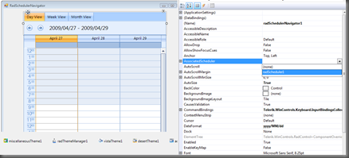
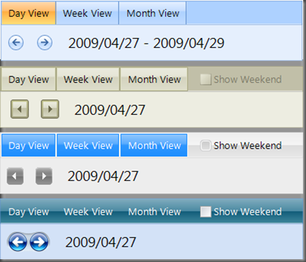

# Scheduler Navigator Overview

## 

__RadSchedulerNavigator__ is a stand-alone control used for navigation in RadScheduler control. 

Designed as a stand-alone component, RadSchedulerNavigator can be bound to a RadScheduler instance both with code or using Visual Studio Designer. The control serves as a convenient UI for navigating between the different views and also shows information about the time period which is displayed in the currently active view of RadScheduler. The user can also show or hide the weekends by using *Show Weekend* check-box.

RadSchedulerNavigator is built using *Telerik Presentation Framework *so it can be easily themed with the *Visual Style Builder*:

