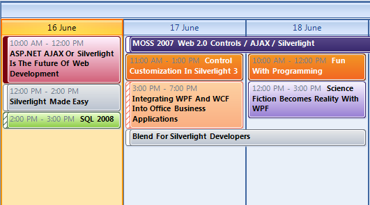

# Common visual properties

There are some properties which can modify the appearance of the appointments in __RadScheduler__ and are common for all views.
      

## Exact time rendering

Exact Time Rendering increases readability of the appointments by rendering them at its exact Start and End time corresponding
          with the time slots around. When __ExactTimeRendering__ is enabled, appointments will not snap to the nearest cell border but will
          render exactly on the location where their Start and End dates are expected to be. To enable this functionality, use the __ExactTimeRendering__  property:
        

#### __[C#]__

{{source=..\SamplesCS\Scheduler\Views\CommonProperties.cs region=exactTimeRendering}}
	            this.radScheduler1.EnableExactTimeRendering = true;
	{{endregion}}

#### __[VB.NET]__

{{source=..\SamplesVB\Scheduler\Views\CommonProperties.vb region=exactTimeRendering}}
	        Me.RadScheduler1.EnableExactTimeRendering = True
	{{endregion}}

## AutoSizeAppointments

When __AutoSizeAppointments__ is enabled, appointment elements will automatically adjust their height so that they can
        fully display their summary. This property will not have any effect in DayView and WeekView because the height in these views is determined by
        the appointment’s dates.

#### __[C#]__

{{source=..\SamplesCS\Scheduler\Views\CommonProperties.cs region=autoSizeAppointments}}
	            this.radScheduler1.AutoSizeAppointments = true;
	{{endregion}}

#### __[VB.NET]__

{{source=..\SamplesVB\Scheduler\Views\CommonProperties.vb region=autoSizeAppointments}}
	        Me.RadScheduler1.AutoSizeAppointments = True
	{{endregion}}

## Appointments’ height

When __AutoSizeAppointments__ is disabled, the appointments in Month and Timeline views have a fixed height
        which can be modified by using the __AppointmentsHeight__ property.

#### __[C#]__

{{source=..\SamplesCS\Scheduler\Views\CommonProperties.cs region=appointmentsHeight}}
	            ((SchedulerMonthViewElement)this.radScheduler1.ViewElement).AppointmentHeight = 50;
	            ((SchedulerTimelineViewElement)this.radScheduler1.ViewElement).AppointmentHeight = 50;
	{{endregion}}

#### __[VB.NET]__

{{source=..\SamplesVB\Scheduler\Views\CommonProperties.vb region=appointmentsHeight}}
	        DirectCast(Me.RadScheduler1.ViewElement, SchedulerMonthViewElement).AppointmentHeight = 50
	        DirectCast(Me.RadScheduler1.ViewElement, SchedulerTimelineViewElement).AppointmentHeight = 50
	{{endregion}}

## Spacing between the appointments

Using the __AppointmentsMargin__ property, you can specify the spacing between the appointment elements:

#### __[C#]__

{{source=..\SamplesCS\Scheduler\Views\CommonProperties.cs region=appointmentsMargin}}
	            this.radScheduler1.ViewElement.AppointmentMargin = new Padding(5, 0, 10, 0);
	{{endregion}}

#### __[VB.NET]__

{{source=..\SamplesVB\Scheduler\Views\CommonProperties.vb region=appointmentsMargin}}
	        Me.RadScheduler1.ViewElement.AppointmentMargin = New Padding(5, 0, 10, 0)
	{{endregion}}

