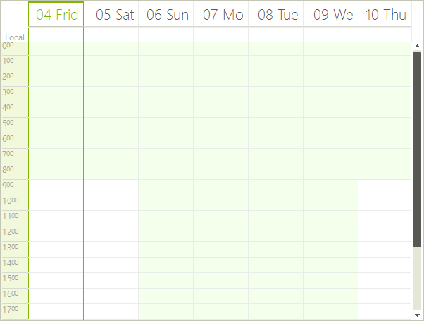
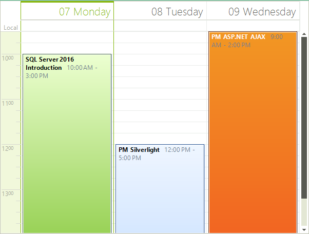
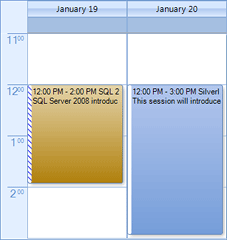
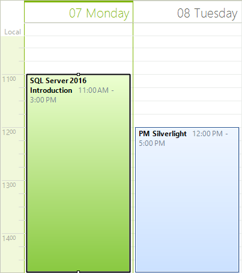

# Day View

## Overview

The Day view shows one or more days at a time. To move to the next or previous day, you can use the back and forward keyboard arrows, or the [SchedulerNavigator]() control.
        
>caption Figure 1: Day View


## Setting Day View

The Day View is the default RadScheduler view, but you can explicitly set it to be the view which the user sees:

#### Set Day View

{{source=..\SamplesCS\Scheduler\Views\DayView.cs region=activeViewType1}} 
{{source=..\SamplesVB\Scheduler\Views\DayView.vb region=activeViewType1}} 

````C#
this.radScheduler1.ActiveViewType = SchedulerViewType.Day;

````
````VB.NET
Me.RadScheduler1.ActiveViewType = SchedulerViewType.Day

````

{{endregion}} 

## Getting Day View

To get the instance to the SchedulerDayView from the RadScheduler object, either:
* use the __GetDayView__ method:

#### GetDayView Method

{{source=..\SamplesCS\Scheduler\Views\DayView.cs region=getDayView}} 
{{source=..\SamplesVB\Scheduler\Views\DayView.vb region=getDayView}} 

````C#
SchedulerDayView dayView = this.radScheduler1.GetDayView();

````
````VB.NET
Dim dayView As SchedulerDayView = Me.RadScheduler1.GetDayView()

````

{{endregion}} 

>note This method returns null if the active view of the scheduler is not SchedulerDayView.
>

* use the the RadScheduler __ActiveView__ property:

#### ActiveView Property

{{source=..\SamplesCS\Scheduler\Views\DayView.cs region=activeView2}} 
{{source=..\SamplesVB\Scheduler\Views\DayView.vb region=activeView2}} 

````C#
if (this.radScheduler1.ActiveViewType == SchedulerViewType.Day)
{
    SchedulerDayView activeDayView = (SchedulerDayView)this.radScheduler1.ActiveView;
}

````
````VB.NET
If Me.RadScheduler1.ActiveViewType = SchedulerViewType.Day Then
    Dim activeDayView As SchedulerDayView = CType(Me.RadScheduler1.ActiveView, SchedulerDayView)
End If

````

{{endregion}}

## Changing the number of days visible

The Day View can show a predefined number of days through the __DayCount__ property. The default value is 3 days, whereas the minimum value is 1 day and the maximum is 10 days:

#### Day Count

{{source=..\SamplesCS\Scheduler\Views\DayView.cs region=dayCount}} 
{{source=..\SamplesVB\Scheduler\Views\DayView.vb region=dayCount}} 

````C#
dayView.DayCount = 3;

````
````VB.NET
dayView.DayCount = 3

````

{{endregion}} 


## Changing The Work Time

The work time hours is a predefined range of hours, which can be specified within the timeline to make it easier for end-users to carry out scheduling. They are properly indicated by a lighter color, similar to Microsoft Outlook, and are controled from the __TimeInterval__ property.

#### Work Time

{{source=..\SamplesCS\Scheduler\Views\DayView.cs region=workTime}} 
{{source=..\SamplesVB\Scheduler\Views\DayView.vb region=workTime}} 

````C#
dayView.WorkTime = TimeInterval.DefaultWorkTime;

````
````VB.NET
dayView.WorkTime = TimeInterval.DefaultWorkTime

````

{{endregion}} 

Example when you set a 4 hour working day:

>caption Figure 2: Four Hour Working Day


Additionally, you can specify which week days are part of the working week. This can be achieved by setting the __WorkWeekStart__ and __WorkWeekEnd__ properties.

#### Work Week Start and End 

{{source=..\SamplesCS\Scheduler\Views\DayView.cs region=workWeek}} 
{{source=..\SamplesVB\Scheduler\Views\DayView.vb region=workWeek}} 

````C#
dayView.WorkWeekStart = DayOfWeek.Thursday;
dayView.WorkWeekEnd = DayOfWeek.Saturday;

````
````VB.NET
dayView.WorkWeekStart = DayOfWeek.Thursday
dayView.WorkWeekEnd = DayOfWeek.Saturday

````

{{endregion}} 

## Showing and hiding the Day Headers

Showing/hiding the day headers is done through the __ShowHeader__ property (the default setting is True):

#### Show Day Headers

{{source=..\SamplesCS\Scheduler\Views\DayView.cs region=showHeader}} 
{{source=..\SamplesVB\Scheduler\Views\DayView.vb region=showHeader}} 

````C#
dayView.ShowHeader = true;

````
````VB.NET
dayView.ShowHeader = True

````

{{endregion}} 

## Customizing the day header format

RadScheduler uses the [.NET Standard DateTime Format Strings](http://msdn.microsoft.com/en-us/library/az4se3k1(VS.71).aspx), which can be set through the __HeaderFormat__ property (either in design time or through code). The default value is "MMMM dd":

#### Set Header Format

{{source=..\SamplesCS\Scheduler\Views\DayView.cs region=headerFormat}} 
{{source=..\SamplesVB\Scheduler\Views\DayView.vb region=headerFormat}} 

````C#
dayView.HeaderFormat = "MMMM dd";

````
````VB.NET
dayView.HeaderFormat = "MMMM dd"

````

{{endregion}} 


## Ruler Scale

The default __scale of the ruler__ can be set with a single property (__RangeFactor__) to any of the predefined values, or the user can select a new scale by simply right-clicking in the time ruler and selecting the preferable setting. The Range factor modes are (the default is 60 minutes):

* 5 minutes

* 6 minutes

* 10 minutes

* 15 minutes (quarter hour)

* 30 minutes (half hour)

* 60 minutes (one hour) - this is the default value.

#### Set Ruler Scale

{{source=..\SamplesCS\Scheduler\Views\DayView.cs region=rangeFactor}} 
{{source=..\SamplesVB\Scheduler\Views\DayView.vb region=rangeFactor}} 

````C#
dayView.RangeFactor = ScaleRange.Hour;

````
````VB.NET
dayView.RangeFactor = ScaleRange.Hour

````

{{endregion}} 

## Ruler Height and Row Height

The size of the ruler height (and row height respectively) is controlled by the __RulerScaleSize__ property, for example 50px:

#### Set Ruler Size

{{source=..\SamplesCS\Scheduler\Views\DayView.cs region=rulerScaleSize}} 
{{source=..\SamplesVB\Scheduler\Views\DayView.vb region=rulerScaleSize}} 

````C#
dayView.RulerScaleSize = 50;

````
````VB.NET
dayView.RulerScaleSize = 50

````

{{endregion}} 

## Start and End Times

You can control which hours are visible in the view by using __RulerStartScale__ and __RulerEndScale__ properties, where the start time cannot be bigger than the end time. The minimum and maximum values should are between 0 and 24. Setting the start and end times is needed when you do not want to show all hours in a day. Additionally, you can use the __RulerStartScaleMinutes__ and __RulerEndScaleMinutes__ properties to go into more detail and specify the minutes part of the starting and ending times. Note that the minutes are automatically rounded down to the previous ruler tick. You can use the __RulerScale__ property to set the frequency of the ruler ticks. The following example shows how you can show the time between 9:30 and 14:45:

#### Ruler Start and End

{{source=..\SamplesCS\Scheduler\Views\DayView.cs region=rulerStartScale}} 
{{source=..\SamplesVB\Scheduler\Views\DayView.vb region=rulerStartScale}} 

````C#
dayView.RangeFactor = ScaleRange.QuarterHour;
dayView.RulerStartScale = 9;
dayView.RulerStartScaleMinutes = 30;
dayView.RulerEndScale = 14; 
dayView.RulerEndScaleMinutes = 45;

````
````VB.NET
dayView.RangeFactor = ScaleRange.QuarterHour
dayView.RulerStartScale = 9
dayView.RulerStartScaleMinutes = 30
dayView.RulerEndScale = 14
dayView.RulerEndScaleMinutes = 45

````

{{endregion}} 

>caption Figure 3: Ruler Scaling


## Ruler Time Format (am/pm)

The __RulerFormatStrings__ property changes the time format in the ruler between am and pm.   The properties of the __RulerFormatStrings__ class allow you to specify the hour and minute formats for both types of ticks (whole hour ticks and sub hour ticks). The following example demonstrates the usage of __RulerFormatStrings__:

#### Set 12 Hour Time Format

{{source=..\SamplesCS\Scheduler\Views\DayView.cs region=12rulerTimeFormat}} 
{{source=..\SamplesVB\Scheduler\Views\DayView.vb region=12rulerTimeFormat}} 

````C#
dayView.RulerStartScale = 9;
dayView.RulerEndScale = 14;
dayView.RulerFormatStrings = new RulerFormatStrings("%h", "mm", "", "");

````
````VB.NET
dayView.RulerStartScale = 9
dayView.RulerEndScale = 14
dayView.RulerFormatStrings = New RulerFormatStrings("%h", "mm", "", "")

````

{{endregion}} 

>caption Figure 4: 12 Hour Time Format


#### Set 24 Hour Time Format

{{source=..\SamplesCS\Scheduler\Views\DayView.cs region=24rulerTimeFormat}} 
{{source=..\SamplesVB\Scheduler\Views\DayView.vb region=24rulerTimeFormat}} 

````C#
dayView.RulerStartScale = 9;
dayView.RulerEndScale = 14;
dayView.RulerFormatStrings = new RulerFormatStrings("%H", "mm", "", "");

````
````VB.NET
dayView.RulerStartScale = 9
dayView.RulerEndScale = 14
dayView.RulerFormatStrings = New RulerFormatStrings("%H", "mm", "", "")

````

{{endregion}} 

>caption Figure 5: 24 Hour Time Format


## Showing and Hiding the Ruler

To show and hide the ruler, use the __ShowRuler__ property:

#### Show Ruler

{{source=..\SamplesCS\Scheduler\Views\DayView.cs region=showRuler}} 
{{source=..\SamplesVB\Scheduler\Views\DayView.vb region=showRuler}} 

````C#
dayView.ShowRuler = true;

````
````VB.NET
dayView.ShowRuler = True

````

{{endregion}} 

## Ruler Width 

The width of the ruler is controlled from the __RulerWidth__ property, whereas the minimum value is 0, and the default value is 40px:

#### Set Ruler Width

{{source=..\SamplesCS\Scheduler\Views\DayView.cs region=rulerWidth}} 
{{source=..\SamplesVB\Scheduler\Views\DayView.vb region=rulerWidth}} 

````C#
dayView.RulerWidth = 40;

````
````VB.NET
dayView.RulerWidth = 40

````

{{endregion}} 

## Current Time Pointer

The current time pointer is a thin line on the ruler and on the today’s column in the appointments area and it visually represents the current time. The current time pointer belongs to the __RulerPrimitive__ which is a visual element, part of the element tree of __SchedulerDayViewElement__. You can manipulate this line in two ways – by setting its style or by setting its width. The following code snippet demonstrates this:

#### Time Pointer

{{source=..\SamplesCS\Scheduler\Views\DayView.cs region=currentTimePointer}} 
{{source=..\SamplesVB\Scheduler\Views\DayView.vb region=currentTimePointer}} 

````C#
SchedulerDayViewElement dayViewElement = (SchedulerDayViewElement)this.radScheduler1.ViewElement;
dayViewElement.DataAreaElement.Ruler.TimePointerStyle = RulerCurrentTimePointer.Arrow;
dayViewElement.DataAreaElement.Ruler.CurrentTimePointerWidth = 3;
dayViewElement.DataAreaElement.Ruler.CurrentTimePointerColor = Color.Red;

````
````VB.NET
Dim dayViewElement As SchedulerDayViewElement = DirectCast(Me.RadScheduler1.ViewElement, SchedulerDayViewElement)
dayViewElement.DataAreaElement.Ruler.TimePointerStyle = RulerCurrentTimePointer.Arrow
dayViewElement.DataAreaElement.Ruler.CurrentTimePointerWidth = 3
dayViewElement.DataAreaElement.Ruler.CurrentTimePointerColor = Color.Red

````

{{endregion}} 

## The All Day Area

The AllDay area contains appointments that are either defined as AllDay appointments or their duration is greater than 24 hours. The appointments in this area are displayed with a fixed height (unless __AutoSizeAppointments__ is enabled). When the total height of the appointments reaches a certain value, a vertical scrollbar is displayed. Using the properties of the __AllDayHeaderElement__ you can manipulate the height of the appointments and the maximum height before the scrollbar appears:

#### Modify All Day Area

{{source=..\SamplesCS\Scheduler\Views\DayView.cs region=allDayArea}} 
{{source=..\SamplesVB\Scheduler\Views\DayView.vb region=allDayArea}} 

````C#
dayViewElement.AllDayHeaderElement.HeaderHeight = 50;
dayViewElement.AllDayHeaderElement.MaxHeaderHeight = 200;

````
````VB.NET
dayViewElement.AllDayHeaderElement.HeaderHeight = 50
dayViewElement.AllDayHeaderElement.MaxHeaderHeight = 200

````

{{endregion}}

## Modifying The Size Of Day View Columns

The __SchedulerDayViewElement__ allows you to specify different size for the different columns. To manipulate the size of the columns, you can use the __SetColumnWidth__ and __GetColumnWidth__ methods. The values passed to the __SetColumnWidth__ method are proportional and the actual width of the columns is calculated based on them. By default all columns have a value of 1 and therefore if you set a value of 2 to any column, it will stay twice as bigger compared to the others.

#### Set Column Size

{{source=..\SamplesCS\Scheduler\Views\DayView.cs region=resizeColumns}} 
{{source=..\SamplesVB\Scheduler\Views\DayView.vb region=resizeColumns}} 

````C#
dayViewElement.SetColumnWidth(2, 2);

````
````VB.NET
dayViewElement.SetColumnWidth(2, 2)

````

{{endregion}} 

>caption Figure 6: Column Size


# See Also

* [Common Visual Properties]()
* [Working with Views]()
* [Views Walkthrough]()
* [Grouping by Resources]()
* [Exact Time Rendering]()
