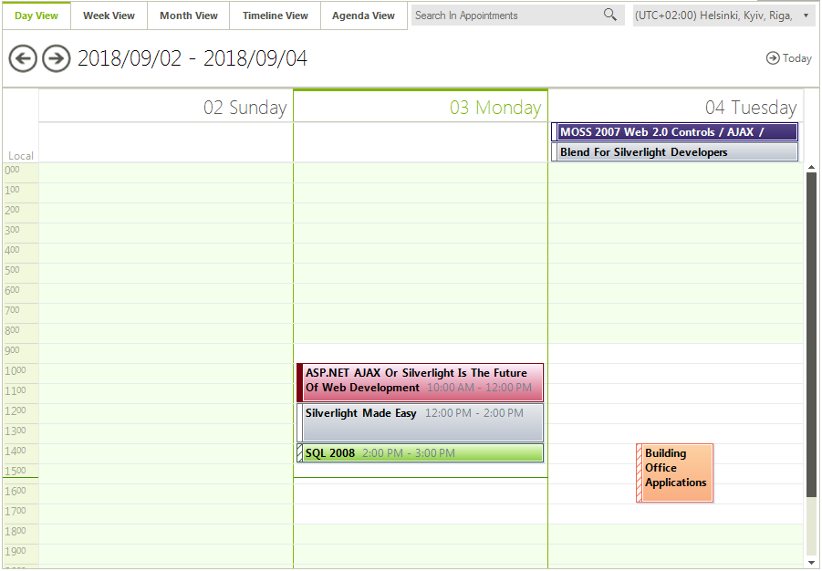
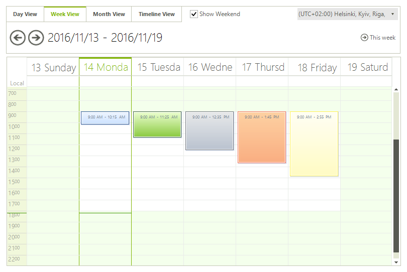
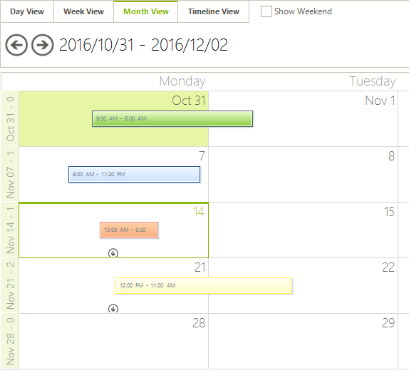
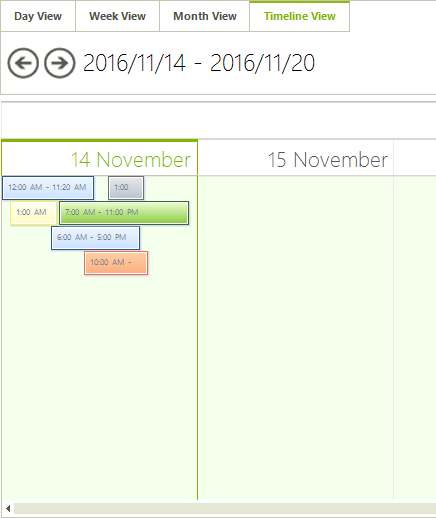

# Exact time rendering

## 

__RadScheduler__ supports functionality to arrange appointments according to their start time and duration. The __EnableExactTimeRendering__ property should get or set a value, indicating whether the appointment start and end time should be rendered exactly. By default its value is *false*.

>note Due to the great difference in the amount of time, which different time scales represent, appointments might become too small to render accurately in larger time scales.
>

* __Day View:__
    

* __Week View:__
    

* __Month View:__
    

* __Timeline View:__
    
