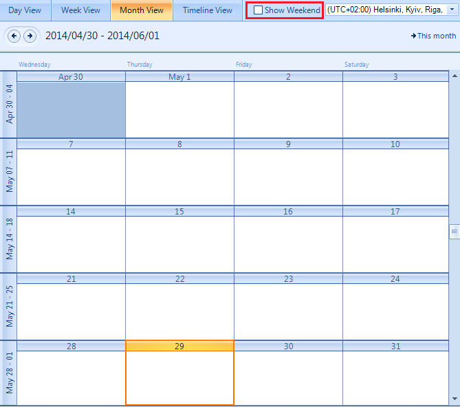
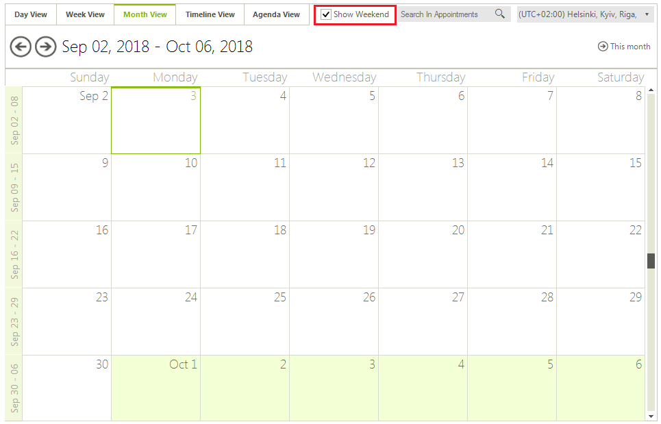
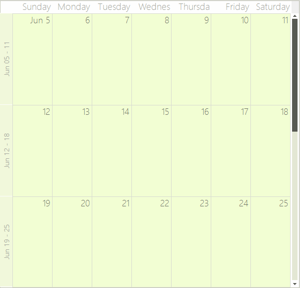

# Month View

## Month View Overview

The Month view shows one month at a time, or a preset number of weeks. To move to the next day or previous month, you can use the back and forward keyboard arrows, or the [SchedulerNavigator]() control.
        

## Structure of Month View

The [Month View]() of the scheduler simply has a __Header__, __Month Cells__ for every day in the month and zero or more __Appointment Cells__ in each month cell.
        

## Setting the Month View

The Week View can be set it to be the default view which the user sees:

#### __[C#]__

{{source=..\SamplesCS\Scheduler\Views\MonthView.cs region=activeViewType}}
	
	            this.radScheduler1.ActiveViewType = Telerik.WinControls.UI.SchedulerViewType.Month;
	            
	{{endregion}}

#### __[VB.NET]__

{{source=..\SamplesVB\Scheduler\Views\MonthView.vb region=activeViewType}}
	        Me.RadScheduler1.ActiveViewType = Telerik.WinControls.UI.SchedulerViewType.Month
	{{endregion}}

## Getting Month View

To get the instance to the SchedulerMonthView from the RadScheduler object:

* use the __GetMonthView__ method:
            

#### __[C#]__

{{source=..\SamplesCS\Scheduler\Views\MonthView.cs region=getMonthView}}
	            
	            SchedulerMonthView monthView = this.radScheduler1.GetMonthView();
	                
	{{endregion}}

#### __[VB.NET]__

{{source=..\SamplesVB\Scheduler\Views\MonthView.vb region=getMonthView}}
	        Dim monthView As SchedulerMonthView = Me.RadScheduler1.GetMonthView()
	{{endregion}}

## Showing/hiding the weekend

By default the weekends are shown, but you can hide them by using the __ShowWeekend__ property: 
        

#### __[C#]__

{{source=..\SamplesCS\Scheduler\Views\MonthView.cs region=showWeekend}}
	
	            monthView.ShowWeekend = false;
	            
	{{endregion}}

#### __[VB.NET]__

{{source=..\SamplesVB\Scheduler\Views\MonthView.vb region=showWeekend}}
	        monthView.ShowWeekend = False
	{{endregion}}

You can also specify which days to be considered weekends. The WorkWeekStart and WorkWeekEnd properties allow you to achieve this:
        

#### __[C#]__

{{source=..\SamplesCS\Scheduler\Views\MonthView.cs region=workWeek}}
	            monthView.WorkWeekStart = DayOfWeek.Tuesday;
	            monthView.WorkWeekEnd = DayOfWeek.Thursday;
	{{endregion}}

#### __[VB.NET]__

{{source=..\SamplesVB\Scheduler\Views\MonthView.vb region=workWeek}}
	        monthView.WorkWeekStart = DayOfWeek.Tuesday
	        monthView.WorkWeekEnd = DayOfWeek.Thursday
	{{endregion}}

## Changing the start/end work days 

The work days determine the start and end days for the work week. All days outside the work days range are part of the weekend.

#### __[C#]__

{{source=..\SamplesCS\Scheduler\Views\MonthView.cs region=workDays}}
	            
	            monthView.WorkWeekStart = DayOfWeek.Wednesday;
	            monthView.WorkWeekEnd = DayOfWeek.Saturday;
	            
	{{endregion}}

#### __[VB.NET]__

{{source=..\SamplesVB\Scheduler\Views\MonthView.vb region=workDays}}
	        monthView.WorkWeekStart = DayOfWeek.Wednesday
	        monthView.WorkWeekEnd = DayOfWeek.Saturday
	
	{{endregion}}

## Setting the number of weeks

By default the Month view shows 3 weeks at a time, but this can be changed by using the __WeekCount__ property (the minimum value is 1 week): 
        

#### __[C#]__

{{source=..\SamplesCS\Scheduler\Views\MonthView.cs region=weekCount}}
	            
	            monthView.WeekCount = 5;
	
	{{endregion}}

#### __[VB.NET]__

{{source=..\SamplesVB\Scheduler\Views\MonthView.vb region=weekCount}}
	        monthView.WeekCount = 5
	{{endregion}}

## Getting the week days displayed

#### __[C#]__

{{source=..\SamplesCS\Scheduler\Views\MonthView.cs region=weekDaysCount}}
	            
	            int weekDaysCount = monthView.WeekDaysCount;
	            
	{{endregion}}

#### __[VB.NET]__

{{source=..\SamplesVB\Scheduler\Views\MonthView.vb region=weekDaysCount}}
	        Dim weekDaysCount As Integer = monthView.WeekDaysCount
	{{endregion}}

## Showing full month

It is possible to indicate whether the month view should always display exactly one month with the respective number of weeks.

#### __[C#]__

{{source=..\SamplesCS\Scheduler\Views\MonthView.cs region=showFullMonth}}
	            
	            monthView.ShowFullMonth = true;
	
	{{endregion}}

#### __[VB.NET]__

{{source=..\SamplesVB\Scheduler\Views\MonthView.vb region=showFullMonth}}
	        monthView.ShowFullMonth = True
	{{endregion}}

## Showing/hiding the vertical navigator

#### __[C#]__

{{source=..\SamplesCS\Scheduler\Views\MonthView.cs region=showVerticalNavigator}}
	        
	            monthView.ShowVerticalNavigator = false;
	
	{{endregion}}

#### __[VB.NET]__

{{source=..\SamplesVB\Scheduler\Views\MonthView.vb region=showVerticalNavigator}}
	        monthView.ShowVerticalNavigator = False
	{{endregion}}

## Setting the vertical navigator range

#### __[C#]__

{{source=..\SamplesCS\Scheduler\Views\MonthView.cs region=verticalNavigatorRange}}
	
	            monthView.RangeStartDate = new DateTime(2014, 6, 10);
	            monthView.RangeEndDate = new DateTime(2014, 7, 20);
	
	{{endregion}}

#### __[VB.NET]__

{{source=..\SamplesVB\Scheduler\Views\MonthView.vb region=verticalNavigatorRange}}
	
	        monthView.RangeStartDate = New DateTime(2014, 6, 10)
	        monthView.RangeEndDate = New DateTime(2014, 7, 20)
	
	{{endregion}}

## Showing and hiding the week (row) headers

The week (row) headers display the date range presented by the respective row.
          By clicking on them, the user can navigate to WeekView with the specified range. Showing/hiding the week (row) headers
          is done through the __ShowWeeksHeader__ property (the default setting is True). To allow or disallow navigating to WeekView
          on click, you can set the __EnableWeeksHeader__ property (which also defaults to True)
        

#### __[C#]__

{{source=..\SamplesCS\Scheduler\Views\MonthView.cs region=showWeeksHeader}}
	
	            monthView.ShowWeeksHeader = true;
	            monthView.EnableWeeksHeader = false;
	{{endregion}}

#### __[VB.NET]__

{{source=..\SamplesVB\Scheduler\Views\MonthView.vb region=showWeeksHeader}}
	        monthView.ShowWeeksHeader = True
	        monthView.EnableWeeksHeader = True
	{{endregion}}

## Customizing the week (row) header format

RadScheduler uses the [.NET Standard DateTime Format Strings](http://msdn.microsoft.com/en-us/library/az4se3k1(VS.71).aspx), which can be set through the HeaderFormat property (either in design time or through code). The default value is "MMMM dd":
        

#### __[C#]__

{{source=..\SamplesCS\Scheduler\Views\MonthView.cs region=headerFormat}}
	            radScheduler1.HeaderFormat = "MMMM dd";
	{{endregion}}

#### __[VB.NET]__

{{source=..\SamplesVB\Scheduler\Views\MonthView.vb region=headerFormat}}
	        RadScheduler1.HeaderFormat = "MMMM dd"
	{{endregion}}

## Showing an exact month

You can set the __ShowFullMonth__ property to force the __SchedulerMonthView__ to always display exactly
          one month no matter how many weeks it contains. When this property is enabled, the view will
          always navigate to the beginning of the previous/next month and the WeekCount will automatically be updated according to the number of weeks in the target month.
        

#### __[C#]__

{{source=..\SamplesCS\Scheduler\Views\MonthView.cs region=showFullMonth}}
	            
	            monthView.ShowFullMonth = true;
	
	{{endregion}}

#### __[VB.NET]__

{{source=..\SamplesVB\Scheduler\Views\MonthView.vb region=showFullMonth}}
	        monthView.ShowFullMonth = True
	{{endregion}}

## Vertical Scrolling

The vertical scrollbar in MonthView allows for quick navigation in large date ranges.
          To show or hide the vertical scrollbar you can use the __ShowVerticalNavigator__ property.
          When the vertical scrollbar is displayed it can navigate through the date range defined by the __RangeStartDate__ and __RangeEndDate__ properties.
          These properties do not limit keyboard navigation outside this range but only stand for specifying the range of the vertical scrollbar.
        

#### __[C#]__

{{source=..\SamplesCS\Scheduler\Views\MonthView.cs region=verticalScrolling}}
	            monthView.ShowVerticalNavigator = true;
	            monthView.RangeStartDate = DateTime.Today.AddYears(-1);
	            monthView.RangeEndDate = DateTime.Today.AddYears(1);
	{{endregion}}

#### __[VB.NET]__

{{source=..\SamplesVB\Scheduler\Views\MonthView.vb region=verticalScrolling}}
	        monthView.ShowVerticalNavigator = True
	        monthView.RangeStartDate = DateTime.Today.AddYears(-1)
	        monthView.RangeEndDate = DateTime.Today.AddYears(1)
	{{endregion}}

## Handling overflown cells

RadScheduler handles the overflown cells in month view in two ways. The first one is by displaying a cell
          overflow button at the bottom of each cell that has more appointments than it can display. Clicking on this
          button opens a DayView set to the same date the cell represents. This way the user can scroll through and preview
          all appointments. The second way to handle overflown cells is by displaying a scrollbar at the end of each row if this
          row contains overflown cells. Using the scrollbar the end user can scroll directly through the appointments. Both of these
          features can be disabled or enabled using the following properties:
        

#### __[C#]__

{{source=..\SamplesCS\Scheduler\Views\MonthView.cs region=columnRowResize}}
	            SchedulerMonthViewElement monthViewElement = (SchedulerMonthViewElement)this.radScheduler1.ViewElement;
	            monthViewElement.SetRowHeight(1, 2);
	            monthViewElement.SetColumnWidth(1, 2);
	{{endregion}}

#### __[VB.NET]__

{{source=..\SamplesVB\Scheduler\Views\MonthView.vb region=columnRowResize}}
	        Dim monthViewElement As SchedulerMonthViewElement = DirectCast(Me.RadScheduler1.ViewElement, SchedulerMonthViewElement)
	        monthViewElement.SetRowHeight(1, 2)
	        monthViewElement.SetColumnWidth(1, 2)
	{{endregion}}

## Modifying the size of rows and columns in MonthView

The __SchedulerMonthViewElement__ allows you to specify different size for the different
          columns. To manipulate the size of the columns, you can use the __SetColumnWidth__, __GetColumnWidth__,
          __SetRowHeight__, __GetRowHeight__ methods. The values passed to the SetColumnWidth and SetRowHeight methods
          are proportional and the actual width of the columns is calculated based on them.
          By default all columns have a value of 1 and therefore if you set a value of 2 to any column, it will stay twice as bigger compared to the others.
        

#### __[C#]__

{{source=..\SamplesCS\Scheduler\Views\MonthView.cs region=columnRowResize}}
	            SchedulerMonthViewElement monthViewElement = (SchedulerMonthViewElement)this.radScheduler1.ViewElement;
	            monthViewElement.SetRowHeight(1, 2);
	            monthViewElement.SetColumnWidth(1, 2);
	{{endregion}}

#### __[VB.NET]__

{{source=..\SamplesVB\Scheduler\Views\MonthView.vb region=columnRowResize}}
	        Dim monthViewElement As SchedulerMonthViewElement = DirectCast(Me.RadScheduler1.ViewElement, SchedulerMonthViewElement)
	        monthViewElement.SetRowHeight(1, 2)
	        monthViewElement.SetColumnWidth(1, 2)
	{{endregion}}

## Modifying the size of the headers in MonthView

The month view of RadScheduler contains two headers – the horizontal __MonthViewHeader__,
          which displays the weekdays on top of the columns, and the vertical __MonthViewVerticalHeader__,
          which displays the date ranges for each row. You can modify the size of these headers by accessing the respective element and its properties:
        

#### __[C#]__

{{source=..\SamplesCS\Scheduler\Views\MonthView.cs region=headerResize}}
	            monthViewElement.VerticalHeader.HeaderWidth = 50;
	            monthViewElement.Header.HeaderHeight = 50;
	{{endregion}}

#### __[VB.NET]__

{{source=..\SamplesVB\Scheduler\Views\MonthView.vb region=headerResize}}
	        monthViewElement.VerticalHeader.HeaderWidth = 50
	        monthViewElement.Header.HeaderHeight = 50
	{{endregion}}

