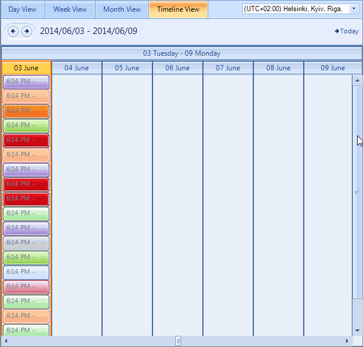

# Timeline View

## Timeline View Overview

RadScheduler's __Timeline__ view allows you to display appointments in horizontally arranged time slots. Consequently, time slots can be configured
          by duration and the time scale can be set for minutes to years. User capabilities include creating, adding, and modifying appointments at run-time,
          appointment and cell selection, resizing, drag and drop, keyboard navigation, a customizable timeline context menu and resource grouping support.
          To move to the next day or previous month, you can use the back and forward keyboard arrows, or the
          [SchedulerNavigator]() control.
        

## Structure of Timeline View

The [Timeline View]() of the scheduler simply
          has a __Header__, __Columns__ for every hour/day/week/month and zero or more __Appointment Cells__.     
        

## Setting the Timeline View

The Timeline View can be set it to be the default view which the user sees:

#### __[C#]__

{{source=..\SamplesCS\Scheduler\Views\TimelineView.cs region=activeViewType}}
	            
	            this.radScheduler1.ActiveViewType = Telerik.WinControls.UI.SchedulerViewType.Timeline;
	
	{{endregion}}

#### __[VB.NET]__

{{source=..\SamplesVB\Scheduler\Views\TimelineView.vb region=activeViewType}}
	        Me.RadScheduler1.ActiveViewType = Telerik.WinControls.UI.SchedulerViewType.Timeline
	        '#End Region
	
	        '#Region timelineView
	        Dim timelineView As SchedulerTimelineView = Me.RadScheduler1.GetTimelineView()
	        '#End Region
	
	        '#Region activeView
	        If Me.RadScheduler1.ActiveViewType = SchedulerViewType.Timeline Then
	            Dim activeTimelineView As SchedulerTimelineView = CType(Me.RadScheduler1.ActiveView, SchedulerTimelineView)
	        End If
	        '#End Region
	
	        '#Region getTimelineView
	        Me.RadScheduler1.GetTimelineView().RangeStartDate = New Date(2010, 1, 20)
	        Me.RadScheduler1.GetTimelineView().RangeEndDate = New Date(2010, 2, 20)
	        Me.RadScheduler1.GetTimelineView().StartDate = New Date(2010, 2, 1)
	        '#End Region
	
	        '#Region duration
	        Dim duration As TimeSpan = timelineView.Duration
	        '			#End Region
	
	        '#Region showTimescale
	        Dim scale As Timescales = Timescales.Hours
	        timelineView.ShowTimescale(scale)
	        '#End Region
	
	        '#Region getTimescale
	        Dim currentScaling As SchedulerTimescale = timelineView.GetScaling()
	        currentScaling.Format = "dd MMM"
	        currentScaling.DisplayedCellsCount = 8
	        '#End Region
	
	        '#Region navigationElements
	        timelineView.ShowNavigationElement = False
	        timelineView.ShowVerticalScrollBar = False
	        '#End Region
	
	        '#Region resizeColumns
	        Dim viewElement As SchedulerTimelineViewElement = CType(RadScheduler1.ViewElement, SchedulerTimelineViewElement)
	        viewElement.SetColumnWidth(1, 2)
	        '#End Region
	
	        '#Region headerSizing
	        viewElement.ColumnHeaderHeight = 70
	        viewElement.ViewHeaderHeight = 35
	        '#End Region
	
	
	        '#Region "verticalScrollBar"
	        timelineView.ShowVerticalScrollBar = True
	        '#End Region
	
	    End Sub
	End Class

## Getting Timeline View

To get the instance to the Scheduler Timeline View from the RadScheduler object, either:

* the __GetTimelineView__ method:
            

#### __[C#]__

{{source=..\SamplesCS\Scheduler\Views\TimelineView.cs region=timelineView}}
	
	            SchedulerTimelineView timelineView = this.radScheduler1.GetTimelineView();
	            
	{{endregion}}

#### __[VB.NET]__

{{source=..\SamplesVB\Scheduler\Views\TimelineView.vb region=timelineView}}
	        Dim timelineView As SchedulerTimelineView = Me.RadScheduler1.GetTimelineView()
	        '#End Region
	
	        '#Region activeView
	        If Me.RadScheduler1.ActiveViewType = SchedulerViewType.Timeline Then
	            Dim activeTimelineView As SchedulerTimelineView = CType(Me.RadScheduler1.ActiveView, SchedulerTimelineView)
	        End If
	        '#End Region
	
	        '#Region getTimelineView
	        Me.RadScheduler1.GetTimelineView().RangeStartDate = New Date(2010, 1, 20)
	        Me.RadScheduler1.GetTimelineView().RangeEndDate = New Date(2010, 2, 20)
	        Me.RadScheduler1.GetTimelineView().StartDate = New Date(2010, 2, 1)
	        '#End Region
	
	        '#Region duration
	        Dim duration As TimeSpan = timelineView.Duration
	        '			#End Region
	
	        '#Region showTimescale
	        Dim scale As Timescales = Timescales.Hours
	        timelineView.ShowTimescale(scale)
	        '#End Region
	
	        '#Region getTimescale
	        Dim currentScaling As SchedulerTimescale = timelineView.GetScaling()
	        currentScaling.Format = "dd MMM"
	        currentScaling.DisplayedCellsCount = 8
	        '#End Region
	
	        '#Region navigationElements
	        timelineView.ShowNavigationElement = False
	        timelineView.ShowVerticalScrollBar = False
	        '#End Region
	
	        '#Region resizeColumns
	        Dim viewElement As SchedulerTimelineViewElement = CType(RadScheduler1.ViewElement, SchedulerTimelineViewElement)
	        viewElement.SetColumnWidth(1, 2)
	        '#End Region
	
	        '#Region headerSizing
	        viewElement.ColumnHeaderHeight = 70
	        viewElement.ViewHeaderHeight = 35
	        '#End Region
	
	
	        '#Region "verticalScrollBar"
	        timelineView.ShowVerticalScrollBar = True
	        '#End Region
	
	    End Sub
	End Class

>This method returns null if the active view of the scheduler is not SchedulerTimelineView.

* use the the RadScheduler __ActiveView__ property:       
            

#### __[C#]__

{{source=..\SamplesCS\Scheduler\Views\TimelineView.cs region=activeView}}
	            
	            this.radScheduler1.ActiveViewType = Telerik.WinControls.UI.SchedulerViewType.Timeline;
	
	{{endregion}}

#### __[VB.NET]__

{{source=..\SamplesVB\Scheduler\Views\TimelineView.vb region=activeView}}
	        If Me.RadScheduler1.ActiveViewType = SchedulerViewType.Timeline Then
	            Dim activeTimelineView As SchedulerTimelineView = CType(Me.RadScheduler1.ActiveView, SchedulerTimelineView)
	        End If
	        '#End Region
	
	        '#Region getTimelineView
	        Me.RadScheduler1.GetTimelineView().RangeStartDate = New Date(2010, 1, 20)
	        Me.RadScheduler1.GetTimelineView().RangeEndDate = New Date(2010, 2, 20)
	        Me.RadScheduler1.GetTimelineView().StartDate = New Date(2010, 2, 1)
	        '#End Region
	
	        '#Region duration
	        Dim duration As TimeSpan = timelineView.Duration
	        '			#End Region
	
	        '#Region showTimescale
	        Dim scale As Timescales = Timescales.Hours
	        timelineView.ShowTimescale(scale)
	        '#End Region
	
	        '#Region getTimescale
	        Dim currentScaling As SchedulerTimescale = timelineView.GetScaling()
	        currentScaling.Format = "dd MMM"
	        currentScaling.DisplayedCellsCount = 8
	        '#End Region
	
	        '#Region navigationElements
	        timelineView.ShowNavigationElement = False
	        timelineView.ShowVerticalScrollBar = False
	        '#End Region
	
	        '#Region resizeColumns
	        Dim viewElement As SchedulerTimelineViewElement = CType(RadScheduler1.ViewElement, SchedulerTimelineViewElement)
	        viewElement.SetColumnWidth(1, 2)
	        '#End Region
	
	        '#Region headerSizing
	        viewElement.ColumnHeaderHeight = 70
	        viewElement.ViewHeaderHeight = 35
	        '#End Region
	
	
	        '#Region "verticalScrollBar"
	        timelineView.ShowVerticalScrollBar = True
	        '#End Region
	
	    End Sub
	End Class

## Setting the time range and first date

The time range that the timeline shows can be set with the __RangeStartDate__ and __RangeEndDate__ 
          properties, where __RangeEndDate__ must be bigger than __RangeStartDate__. The scheduler will 
          not be able to navigate outside this range.
        

The __StartDate__ property sets the first date that is shown in the timeline view. This property should contain a date which is after
          __RangeStartDate__ and __RangeEndDate__.
        

#### __[C#]__

{{source=..\SamplesCS\Scheduler\Views\TimelineView.cs region=getTimelineView}}
	            
	            this.radScheduler1.GetTimelineView().RangeStartDate = new DateTime(2010, 1, 20);
	            this.radScheduler1.GetTimelineView().RangeEndDate = new DateTime(2010, 2, 20);
	            this.radScheduler1.GetTimelineView().StartDate = new DateTime(2010, 2, 1);
	            
	{{endregion}}

#### __[VB.NET]__

{{source=..\SamplesVB\Scheduler\Views\TimelineView.vb region=getTimelineView}}
	        Me.RadScheduler1.GetTimelineView().RangeStartDate = New Date(2010, 1, 20)
	        Me.RadScheduler1.GetTimelineView().RangeEndDate = New Date(2010, 2, 20)
	        Me.RadScheduler1.GetTimelineView().StartDate = New Date(2010, 2, 1)
	        '#End Region
	
	        '#Region duration
	        Dim duration As TimeSpan = timelineView.Duration
	        '			#End Region
	
	        '#Region showTimescale
	        Dim scale As Timescales = Timescales.Hours
	        timelineView.ShowTimescale(scale)
	        '#End Region
	
	        '#Region getTimescale
	        Dim currentScaling As SchedulerTimescale = timelineView.GetScaling()
	        currentScaling.Format = "dd MMM"
	        currentScaling.DisplayedCellsCount = 8
	        '#End Region
	
	        '#Region navigationElements
	        timelineView.ShowNavigationElement = False
	        timelineView.ShowVerticalScrollBar = False
	        '#End Region
	
	        '#Region resizeColumns
	        Dim viewElement As SchedulerTimelineViewElement = CType(RadScheduler1.ViewElement, SchedulerTimelineViewElement)
	        viewElement.SetColumnWidth(1, 2)
	        '#End Region
	
	        '#Region headerSizing
	        viewElement.ColumnHeaderHeight = 70
	        viewElement.ViewHeaderHeight = 35
	        '#End Region
	
	
	        '#Region "verticalScrollBar"
	        timelineView.ShowVerticalScrollBar = True
	        '#End Region
	
	    End Sub
	End Class

To get the duration between __RangeStartDate__ and __RangeEndDate__ you can use the duration 
          __property__:
        

#### __[C#]__

{{source=..\SamplesCS\Scheduler\Views\TimelineView.cs region=duration}}
	            
	            TimeSpan duration = timelineView.Duration;
	            
	{{endregion}}

#### __[VB.NET]__

{{source=..\SamplesVB\Scheduler\Views\TimelineView.vb region=duration}}
	        Dim duration As TimeSpan = timelineView.Duration
	        '			#End Region
	
	        '#Region showTimescale
	        Dim scale As Timescales = Timescales.Hours
	        timelineView.ShowTimescale(scale)
	        '#End Region
	
	        '#Region getTimescale
	        Dim currentScaling As SchedulerTimescale = timelineView.GetScaling()
	        currentScaling.Format = "dd MMM"
	        currentScaling.DisplayedCellsCount = 8
	        '#End Region
	
	        '#Region navigationElements
	        timelineView.ShowNavigationElement = False
	        timelineView.ShowVerticalScrollBar = False
	        '#End Region
	
	        '#Region resizeColumns
	        Dim viewElement As SchedulerTimelineViewElement = CType(RadScheduler1.ViewElement, SchedulerTimelineViewElement)
	        viewElement.SetColumnWidth(1, 2)
	        '#End Region
	
	        '#Region headerSizing
	        viewElement.ColumnHeaderHeight = 70
	        viewElement.ViewHeaderHeight = 35
	        '#End Region
	
	
	        '#Region "verticalScrollBar"
	        timelineView.ShowVerticalScrollBar = True
	        '#End Region
	
	    End Sub
	End Class

## Setting the default time scale

The default __time scale__ can be set to any of the predefined values, or the user can select a new scale by simply right-clicking 
          in the time table and selecting the preferable setting from the context menu.
        

* Year

* Month

* Week

* Day - this is the default value

* Hour

* 15 minutes

To change the time scaling to HOUR, for example, you need to use the __ShowTimescale__ method:
        

#### __[C#]__

{{source=..\SamplesCS\Scheduler\Views\TimelineView.cs region=showTimescale}}
	            
	            Timescales scale = Timescales.Hours;
	            timelineView.ShowTimescale(scale);
	            
	{{endregion}}

#### __[VB.NET]__

{{source=..\SamplesVB\Scheduler\Views\TimelineView.vb region=showTimescale}}
	        Dim scale As Timescales = Timescales.Hours
	        timelineView.ShowTimescale(scale)
	        '#End Region
	
	        '#Region getTimescale
	        Dim currentScaling As SchedulerTimescale = timelineView.GetScaling()
	        currentScaling.Format = "dd MMM"
	        currentScaling.DisplayedCellsCount = 8
	        '#End Region
	
	        '#Region navigationElements
	        timelineView.ShowNavigationElement = False
	        timelineView.ShowVerticalScrollBar = False
	        '#End Region
	
	        '#Region resizeColumns
	        Dim viewElement As SchedulerTimelineViewElement = CType(RadScheduler1.ViewElement, SchedulerTimelineViewElement)
	        viewElement.SetColumnWidth(1, 2)
	        '#End Region
	
	        '#Region headerSizing
	        viewElement.ColumnHeaderHeight = 70
	        viewElement.ViewHeaderHeight = 35
	        '#End Region
	
	
	        '#Region "verticalScrollBar"
	        timelineView.ShowVerticalScrollBar = True
	        '#End Region
	
	    End Sub
	End Class

## Getting the scale

To get the currently selected scale, use the __GetScaling__ method. After this you can modify properties of the current scale such as the Format property,
          which specifies the date-time format of the header cells, and the __DisplayedCellsCount__ property, which specifies the number of cells to be displayed in the view.

#### __[C#]__

{{source=..\SamplesCS\Scheduler\Views\TimelineView.cs region=getTimescale}}
	            
	            SchedulerTimescale currentScaling = timelineView.GetScaling();
	            currentScaling.Format = "dd MMM";
	            currentScaling.DisplayedCellsCount = 8;
	            
	{{endregion}}

#### __[VB.NET]__

{{source=..\SamplesVB\Scheduler\Views\TimelineView.vb region=getTimescale}}
	        Dim currentScaling As SchedulerTimescale = timelineView.GetScaling()
	        currentScaling.Format = "dd MMM"
	        currentScaling.DisplayedCellsCount = 8
	        '#End Region
	
	        '#Region navigationElements
	        timelineView.ShowNavigationElement = False
	        timelineView.ShowVerticalScrollBar = False
	        '#End Region
	
	        '#Region resizeColumns
	        Dim viewElement As SchedulerTimelineViewElement = CType(RadScheduler1.ViewElement, SchedulerTimelineViewElement)
	        viewElement.SetColumnWidth(1, 2)
	        '#End Region
	
	        '#Region headerSizing
	        viewElement.ColumnHeaderHeight = 70
	        viewElement.ViewHeaderHeight = 35
	        '#End Region
	
	
	        '#Region "verticalScrollBar"
	        timelineView.ShowVerticalScrollBar = True
	        '#End Region
	
	    End Sub
	End Class

## Navigation and scrolling

In TimelineView there are two scrollbars which stand for navigation between dates and scrolling through appointments.
        The horizontal one allows you to scroll fast through the dates in the range specified by the RangeStartDate and RangeEndDate properties. 
        The vertical one appears when there is a cell which contains more appointments than it can fit. This scrollbar allows you to scroll the presenter
        area so you can view the appointments. You can show or hide any of these scrollbars by using the following properties.
      

#### __[C#]__

{{source=..\SamplesCS\Scheduler\Views\TimelineView.cs region=navigationElements}}
	            
	            timelineView.ShowNavigationElement = false;
	            timelineView.ShowVerticalScrollBar = false;
	        
	{{endregion}}

#### __[VB.NET]__

{{source=..\SamplesVB\Scheduler\Views\TimelineView.vb region=navigationElements}}
	        timelineView.ShowNavigationElement = False
	        timelineView.ShowVerticalScrollBar = False
	        '#End Region
	
	        '#Region resizeColumns
	        Dim viewElement As SchedulerTimelineViewElement = CType(RadScheduler1.ViewElement, SchedulerTimelineViewElement)
	        viewElement.SetColumnWidth(1, 2)
	        '#End Region
	
	        '#Region headerSizing
	        viewElement.ColumnHeaderHeight = 70
	        viewElement.ViewHeaderHeight = 35
	        '#End Region
	
	
	        '#Region "verticalScrollBar"
	        timelineView.ShowVerticalScrollBar = True
	        '#End Region
	
	    End Sub
	End Class

## Modifying the size of the columns

The SchedulerTimelineViewElement allows you to specify different size for the different columns. To manipulate the size of the columns, you can use the 
          __SetColumnWidth__ and __GetColumnWidth__ methods. The values passed to the __SetColumnWidth__ 
            method are proportional and the actual width of the columns is calculated 
          based on them. By default all columns have a value of 1 and therefore if you set a value of 2 to any column, it will stay twice as bigger compared to the others.
        

#### __[C#]__

{{source=..\SamplesCS\Scheduler\Views\TimelineView.cs region=resizeColumns}}
	
	            SchedulerTimelineViewElement viewElement = (SchedulerTimelineViewElement)this.radScheduler1.ViewElement;
	            viewElement.SetColumnWidth(1, 2);
	
	{{endregion}}

#### __[VB.NET]__

{{source=..\SamplesVB\Scheduler\Views\TimelineView.vb region=resizeColumns}}
	        Dim viewElement As SchedulerTimelineViewElement = CType(RadScheduler1.ViewElement, SchedulerTimelineViewElement)
	        viewElement.SetColumnWidth(1, 2)
	        '#End Region
	
	        '#Region headerSizing
	        viewElement.ColumnHeaderHeight = 70
	        viewElement.ViewHeaderHeight = 35
	        '#End Region
	
	
	        '#Region "verticalScrollBar"
	        timelineView.ShowVerticalScrollBar = True
	        '#End Region
	
	    End Sub
	End Class

## Modifying the size of the headers

TimelineView contains two header rows. The first one displays the date range of the view that is currently displayed. The second one holds the header cells 
          for each column and each of them displays the date that corresponds to this column. You can modify the height of both of these headers by using the 
          following properties of the __SchedulerTimelineViewElement__.
        

#### __[C#]__

{{source=..\SamplesCS\Scheduler\Views\TimelineView.cs region=headerSizing}}
	
	            viewElement.ColumnHeaderHeight = 70;
	            viewElement.ViewHeaderHeight = 35;
	
	{{endregion}}

#### __[VB.NET]__

{{source=..\SamplesVB\Scheduler\Views\TimelineView.vb region=headerSizing}}
	        viewElement.ColumnHeaderHeight = 70
	        viewElement.ViewHeaderHeight = 35
	        '#End Region
	
	
	        '#Region "verticalScrollBar"
	        timelineView.ShowVerticalScrollBar = True
	        '#End Region
	
	    End Sub
	End Class

The following picture demonstrates the result of setting the header sizes and resizing the column with index 1.
        
