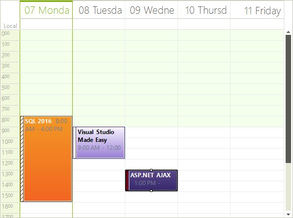

# Work Week View

## Work Week View Overview

The Work Week View is a special case of the WeekView, where the
          __ShowWeekend__ property is by default set to
          __false__.
        

## Setting the Work Week View

The Week View can be set it to be the default view which the user sees:

#### __[C#]__

{{region activeViewType}}
	            this.radScheduler1.ActiveViewType = Telerik.WinControls.UI.SchedulerViewType.WorkWeek;
	{{endregion}}

#### __[VB.NET]__

{{region activeViewType}}
	        Me.RadScheduler1.ActiveViewType = Telerik.WinControls.UI.SchedulerViewType.WorkWeek
	        '#End Region
	
	        '#Region getWeekView
	        Dim weekView As SchedulerWeekView = Me.RadScheduler1.GetWeekView()
	        '#End Region
	
	        '#Region activeWorkWeek
	        If Me.RadScheduler1.ActiveViewType = SchedulerViewType.WorkWeek Then
	            Dim activeWeekView As SchedulerWeekView = CType(Me.RadScheduler1.ActiveView, SchedulerWeekView)
	        End If
	        '#End Region
	
	        '#Region showDayHeaders
	        weekView.ShowHeader = True
	        '#End Region
	
	        '#Region headerFormat
	        weekView.HeaderFormat = "MMMM dd"
	        '#End Region
	
	        '#Region rangeFactor
	        weekView.RangeFactor = ScaleRange.Hour
	        '#End Region
	
	        '#Region rulerScaleSize
	        weekView.RulerScaleSize = 50
	        '#End Region
	
	        '#Region rulerScale
	        weekView.RulerStartScale = 9
	        weekView.RulerEndScale = 14
	        '#End Region
	
	        '#Region 12rulerTimeFormat
	        weekView.RulerStartScale = 9
	        weekView.RulerEndScale = 14
	        weekView.RulerTimeFormat = RulerTimeFormat.hours12
	        '#End Region
	
	        '#Region 24rulerTimeFormat
	        weekView.RulerStartScale = 9
	        weekView.RulerEndScale = 14
	        weekView.RulerTimeFormat = RulerTimeFormat.hours24
	        '#End Region
	
	        '#Region showRuler
	        weekView.ShowRuler = True
	        '#End Region
	
	        '#Region rulerWidth
	        weekView.RulerWidth = 40
	        '#End Region
	    End Sub
	End Class

## Getting Work Week View

To get the instance to the SchedulerWeekView from the RadScheduler object,either:

* use the __GetDayView__ method:
            

#### __[C#]__

{{region getWeekView}}
	            SchedulerWeekView weekView = this.radScheduler1.GetWeekView();
	{{endregion}}

#### __[VB.NET]__

{{region getWeekView}}
	        Dim weekView As SchedulerWeekView = Me.RadScheduler1.GetWeekView()
	        '#End Region
	
	        '#Region activeWorkWeek
	        If Me.RadScheduler1.ActiveViewType = SchedulerViewType.WorkWeek Then
	            Dim activeWeekView As SchedulerWeekView = CType(Me.RadScheduler1.ActiveView, SchedulerWeekView)
	        End If
	        '#End Region
	
	        '#Region showDayHeaders
	        weekView.ShowHeader = True
	        '#End Region
	
	        '#Region headerFormat
	        weekView.HeaderFormat = "MMMM dd"
	        '#End Region
	
	        '#Region rangeFactor
	        weekView.RangeFactor = ScaleRange.Hour
	        '#End Region
	
	        '#Region rulerScaleSize
	        weekView.RulerScaleSize = 50
	        '#End Region
	
	        '#Region rulerScale
	        weekView.RulerStartScale = 9
	        weekView.RulerEndScale = 14
	        '#End Region
	
	        '#Region 12rulerTimeFormat
	        weekView.RulerStartScale = 9
	        weekView.RulerEndScale = 14
	        weekView.RulerTimeFormat = RulerTimeFormat.hours12
	        '#End Region
	
	        '#Region 24rulerTimeFormat
	        weekView.RulerStartScale = 9
	        weekView.RulerEndScale = 14
	        weekView.RulerTimeFormat = RulerTimeFormat.hours24
	        '#End Region
	
	        '#Region showRuler
	        weekView.ShowRuler = True
	        '#End Region
	
	        '#Region rulerWidth
	        weekView.RulerWidth = 40
	        '#End Region
	    End Sub
	End Class

>This method
                returns null if the active view of the scheduler is not
                SchedulerWeekView.
              

* use the the RadScheduler __ActiveView__ property:
               
            

#### __[C#]__

{{region getWeekView}}
	            SchedulerWeekView weekView = this.radScheduler1.GetWeekView();
	{{endregion}}

#### __[VB.NET]__

{{region getWeekView}}
	        Dim weekView As SchedulerWeekView = Me.RadScheduler1.GetWeekView()
	        '#End Region
	
	        '#Region activeWorkWeek
	        If Me.RadScheduler1.ActiveViewType = SchedulerViewType.WorkWeek Then
	            Dim activeWeekView As SchedulerWeekView = CType(Me.RadScheduler1.ActiveView, SchedulerWeekView)
	        End If
	        '#End Region
	
	        '#Region showDayHeaders
	        weekView.ShowHeader = True
	        '#End Region
	
	        '#Region headerFormat
	        weekView.HeaderFormat = "MMMM dd"
	        '#End Region
	
	        '#Region rangeFactor
	        weekView.RangeFactor = ScaleRange.Hour
	        '#End Region
	
	        '#Region rulerScaleSize
	        weekView.RulerScaleSize = 50
	        '#End Region
	
	        '#Region rulerScale
	        weekView.RulerStartScale = 9
	        weekView.RulerEndScale = 14
	        '#End Region
	
	        '#Region 12rulerTimeFormat
	        weekView.RulerStartScale = 9
	        weekView.RulerEndScale = 14
	        weekView.RulerTimeFormat = RulerTimeFormat.hours12
	        '#End Region
	
	        '#Region 24rulerTimeFormat
	        weekView.RulerStartScale = 9
	        weekView.RulerEndScale = 14
	        weekView.RulerTimeFormat = RulerTimeFormat.hours24
	        '#End Region
	
	        '#Region showRuler
	        weekView.ShowRuler = True
	        '#End Region
	
	        '#Region rulerWidth
	        weekView.RulerWidth = 40
	        '#End Region
	    End Sub
	End Class

# See Also

 * [Day View]()
