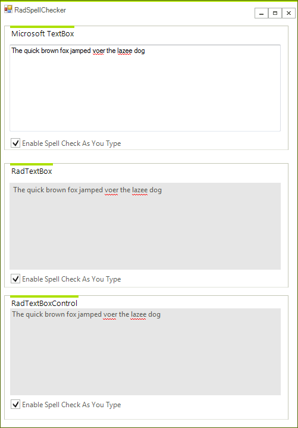
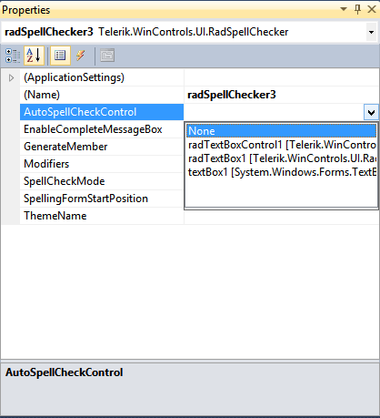

# Spell check as you type


## 

This article demonstrates the spell as you type functionality currently available for RadTextBox and RadTextBoxControls, as well as for any HostedTextBoxBase descendant.

As the user types in one of the supported controls a red underline indicates the spelling mistakes and right-clicking on the error shows a context menu with spelling suggestions.

>note Supported controls are: __RadTextBox__ , __RadTextBoxControl__ and __TextBox__ 
>


In order to enable this functionality you should set the __AutoSpellCheckControl__ property of RadSpellChecker to an instance of the supported controls:
        #_[C#] _

	


{{source=..\SamplesCS\SpellChecker\SpellCheckAsYouType.cs region=AutoSpellCheckControl}} 
{{source=..\SamplesVB\SpellChecker\SpellCheckAsYouType.vb region=AutoSpellCheckControl}} 

````C#
            this.radSpellChecker1.AutoSpellCheckControl = this.textBox1;
            this.radSpellChecker2.AutoSpellCheckControl = this.radTextBox1;
            this.radSpellChecker3.AutoSpellCheckControl = this.radTextBoxControl1;
````
````VB.NET
        Me.RadSpellChecker1.AutoSpellCheckControl = Me.TextBox1
        Me.RadSpellChecker2.AutoSpellCheckControl = Me.RadTextBox1
        Me.RadSpellChecker3.AutoSpellCheckControl = Me.RadTextBoxControl1
        '
````

{{endregion}} 


This property can also be set at design time:
        

>note If you set this property to *Null* you will turn off the spell check as you type functionality. 
            Also every __RadSpellChecker__ can be used with only one of the supported controls. 
            For example if you have five text boxes you will need five __RadSpellChecker__ instances for them.
>

