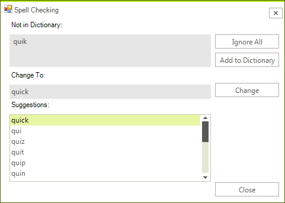
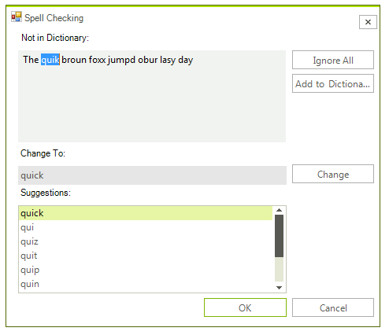

# SpellChecking Modes


## 

RadSpellChecker allows you to choose between two spellchecking modes:


* 

Check Word By Word

* 

Check All Words At Once


__Check Word By Word__
        
        To do this kind of check, you should set the __SpellCheckMode__
        property to *WordByWord*:
        

#_[C#]_

	


{{source=..\SamplesCS\SpellChecker\SpChGettingStarted.cs region=wordByWord}} 
{{source=..\SamplesVB\SpellChecker\SpChGettingStarted.vb region=wordByWord}} 

````C#
            this.radSpellChecker1.SpellCheckMode = Telerik.WinControls.UI.SpellCheckMode.WordByWord;
````
````VB.NET
        Me.RadSpellChecker1.SpellCheckMode = Telerik.WinControls.UI.SpellCheckMode.WordByWord
        '
````

{{endregion}} 


      	
      	
      	When using this mode RadSpellChecker will check every word in a separate window, which looks like this:
      	
      	
        
        You are presented with a list of all possible suggestions, from which you can choose a word to replace the wrong one. Alternatively you can ignore the word or add it to a custom dictionary.
        


>note 

This dialog will be called on every word considered wrong.


>note 

WordByWord is the default value of SpellCheckMode so unless you have a complex scenario
	  where you need to go from WordByWord to AllAtOnce an back, you do not need to set the property.


__Check All Words at Once__
        
         To do this kind of check, you should set the __SpellCheckMode__
        property to *AllAtOnce*:
        

#_[C#]_

	


{{source=..\SamplesCS\SpellChecker\SpChGettingStarted.cs region=allAtOnce}} 
{{source=..\SamplesVB\SpellChecker\SpChGettingStarted.vb region=allAtOnce}} 

````C#
            this.radSpellChecker1.SpellCheckMode = Telerik.WinControls.UI.SpellCheckMode.AllAtOnce;
````
````VB.NET
        Me.RadSpellChecker1.SpellCheckMode = Telerik.WinControls.UI.SpellCheckMode.AllAtOnce
        '
````

{{endregion}} 


    	
    	
    	When using AllAtOnce mode, RadSpellChecker loads the entire content of the control being spellchecked in a window looking like this:
    	
 		
    	
    	You are presented with the same options as the WordByWord mode. The difference is that the entire spellchecking is executed in this window and only after that the content is transferred to the original control being spellchecked.
        
        
        
