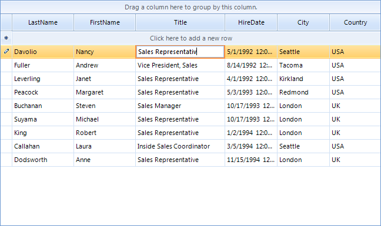

# SpellChecking RadGridView

**RadSpellChecker** is not limited to checking only simple text-editing controls such as **RadTextBox**. It can spell check editors in more complex controls such as **RadGridView** as well.
      
Here is a sample scenario: the end-user types something in **RadTextBoxEditor** in **RadGridView** and tries to commit the typed text in the cell. This is the place where **RadSpellChecker** should appear and correct the misspelled words.  After a confirmation given by the end-user on the **RadSpellChecker** form, the editor should close and the corrected values should be committed to the edited cell.
      
Supposing that we have a **RadGridView** filled with data and a **RadSpellChecker** on the form, the following steps demonstrate how to implement the given scenario:
      
1\. Let's subscribe to **CellValidating** event. This event is fired when the edited cell should be validated before the editor for that particular cell is closed. In this event we should call the **Check** method of **RadSpellChecker** passing the currently opened editor:

#### Spell check RadGridView's editor

{{source=..\SamplesCS\SpellChecker\SpChWithRadGridView.cs region=validating}} 
{{source=..\SamplesVB\SpellChecker\SpChWithRadGridView.vb region=validating}} 

````C#
string correctedValue = String.Empty;
void radGridView1_CellValidating(object sender, Telerik.WinControls.UI.CellValidatingEventArgs e)
{
    RadTextBoxEditor editor = e.ActiveEditor as RadTextBoxEditor;
    if (editor != null)
    {
        RadTextBoxEditorElement element = editor.EditorElement as RadTextBoxEditorElement;
        this.radSpellChecker1.Check(element.TextBoxItem.HostedControl);
        correctedValue = e.ActiveEditor.Value.ToString();
    }
}

````
````VB.NET
Dim correctedValue As String = String.Empty
Private Sub RadGridView1_CellValidating(ByVal sender As Object, ByVal e As Telerik.WinControls.UI.CellValidatingEventArgs) Handles RadGridView1.CellValidating
    Dim editor As RadTextBoxEditor = TryCast(e.ActiveEditor, RadTextBoxEditor)
    If editor IsNot Nothing Then
        Dim element As RadTextBoxEditorElement = TryCast(editor.EditorElement, RadTextBoxEditorElement)
        Me.RadSpellChecker1.Check(element.TextBoxItem.HostedControl)
        correctedValue = e.ActiveEditor.Value.ToString()
    End If
End Sub

````

{{endregion}} 
 
Please note that the editor sets the corrected value to the opened editor, but not directly to the underlying data cell. We save this editor value in a variable named '*correctedValue*'   

2\. Now we should subscribe to the **CellEndEdit** event which is fired after the editor is closed. In this event we should pass the saved corrected value to the data cell:

#### Save the corrected value

{{source=..\SamplesCS\SpellChecker\SpChWithRadGridView.cs region=cellEndEdit}} 
{{source=..\SamplesVB\SpellChecker\SpChWithRadGridView.vb region=cellEndEdit}} 

````C#
void radGridView1_CellEndEdit(object sender, GridViewCellEventArgs e)
{
    this.radGridView1.CurrentCell.Value = correctedValue;
}

````
````VB.NET
Private Sub RadGridView1_CellEndEdit(ByVal sender As Object, ByVal e As Telerik.WinControls.UI.GridViewCellEventArgs) Handles RadGridView1.CellEndEdit
    Me.RadGridView1.CurrentCell.Value = correctedValue
End Sub

````

{{endregion}} 

The following figures provide the end-user experience with **RadSpellChecker** and **RadGridView**:
      

1. The end-user types '*Sales Representativ*':

    

1. Then the end-user tries to commit the misspelled value by pressing the Enter key. As a consequence, the **RadSpellChecker** form is invoked:

    

1. After the user chooses one of the suggestions and presses the `Change` button, the **RadSpellChecker** form disappears, leaving an informative message box that the spell checking operation is completed:

    

1. The end-user pressed the `OK` button. Then, the message box disappears, the editor closes and the corrected value is saved in the cell:

    

# See Also

* [Spellchecking Modes]()	
