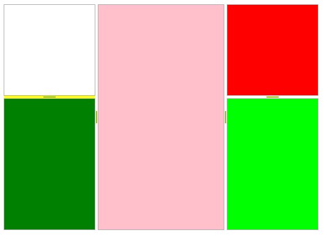

# Building a layout of RadSplitContainers programmatically

## 

You can programmatically build a layout of panels using RadSplitContainer. To do so, refer to the code snippet below:

{{source=..\SamplesCS\SplitContainer\BuildingLayout.cs region=basicLayout}} 
{{source=..\SamplesVB\SplitContainer\BuildingLayout.vb region=basicLayout}} 

````C#
RadSplitContainer container = new RadSplitContainer();
container.Dock = DockStyle.Fill;
//left panel, sized absolutely   
RadSplitContainer leftContainer = new RadSplitContainer();
leftContainer.Orientation = Orientation.Horizontal;
leftContainer.SizeInfo.SizeMode = Telerik.WinControls.UI.Docking.SplitPanelSizeMode.Absolute;
leftContainer.SizeInfo.AbsoluteSize = new Size(150, 150);
container.SplitPanels.Add(leftContainer);
//middle panel, auto-sized   
SplitPanel middlePanel = new SplitPanel();
middlePanel.SplitPanelElement.Fill.BackColor = Color.Pink;
container.SplitPanels.Add(middlePanel);
//left panel, sized absolutely   
RadSplitContainer rightContainer = new RadSplitContainer();
rightContainer.Orientation = Orientation.Horizontal;
rightContainer.SizeInfo.SizeMode = Telerik.WinControls.UI.Docking.SplitPanelSizeMode.Absolute;
rightContainer.SizeInfo.AbsoluteSize = new Size(150, 150);
container.SplitPanels.Add(rightContainer);
//add panels 4 & 5   
SplitPanel leftTopPanel = new SplitPanel();
leftContainer.SplitPanelElement.Fill.BackColor = Color.Yellow;
leftTopPanel.SizeInfo.SizeMode = Telerik.WinControls.UI.Docking.SplitPanelSizeMode.Absolute;
leftTopPanel.SizeInfo.AbsoluteSize = new Size(150, 150);
leftContainer.SplitPanels.Add(leftTopPanel);
SplitPanel leftBottomPanel = new SplitPanel();
leftBottomPanel.SplitPanelElement.Fill.BackColor = Color.Green;
leftContainer.SplitPanels.Add(leftBottomPanel);
//add panels 6 & 7   
SplitPanel rightTopPanel = new SplitPanel();
rightTopPanel.SplitPanelElement.Fill.BackColor = Color.Red;
rightTopPanel.SizeInfo.SizeMode = Telerik.WinControls.UI.Docking.SplitPanelSizeMode.Absolute;
rightTopPanel.SizeInfo.AbsoluteSize = new Size(150, 150);
rightContainer.SplitPanels.Add(rightTopPanel);
SplitPanel rightBottomPanel = new SplitPanel();
rightBottomPanel.SplitPanelElement.Fill.BackColor = Color.Lime;
rightContainer.SplitPanels.Add(rightBottomPanel);
this.Controls.Add(container);

````
````VB.NET
Dim container As RadSplitContainer = New RadSplitContainer()
container.Dock = DockStyle.Fill
'left panel, sized absolutely
Dim leftContainer As RadSplitContainer = New RadSplitContainer()
leftContainer.Orientation = Orientation.Horizontal
leftContainer.SizeInfo.SizeMode = Telerik.WinControls.UI.Docking.SplitPanelSizeMode.Absolute
leftContainer.SizeInfo.AbsoluteSize = New Size(150, 150)
container.SplitPanels.Add(leftContainer)
'middle panel, auto-sized
Dim middlePanel As SplitPanel = New SplitPanel()
container.SplitPanels.Add(middlePanel)
'left panel, sized absolutely
Dim rightContainer As RadSplitContainer = New RadSplitContainer()
rightContainer.Orientation = Orientation.Horizontal
rightContainer.SizeInfo.SizeMode = Telerik.WinControls.UI.Docking.SplitPanelSizeMode.Absolute
rightContainer.SizeInfo.AbsoluteSize = New Size(150, 150)
container.SplitPanels.Add(rightContainer)
'add panels 4 & 5
Dim leftTopPanel As SplitPanel = New SplitPanel()
leftTopPanel.SizeInfo.SizeMode = Telerik.WinControls.UI.Docking.SplitPanelSizeMode.Absolute
leftTopPanel.SizeInfo.AbsoluteSize = New Size(150, 150)
leftContainer.SplitPanels.Add(leftTopPanel)
Dim leftBottomPanel As SplitPanel = New SplitPanel()
leftContainer.SplitPanels.Add(leftBottomPanel)
'add panels 6 & 7
Dim rightTopPanel As SplitPanel = New SplitPanel()
rightTopPanel.SizeInfo.SizeMode = Telerik.WinControls.UI.Docking.SplitPanelSizeMode.Absolute
rightTopPanel.SizeInfo.AbsoluteSize = New Size(150, 150)
rightContainer.SplitPanels.Add(rightTopPanel)
Dim rightBottomPanel As SplitPanel = New SplitPanel()
rightContainer.SplitPanels.Add(rightBottomPanel)
Me.Controls.Add(container)

````

{{endregion}} 

The result is shown on the screenshot below:



>tip You can find advanced layouts created with RadSplitContainers in the Telerik UI for WinForms Demo application, section *SplitContainer >> Layout* . You can find it at *Start >> Programs >> Telerik >> UI for WinForms [version] >> Run Demos* (Please note that you should have the Telerik UI for WinForms suite installed).
>

