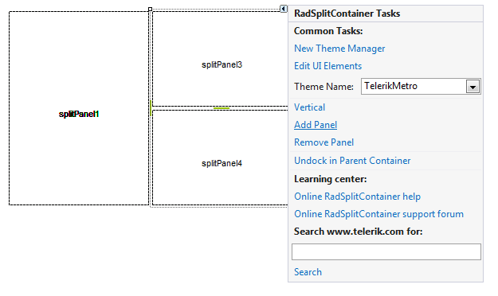
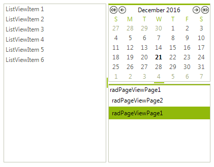

# Getting Started

## 

In this example we will position several RadControls in a specific layout using the RadSplitContainer:

1. Drop a RadSplitContainer on your form.

2. Click its Smart-Tag to open the Action Menu. Notice that there is an option for the orientation of the SplitPanels in the RadSplitContainer. While it is set to 'Horizontal' click twice on the Add Panel option. This will add two SplitPanels aligned horizontally in the RadSplitContainer.

    

3. Now we want to have two SplitPanels aligned vertically in the place that is taken by the SplitPanel2. To do so, drag a new RadSplitContainer instance on the SplitPanel2 and set its Dock property to fill.

4. Click on the Smart-Tag of the second RadSplitContainer to open its Action Menu. Click on the 'Horizontal' option to change it to 'Vertical'. Now click twice on the Add Panel option. Since the alignment is set to 'Vertical' the new SplitPanels will be aligned vertically.

    

5. Drag and drop the desired controls on the SplitPanels and set their Dock property to Fill. Set the Dock property of the main RadSplitContainer to Fill as well. The result is shown on the screenshot below:

    
