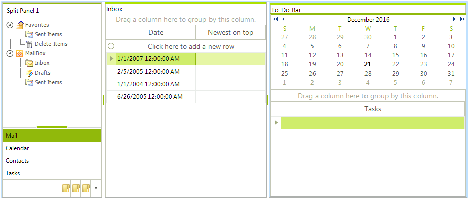

# SplitContainer

## 

Telerik SplitContainer is a layout control which allows you to add many container panels to a form, separated by splitter(s). It is very handy for creating complex user interfaces where a selection in one panel determines what objects are shown in another panel. The splitter makes it very easy for users to resize the panels to fit their personal liking.

The design of the control is simple, yet flexible enough to handle virtually any complex layout scenario. The layout consists of one or more SplitPanel instances, organized in containers. A container has an “Orientation” property, which defines the direction in which each child panel will be laid-out. It also composes a SplitContainerLayoutStrategy instance, which handles all layout requests from its owning container. Each SplitPanel instance has a member of type SplitPanelSizeInfo, which is used by the strategy to determine the size and position of this panel on its hosting container. Available are four different sizing modes per panel basis:

* __Auto__: a panel is auto-sized, based on the available remaining size of the container.

* __Relative__: a panel occupies amount of space, relative to the container’s available size. This amount is specified through the SplitPanelSizeInfo.RelativeRatio property.

* __Absolute__: Absolute size is used for a panel. The amount of size is specified through the SplitPanelSizeInfo.AbsoluteSize property.

* __Fill__: Special mode currently used by the MainDocumentContainer. When a RadSplitContainer has a descendant(s) with this special size mode, all panels are sized absolutely, leaving the available space for all the “Fill” panels.

Having all these sizing modes, combined with the Orientation setting, available per split container basis, allow for virtually any layout scenario to be easily achieved.

