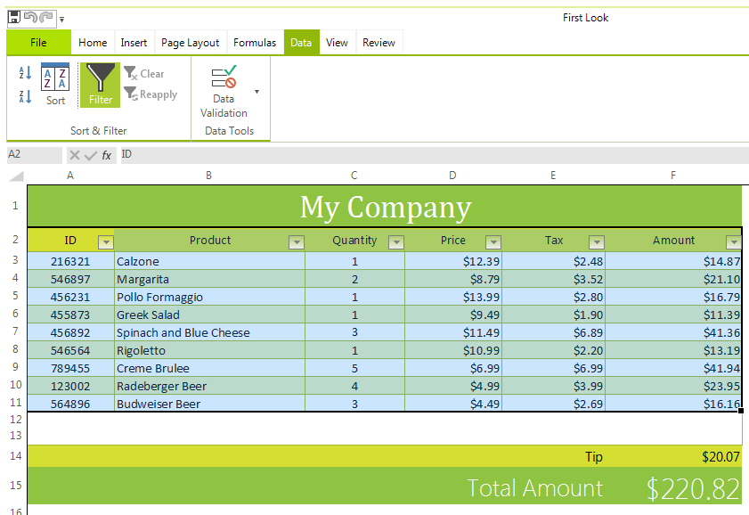
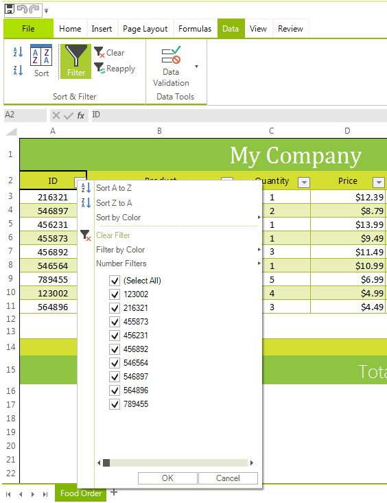
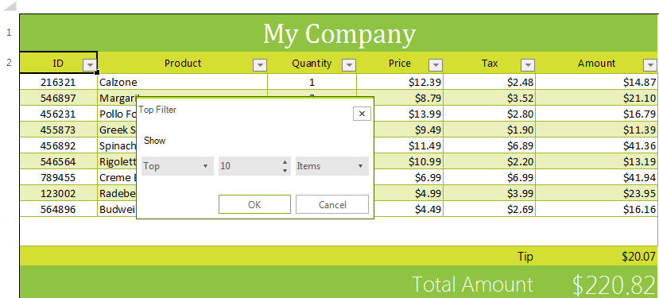

# Filtering

This article briefly describes what is filtering and filters and how to work with them through **RadSpreadsheet**. 

## What Is Filtering?

The filtering feature allows the user to hide and show certain rows of a range, based on different criteria. It provides an easy way to work with just the relevant set of data.

Each column of a range can have one filter applied to it or none.

## How to Turn on Filtering for Current Selection

In order to begin filtering the worksheet, the first thing which needs to be done is to enable filtering for a selection within it.

You can turn on the filtering from the UI by making the desired selection and clicking the **Filter** toggle button under the **Data** tab of the ribbon. Keep in mind that the first row of the range is reserved for column headers and will not be included in the actual filtering.

After the steps specified above are performed, drop-down arrows will appear in the column headers. The result should look like Figure 1.

>caption Figure 1: Enable Filtering

 

At this point the filtering is enabled but no filters are applied. In order to remove the filtering, use the toggle button again.

## Filtering Popup

By clicking the arrow found in each column header, you can open the filtering popup. Through it you can apply, reapply, change and remove the filter for the respective column. The pop up gives access to various predefined filters. A brief description of each type of filter can be found [here](https://docs.telerik.com/devtools/document-processing/libraries/radspreadprocessing/features/filtering).

>caption Figure 2: Filtering Popup

 

The top section is devoted to sorting. The rest of the filtering popup exposes the following options:

* Clearing the applied filter: This option is enabled if there is an applied filter and allows you to remove it.

* Filter by color: This menu allows you to apply a fill filter or a fore color filter.

* Number filters / Text filters / Date filters: This menu gives access to the dynamic, custom and top filters. Which options will be available depends on what type of value makes the majority of the cell values in the respective column.

* Filtering tree: The filtering tree allows easy application and manipulation of the values collection filter. It can be applied and changed by checking and unchecking the options in the tree.

## Applying Filter

You can apply a filter by using the options provided by the filtering popup. The options which apply a dynamic filter (e.g. above average, last week, etc.) require only a single click. The top filter and the custom filter options open dialogs which allow you to specify the desired parameters of the filters.

>caption Figure 3: Custom Filter Dialog

 

>caption Figure 4: Top Filter Dialog

 

When a filter is applied the respective option in the filtering popup will be checked, to signify which type of filter is applied and the *Clear Filter* option will become available.

## Removing Filter

Removing the filter applied to a column from the UI can be done using one of the following approaches.

* Using the Clear Filter option.

* Clicking the Select All option in the filtering tree.

* Setting any new filter will automatically clear the previous one.

Using the first two options leaves the column without a filter applied.

## How Do Filters Work?

Regardless of its type, when a filter is applied it will go through the cells of its assigned column and will evaluate them according to its criteria. If the filter determines that a cell should be hidden, it will hide not only this cell, but the entire row it belongs to. Therefore, if a range has more than one filtered column, some rows may be hidden by more than one filter. These rows will not be displayed until all the filters which hide them are removed.

In the UI this rule has a most notable impact in the filtering tree.

Figure 5 shows a document with a filtered range with two columns, before a filter is applied.

>caption Figure 5: Initial State

If we apply a top filter on the second column, so as to show only the three largest numbers, this will hide rows 2 and 3.

Figure 6: Apply Top Filter 

This will completely hide the respective values from the filtering tree of the first column.

Figure 7: Result

## Apply Filters Programmatically

You can refer to the *Demo Application >> Spreadsheet >> Sorting and Filtering* example which demonstrates how to apply filters to **RadSpreadsheet**.

## See Also

* [Model Filtering](https://docs.telerik.com/devtools/document-processing/libraries/radspreadprocessing/features/filtering)
* [Sorting]()

