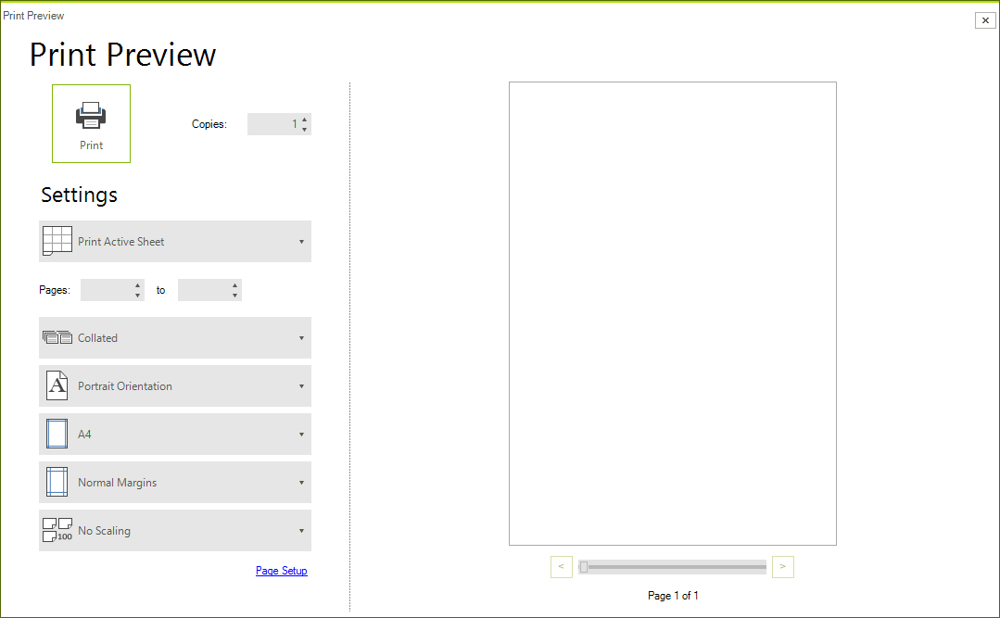
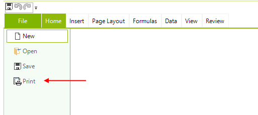

# Printing

Printing in __RadSpreadsheet__ allows you to prepare and display spreadsheet data the most suitable way depending on your needs. Using different printing options such as defining the print page, the scale factor or whether to print grid-lines you may customize the way to present your data. Additionally __Print Area__ and __Page Breaks__ allows to print only what you need to print and separate big documents on pages just the way you want your data to be separated. Together with printing on a real printer, __RadSpreadsheet’s__ printing gives you the opportunity to export your spreadsheet data in different file formats with the help of virtual printers.
      

This article aims to present the __Printing API__ of __RadSpreadsheet__ and demonstrate how to specify what and how to print the document. It contains the following subsections:
      

* [How to print RadSpreadsheet](#how-to-print-radspreadsheet)

* [Worksheet page setup](#worksheet-page-setup)

* [Ribbon UI](#ribbon-ui)

## How to print RadSpreadsheet

__RadSpreadsheet__ provides you with variety of options for organizing and preparing the document’s data for printing.

Using the __PrintWhatSettings__ class you may specify:

* __ExportWhat option:__ Enumeration specifying whether to print the __Active Sheet__, the __Entire Workbook__ or the current __Selection__.

* __IgnorePrintArea option:__ Boolean value indicating whether or not to ignore print area when printing worksheets.

Printing __RadSpreadsheet__ is easily done through the __Print__ method which prints according to some given __PrintWhatSettings__ instance. 

Depending on whether you want to show a print preview before printing you may use the __PrintPreview__ method:

#### Print Methods

{{source=..\SamplesCS\Spreadsheet\SpreadsheetPrinting.cs region=PrintMethod}} 
{{source=..\SamplesVB\Spreadsheet\SpreadsheetPrinting.vb region=PrintMethod}}
````C#
// Prints silently to the default printer without showing the print dialog.
var settings = new PrintWhatSettings(ExportWhat.ActiveSheet, false);
radSpreadsheet1.SpreadsheetElement.Print(settings);
// Prints showing the print dialog.
radSpreadsheet1.SpreadsheetElement.PrintPreview();

````
````VB.NET
'Prints silently to the default printer without showing the print dialog.
Dim settings = New PrintWhatSettings(ExportWhat.ActiveSheet, False)
radSpreadsheet1.SpreadsheetElement.Print(settings)
'Prints showing the print dialog.
radSpreadsheet1.SpreadsheetElement.PrintPreview()

````


{{endregion}}

The bellow image shows the options available in the PrintPreview dialog.

>caption The PrintPreview dialog



## Worksheet page setup

When you need to set different print option such as page size, page orientation or when you want to print the spreadsheet grid lines you may set this options using the worksheet's page setup. For more detailed information you may follow [this link](https://docs.telerik.com/devtools/document-processing/libraries/radspreadprocessing/features/worksheetpagesetup) to __WorksheetPageSetup__ documentation article.
        

>tip You can apply headers and footers to the printed document. For more details on how to achieve this, refer to the [Headers and Footers topic]().

## Ribbon UI

Our **RadSpreadsheetRibbonBar** allows you to print the current document as well. The print option is accessible from the application menu. In this case you have exactly the same options like in the **PrintPreview** dialog. 

>caption Printing from RadSpreadsheetRibbonBar



## See Also

* [Headers and Footers]()
