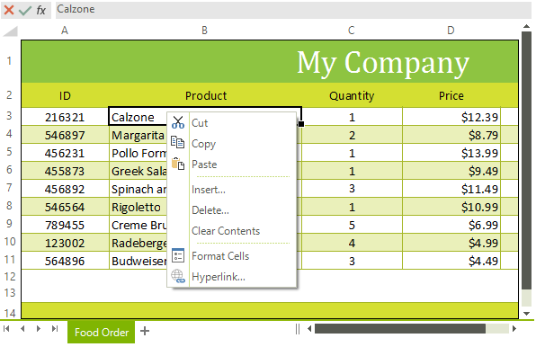

# Context Menu

By default the WorksheetEditor of RadSpreadsheet have a context menu. The control's element exposes a __WorksheetEditorContextMenu__ property of type __RadContextMenu__ that allows you to plug and arrange easily a context menu.      

>tip RadContextMenu is a flexible control that aims to provide additional commands and features. You will be able to find more information regarding RadContextMenu in the section of our online documentation dedicated to the control [here]().
        

## Figure 1: Worksheet Editor's Context Menu



## Modifying the default Context Menu

You can access and modify the default context menu in the ContextMenuShowing event. The following example demonstrates how you can remove the "Copy" item from the context menu.

{{source=..\SamplesCS\Spreadsheet\ContextMenuCode.cs region=context_menu_1}} 
{{source=..\SamplesVB\Spreadsheet\ContextMenuCode.vb region=context_menu_1}} 

 ````C#
public ContextMenuCode()
{
    InitializeComponent();
    radSpreadsheet1.SpreadsheetElement.ContextMenuShowing += SpreadsheetElement_ContextMenuShowing;
}
private void SpreadsheetElement_ContextMenuShowing(object sender, SpreadsheetContextMenuOpeningEventArgs e)
{
    foreach (var item in e.Menu.Items)
    {
        if (item.Text == "Copy")
        {
            item.Visibility = ElementVisibility.Collapsed;
        }
    }
}

````
````VB.NET
Public Sub New()
    InitializeComponent()
    AddHandler radSpreadsheet1.SpreadsheetElement.ContextMenuShowing, AddressOf SpreadsheetElement_ContextMenuShowing
End Sub
Private Sub SpreadsheetElement_ContextMenuShowing(ByVal sender As Object, ByVal e As SpreadsheetContextMenuOpeningEventArgs)
    For Each item In e.Menu.Items
        If item.Text = "Copy" Then
            item.Visibility = ElementVisibility.Collapsed
        End If
    Next item
End Sub

```` 
{{endregion}}
