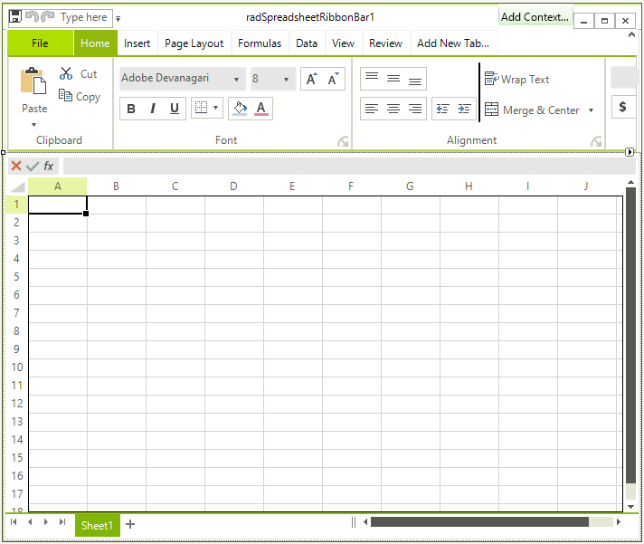
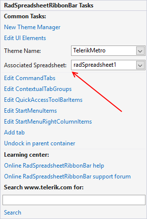

# Getting Started

This article explains how to add a __RadSpreadsheet__ control to a form and wire it with __UI__.
      

It contains the following sections:

* [Assembly References](#assembly-references)

* [Spreadsheet and Ribbon UI](#spreadsheet-and-ribbonview)

## Assembly References

The assemblies that contain the implementation of __RadSpreadsheet__ and must be referenced in order to use the control are:

* Telerik.WinControls.RadSpreadsheet

* Telerik.WinControls

* TelerikCommon

* Telerik.WinControls.UI

* Telerik.WinControls.GridView.dll

For export and import to XLSX:

* Telerik.Windows.Zip.dll

* Telerik.Windows.Documents.Spreadsheet.FormatProviders.OpenXml.dll

To export a document to PDF, you will need to add a reference to the corresponding assembly:

* Telerik.Windows.Documents.Spreadsheet.FormatProviders.Pdf.dll

## Spreadsheet and RibbonView

Now add the __RadSpreadsheet__ control to the form.After that add __RadSpreadsheetRibbonBar__ to the form. Dock it to the top and then Dock the __RadSpreadsheet__ to fill the remaining space. Your layout should look like this.

 

Open the Smart Tag of the ribbon and set the associated control. 

 

That is all. You are ready to start the application and examine the control features.

## See Also

* [SpreadProcessing](http://docs.telerik.com/devtools/document-processing/libraries/radspreadprocessing/overview)

