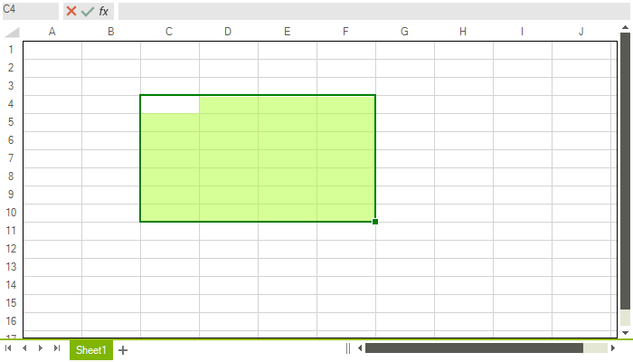

# Customize Selection

__SpreadsheetElement__ exposes several properties that enable you to control the way the selection in the control is rendered. This article describes the available properties and shows you how to work with them.

* **SelectionStroke**: A property of type *Brush* that gets or sets the stroke of the selection.

* **SelectionStrokeThickness**: A property of type *double* that gets or sets the stroke thickness of the selection.

* **SelectionFill**: A property of type *Brush* that gets or sets the fill of the selection. 

* **FillHandleSelectionStroke**: A property of type *Brush* that gets or sets the fill handle selection stroke.

 

>caption Figure 1: Customized selection in RadSpreadsheet



**Example 1** demonstrate how you could customize the properties of the selection in code to achieve the result shown in **Figure 1**. 

####  Example 2: Customizing selection

{{source=..\SamplesCS\Spreadsheet\SelectionCode.cs region=Selection_10}} 
{{source=..\SamplesVB\Spreadsheet\SelectionCode.vb region=Selection_10}} 

 ````C#
Brush strokeBrush = Brushes.Green;
Brush fillBrush = new SolidBrush(Color.FromArgb(128, 173, 255, 47));
radSpreadsheet.SpreadsheetElement.SelectionFill = fillBrush;
radSpreadsheet.SpreadsheetElement.SelectionStroke = strokeBrush;
radSpreadsheet.SpreadsheetElement.SelectionStrokeThickness = 2;

````
````VB.NET
Dim strokeBrush As Brush = Brushes.Green
Dim fillBrush As Brush = New SolidBrush(Color.FromArgb(128, 173, 255, 47))
radSpreadsheet.SpreadsheetElement.SelectionFill = fillBrush
radSpreadsheet.SpreadsheetElement.SelectionStroke = strokeBrush
radSpreadsheet.SpreadsheetElement.SelectionStrokeThickness = 2

```` 
{{endregion}} 


## See Also

 * [Customize Row and Column Headers]()
