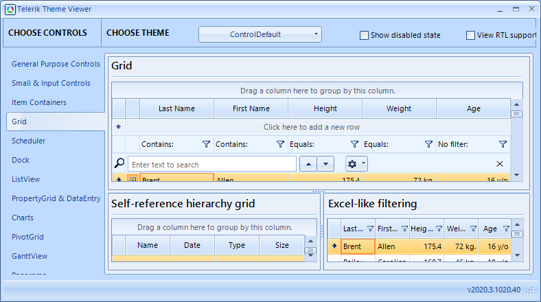
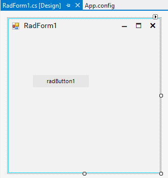
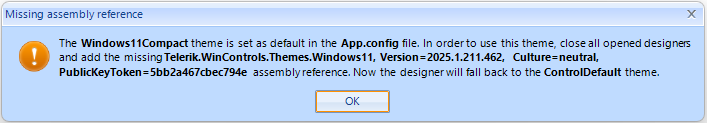
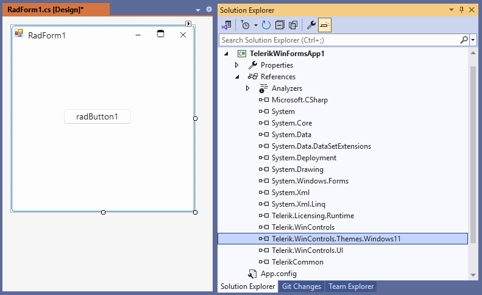
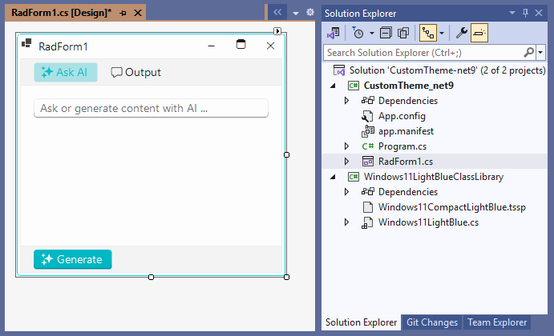

# Default Theme 

All RadControls from the Telerik UI for WinForms suite get the **ControlDefault** theme applied to them by default if no other theme is set. 
 
>caption ControlDefault theme



If you drag a control from the toolbox and drop it onto the form, the **ControlDefault** theme is applied as well.

>caption Design time - default theme


Using the [built-in themes]() that come out of the box with the installation of the Telerik UI for WinForms suite, you can apply a different theme for the specific control. 

## Fluent theme as Default

As of **R1 2021**, it is possible to define which theme is your **default theme** (e.g. **ControlDefault**) for the controls even at design time. This can be defined in the App.config file as follows:


````XML

<?xml version="1.0" encoding="utf-8"?>
<configuration>
  <startup>
    <supportedRuntime version="v4.0" sku=".NETFramework,Version=v4.5" />
  </startup>
 
  <appSettings>
    <add key="TelerikWinFormsThemeName" value="Fluent" />
  </appSettings>
</configuration>

````

>caption Fluent theme as default




>important The **Fluent** theme is now a part of the **Telerik.WinControls** assembly and it is statically available everywhere just like the **ControlDefault** theme. As a result, it is no longer necessary to instantiate the **FluentTheme** type.

>note The **Telerik.WinControls.Themes.Fluent** assembly is still available and it remains for compatibility so that existing projects don't break when they upgrade. 

The theme settings are being read upon opening the first form designer in the project. If you change the default theme in App.config, it is necessary to **close all opened designers and open them again**. 

We will use the above App.config in the VS templates, so that when people create a new Telerik project they will use Fluent as default.

## Other Telerik theme as Default

All Telerik themes are supported with the above API, it is, however, necessary that the project references the correct assembly, e.g. add reference to Telerik.WinControls.Themes.Material and in the App.config set:

````XML

<?xml version="1.0" encoding="utf-8"?>
<configuration>
  <startup>
    <supportedRuntime version="v4.0" sku=".NETFramework,Version=v4.5" />
  </startup>
 
  <appSettings>
    <add key="TelerikWinFormsThemeName" value="Material" />
  </appSettings>
</configuration>

````

If the user sets a valid Telerik theme name (other than Fluent and ControlDefault) as default, but the project misses the theme assembly reference, the following message appears:



Once the necessary assembly is referred, the designer loads with the correct design:



>note In order to use the Theme components, just drag and drop them from the VS Toolbox to the form. This will add a reference to the corresponding theme assembly in the project and will enable the theme in the **ThemeName** drop-down of all Telerik controls on the form. 

## Custom theme as Default

Since it is possible to build your own [custom style](), it is possible to specify this theme as default. We will use the same API to load client's themes defined in their own assemblies: [Creating a theme component]() 

Imagine a client creates a theme with name **LightCoral**. Besides the theme name, the App.config will also need the theme type and theme assembly name. 



````XML

<?xml version="1.0" encoding="utf-8"?>
<configuration>
  <startup>
    <supportedRuntime version="v4.0" sku=".NETFramework,Version=v4.5" />
  </startup>
 
  <appSettings>
    <add key="TelerikWinFormsThemeName" value="LightCoral" />
    <add key="TelerikWinFormsThemeType" value="LightCoralClassLibrary.LightCoralTheme"/>
    <add key="TelerikWinFormsThemeAssemblyName" value="LightCoralClassLibrary"/>
  </appSettings>
</configuration>

````

Thus, if you drag a new **RadButton** from the Toolbox, it will be with the LightCoral theme applied. 

# See Also

* [Using Themes]()

* [Touch Enabled Themes]()

* [Using a Default Theme for the Entire Application]()

* [Using custom themes]()

* [Visual Style Builder]()

