# Themes Style

This article lists all of the available themes that come with the installation of the Telerik UI for WinForms suite and illustrates the design for each of them.

## Windows11CompactDark

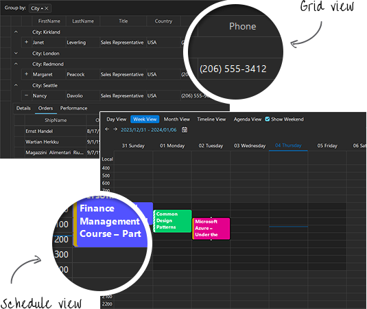

## Windows11Compact

## Windows11Dark

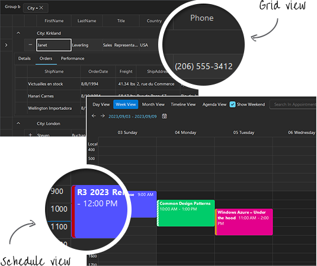

## Windows11

## VisualStudio2022Dark

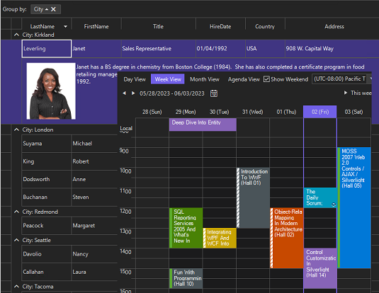

## VisualStudio2022

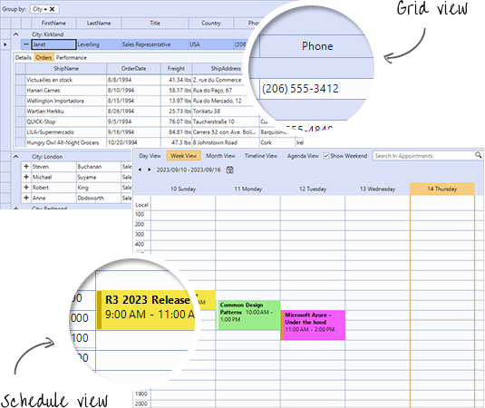

## Office2019

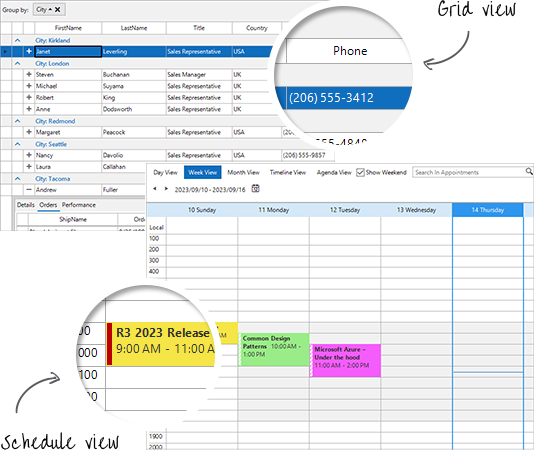

## Office2019Gray

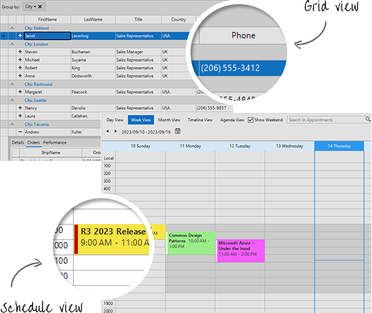

## Office2019Dark

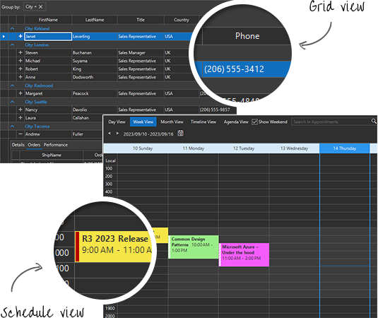

## VisualStudio2012Dark

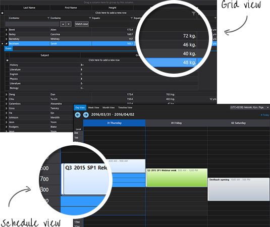

## VisualStudio2012Light

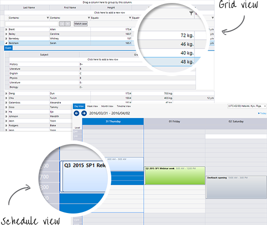

## FluentDark

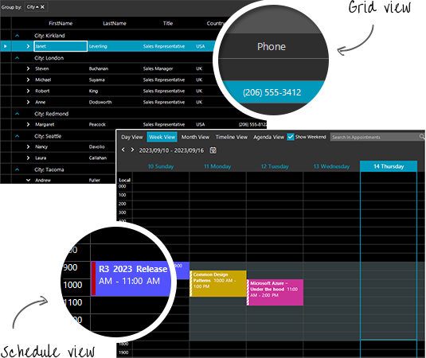

## Fluent

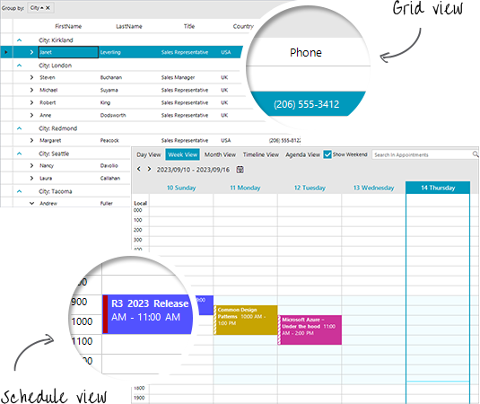

## CrystalDark

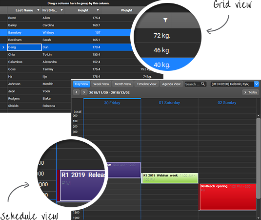

## Crystal

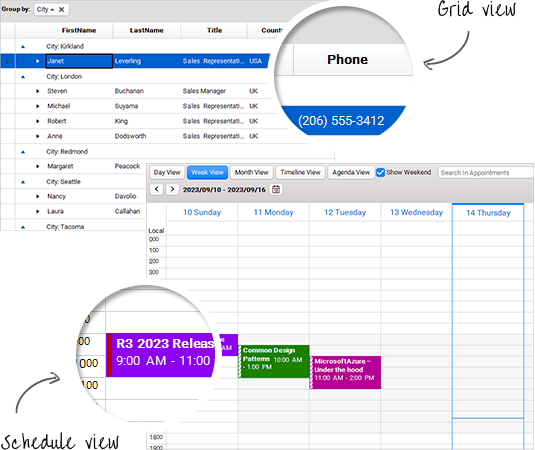

## Material

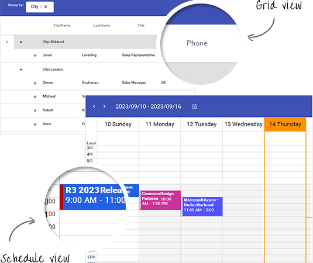

## MaterialBlueGrey

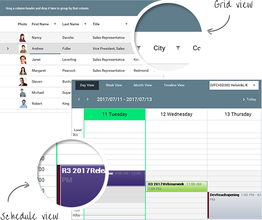

## MaterialPink

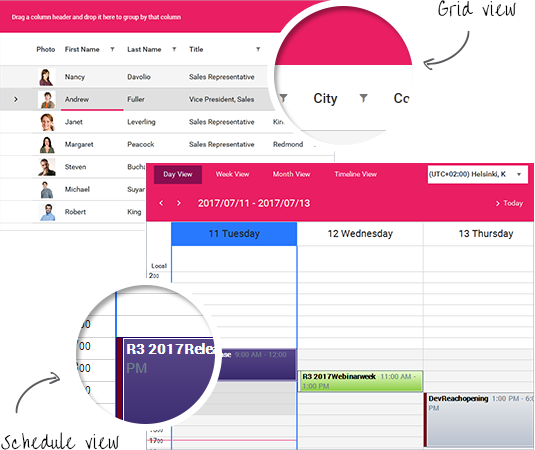

## MaterialTeal

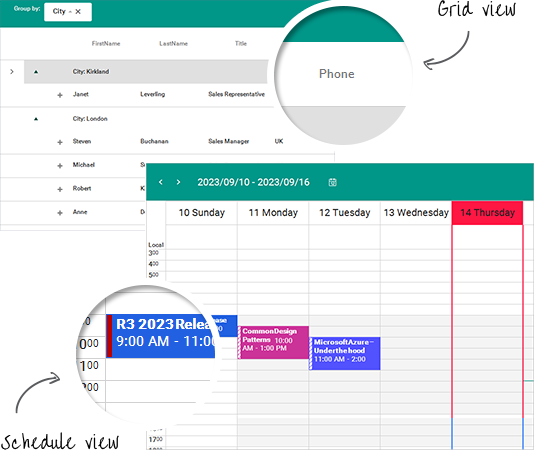

## Windows8

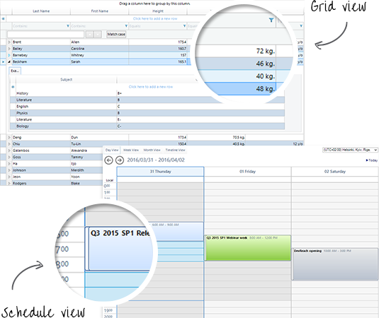

## TelerikMetroTouch

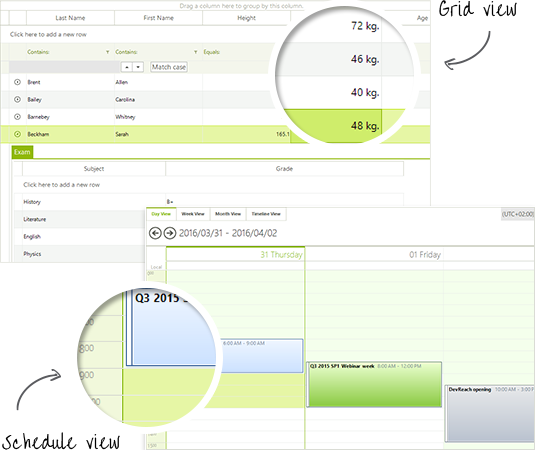

## TelerikMetroBlue

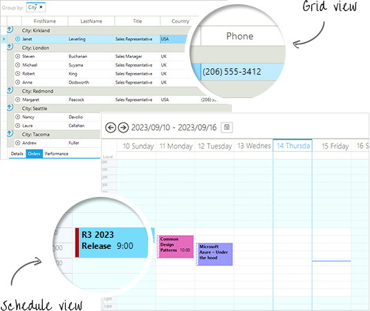

## TelerikMetro

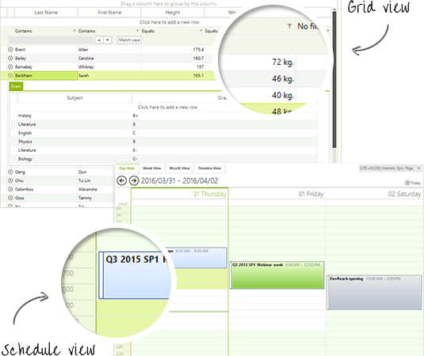

## Office2013Light

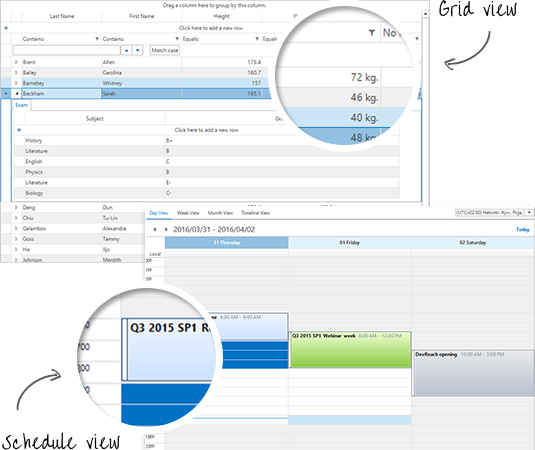

## Office2013Dark

## Office2010Silver

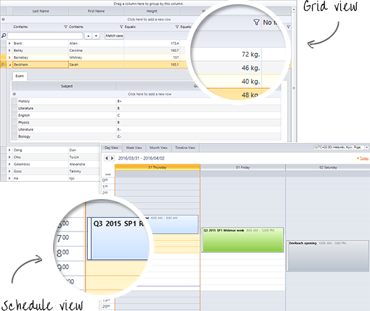

## Office2010Blue

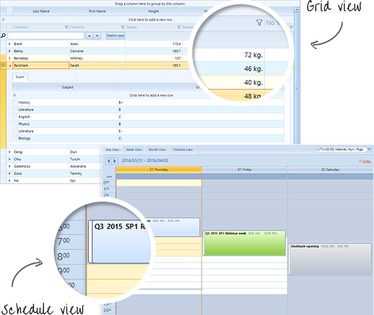

## Office2010Black

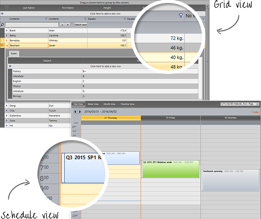

## Windows7

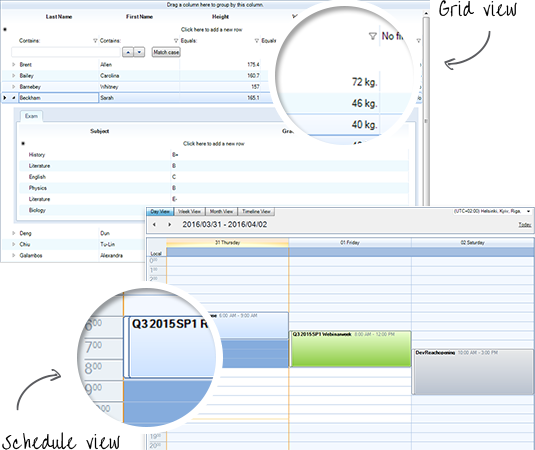

## Office2007Silver

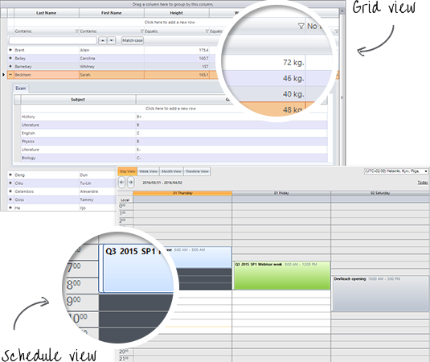

## Office2007Black

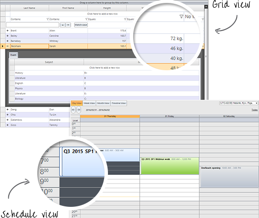

## Breeze

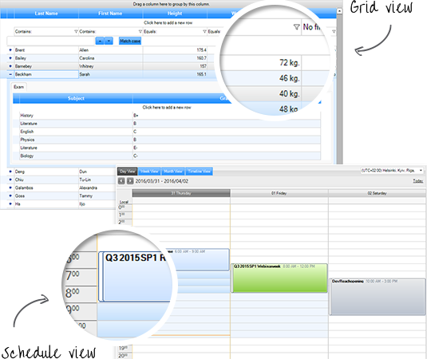

## Desert

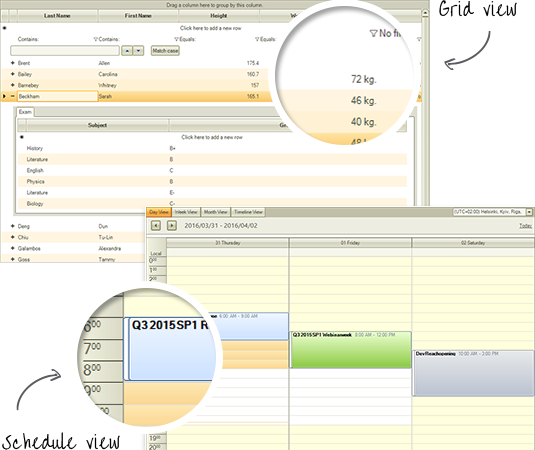

## Aqua

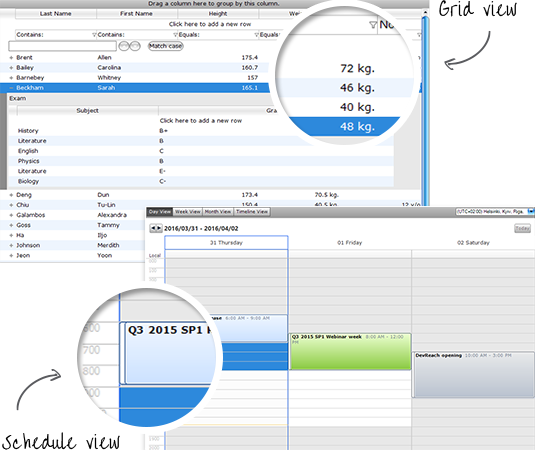

## HighContrastBlack

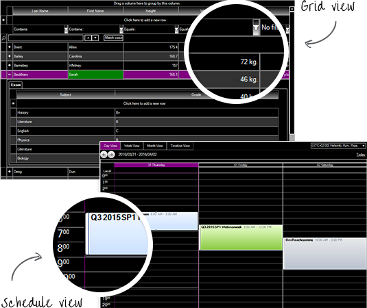

## ControlDefault

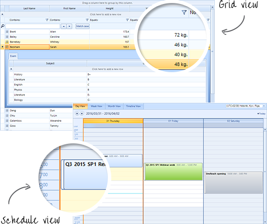

# See Also

* [Using Themes]()

* [Using a Default Theme for the Entire Application]()

* [Default Theme]()
