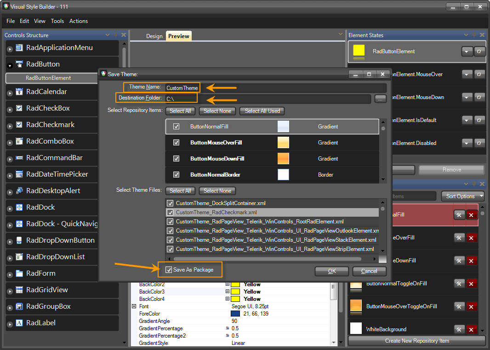

# Using custom themes

Since version R1 2010, Visual Style Builder we have introduced a new theming mechanism, which allows you to create or modify one theme at a time, but for all RadControls simultaneously. The following part shows how you can save and use the custom theme in your application.


## Saving a custom theme

When you choose the __Save__ option, the Visual Style Builder automatically detects whether a theme has been opened and edited. If yes, it simply overwrites the already loaded files with the new XML data. However, if you created a new theme without loading files, the Visual Style Builder will display the __Save As__ dialog and will ask you to choose location and theme name for the newly created theme. What is important is to set the __ThemeName__ and to check __Save As Package__, which will save the theme as .tssp file.

>caption Figure 1: Save the custom theme.



## Loading theme package

The __ThemeResolutionService__ class exposes two static methods that allow you to load a theme package:

* __LoadPackageResource:__ This method loads a theme package file that is contained in the project as an [EmbeddedResource](http://msdn.microsoft.com/en-us/library/0c6xyb66(VS.80).aspx). This is the preferable method for loading a theme package since the resource path to the package is not changed when the application is deployed. The path construction is *DefaultProjectNamespace.ThemeFolder.ThemePackageFile*. The *ThemeFolder* part should only be used if the package is contained in a folder under the main project directory and if the project programming language is C#. In VB.NET project you do not need to include *ThemeFolder* part even if the package file is contained in a folder.
            
#### Loading package resource

{{source=..\SamplesCS\Themes\UsingCustomThemes.cs region=LoadPackageResource}} 
{{source=..\SamplesVB\Themes\UsingCustomThemes.vb region=LoadPackageResource}} 

````C#
ThemeResolutionService.LoadPackageResource("SamplesCS.CustomTheme.tssp");

````
````VB.NET
ThemeResolutionService.LoadPackageResource("SamplesVB.CustomTheme.tssp")

````

{{endregion}} 

* __LoadPackageFile:__ This method loads a file from a specified directory on the system. Depending on how the directory is defined (full or relative), the path to the package may change when the application is deployed on another machine.

#### Loading package file

{{source=..\SamplesCS\Themes\UsingCustomThemes.cs region=LoadPackageFile}} 
{{source=..\SamplesVB\Themes\UsingCustomThemes.vb region=LoadPackageFile}} 

````C#
ThemeResolutionService.LoadPackageFile(@"C:\CustomTheme.tssp");

````
````VB.NET
ThemeResolutionService.LoadPackageFile("C:\CustomTheme.tssp")

````

{{endregion}} 

>important Our **TelerikHelper** class has a static method that determines whether a theme is dark: TelerikHelper.**IsDarkTheme**(themeName). This method is used when an editor in grid activates (if theme is not dark, a white back color is applied to the editor) and the ribbon bars (RichTextEditor, Spreadsheet, Diagram), where different icons set is applied if the theme is dark. So, if you saved a custom theme with a name different from our predefined dark themes, this method, TelerikHelper.**IsDarkTheme**(themeName) will consider the theme as light. This is why in **R2 2020** we introduced a way to register a dark theme and to act as a dark theme everywhere: ThemeResolutionService.**RegisterDarkTheme**(string themeName).

## Applying a theme to an entire application

{{source=..\SamplesCS\Themes\UsingCustomThemes.cs region=setting a theme for the whole application}} 
{{source=..\SamplesVB\Themes\UsingCustomThemes.vb region=setting a theme for the whole application}} 

````C#
ThemeResolutionService.ApplicationThemeName = "CustomTheme";

````
````VB.NET
ThemeResolutionService.ApplicationThemeName = "CustomTheme"

````

{{endregion}} 

## Applying a theme to single control

{{source=..\SamplesCS\Themes\UsingCustomThemes.cs region=setting a theme to single control instance}} 
{{source=..\SamplesVB\Themes\UsingCustomThemes.vb region=setting a theme to single control instance}} 

````C#
radButton1.ThemeName = "CustomTheme";

````
````VB.NET
radButton1.ThemeName = "CustomTheme"

````

{{endregion}} 

## Applying a theme to all instances of a specific control in a form

{{source=..\SamplesCS\Themes\UsingCustomThemes.cs region=setting a theme to all controls from the same kind in a form}} 
{{source=..\SamplesVB\Themes\UsingCustomThemes.vb region=setting a theme to all controls from the same kind in a form}} 

````C#
foreach (Control control in this.Controls)
{
    RadButton button = control as RadButton;
    if (button != null)
    {
        button.ThemeName = "CustomTheme";
    }
}

````
````VB.NET
For Each button As RadButton In Me.Controls
    If button IsNot Nothing Then
        button.ThemeName = "CustomTheme"
    End If
Next

````

{{endregion}} 

# See Also

 * [Saving and Loading Theme Files]()
