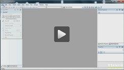
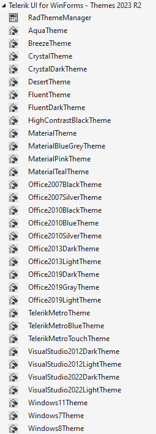
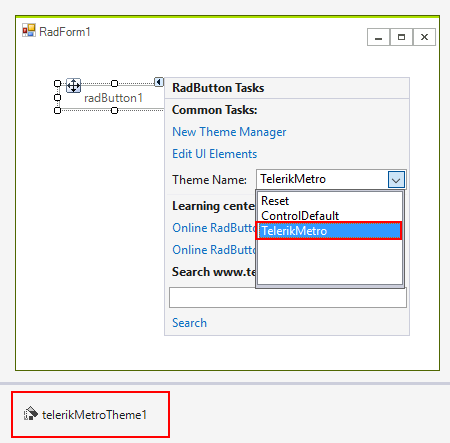
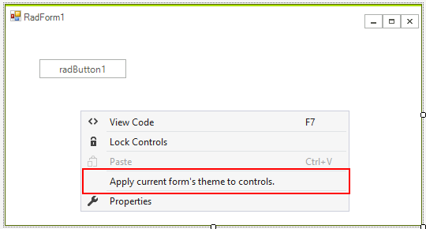

# Using default themes 

| RELATED VIDEOS |  |
| ------ | ------ |
|[Applying themes to RadControls for WinForms at the control and form level.](http://tv.telerik.com/watch/winforms/themes/radcontrols-winforms-theme)||

## 

All themes that come with Telerik UI for WinForms since version R2 2008 are available as standalone components, apart from the control's assemblies. This improvement has been added in order to simplify the way themes are added to the application and to improve the application’s loading time.

If you have installed the suite from the provided installation files, you will see the themes loaded in the Visual Studio toolbox. If you do not see the themes in the toolbox, you will have to [add them manually to the toolbox.]()

>caption Figure 1: The themes in the Visual Studio toolbox.



>note Since R2 2020 **ControlDefault** theme offers additional set of images - SVG images. Clients now are able to choose whether to display SVG or Raster Images in **ControlDefault** theme. By default, SVG images are displayed. More information is available [here]().

>note Since R1 2021 Telerik UI for Winforms suite has introduced the brand new **Office2019Light** theme. Inspired by the latest Microsoft Office application, the **Office2019Light** theme is here to help delivering that fresh look and feel to your WinForms application. As of **R2 2021** there are Gray and Dark variations of the Office2019 theme.

In order to use the Theme components, just drag and drop them from the VS Toolbox to the form. This will add a reference to the corresponding theme assembly in the project and will enable the theme in the ThemeName drop-down of all Telerik controls on the form. All you have to do afterwards is to set the needed theme from the __ThemeName__ drop-down (in the smart tag) or programmatically.

>caption Figure 2: Set the theme at design time using the SmartTag.



## Setting a default theme for a whole application programmatically

Before using the following code snippets, please make sure that you have added the desired theme DLL file to your project references.

#### Setting a default theme for the entire application

{{source=..\SamplesCS\Themes\UsingDefaultThemes.cs region=usingDefaultThemes}} 
{{source=..\SamplesVB\Themes\UsingDefaultThemes.vb region=usingDefaultThemes}} 

````C#
protected override void OnLoad(EventArgs e)
{
    base.OnLoad(e);
    Office2007SilverTheme theme = new Office2007SilverTheme();
    ThemeResolutionService.ApplicationThemeName = "Office2007Silver";
}

````
````VB.NET
Protected Overrides Sub OnLoad(e As EventArgs)
    MyBase.OnLoad(e)
    Dim theme As New Office2007SilverTheme()
    ThemeResolutionService.ApplicationThemeName = "Office2007Silver"
End Sub

````

{{endregion}}

As of **R1 2021** the ThemeResolutionService.**ControlDefaultThemeName** forces an update at runtime. It is possible to define the control default theme name for the entire application. The property works similarly to the ThemeResolutionService.**ApplicationThemeName** but it has lower priority. 

When setting a theme, the priority is as follows, starting with the lowest:

1\. ThemeResolutionService.**ControlDefaultThemeName** - globally sets default theme

2\. RadControl.**ThemeName** - locally sets theme for a control

3\. ThemeResolutionService.**ApplicationThemeName** - globally sets theme for the entire application, overrides all other settings.

## Applying theme to all controls in the current form.

When you are working at design time you can change the theme of the form and apply it to all controls on the form. All you need to do is right-click the form and choose the following item:
 
>caption Figure 3: Apply the current form theme to all controls. 




# See Also
* [Touch Enabled Themes]()

* [Using a Default Theme for the Entire Application]()

* [Using custom themes]()

* [Visual Style Builder]()

