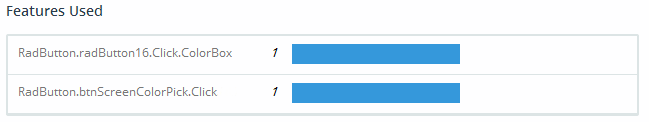

# Telerik Analytics Integration

## 

When you are creating an application for a broad audience, integrating some kind of analytics framework is crucial,
          because you will need to analyze the usage data of the application and its features and most probably you will need to know
          about any application crashes or other errors occurred during the execution. With the Q1 2014 release UI for WinForms provides
          integrated support for
          [
              Telerik Analytics
            ](http://www.telerik.com/analytics)
          . Using Analytics you will be able to trace certain features of the controls and get statistics about their usage.
          By default we have implemented the most used features of our controls (enlisted below) and of course you are enabled to
          track your own features that will better suit your needs. In advance, you can disable the features we track per control.
        

In order to use this service, first you should log into the
          [
              analytics dashboard
            ](https://analytics.telerik.com/)
          , register your application and obtain a __product key__.
          For more information please check out the topic on
          [
              Getting Started with Telerik Analytics.
            ](http://www.telerik.com/analytics/resources/getting-started)
          Then you can create a new Telerik WinForms Application with enabled Analytics support or you can enable it in an existing project.
          Both options are explained in details below.
        

## How to add support to existing applications

First, you will need to reference the EQATEC.Analytics.Monitor.dll in your application. Note that this dll is distributed together with
          the other assemblies in the UI for WinForms suite.
          Then in order to configure the project to support Analytics, please add the following code in the constructor of the Main Form class or static Main function:
        

#### __[C#] __

{{region key}}
	            EQATEC.Analytics.Monitor.IAnalyticsMonitor monitor = Telerik.WinControls.Analytics.TraceMonitor.Initialize("product key");
	{{endregion}}

#### __[VB.NET] __

{{region key}}
	        Dim monitor As Global.EQATEC.Analytics.Monitor.IAnalyticsMonitor = Telerik.WinControls.Analytics.TraceMonitor.Initialize("product key")
	{{endregion}}

Where "product_key" should be replaced with the product key you got after registering your application on
          [
              https://analytics.telerik.com
            ](https://analytics.telerik.com)

## Disable analytics per control

You can disable the analytics functionality for particular controls with their __EnabeleAnalytics__ property.
          Additionally you can customize the analytics data with the __AnalyticsName__ property:
        

#### __[C#] __

{{region properties}}
	            this.radButton1.EnableAnalytics = true;
	            this.radButton1.AnalyticsName = "Save Button";
	{{endregion}}

#### __[VB.NET] __

{{region properties}}
	        Me.RadButton1.EnableAnalytics = True
	        Me.RadButton1.AnalyticsName = "Save Button"
	{{endregion}}

## Tracing features

To trace features please follow the next steps:

* Create Telerik UI for WinForms project called AnalyticsTestApp and add a RadButton to the form.
          

* Make sure you reference the EQATEC.Analytics.Monitor.dll assembly and use the code from the above section
          

* Run the project with the provided code
            

* Click the Button
            

* Close the application.
            

* Go to the Telerik Analytics Dashboard
            

* Expand the AnalyticsTestApp from the DashBoards panel on the left and select __Live__:
            The next screen will list the live usage sessions:
            

Clicking __View__ will show additional details about the session including the exact features used:
        

## Traceable features in UI for WinForms

Currently only few controls support analytics out of the box. Note that only user interactions will be tracked - initial values and values from Bindings are not supported.
          You can find below a list of the controls and their features that support tracing:
        
<table><th><tr><td>

Control</td><td>

Traceable events and methods</td></tr></th><tr><td>

ColorPicker</td><td>

SelectionChanged</td></tr><tr><td>

RadAutocompleteBox
              </td><td>

InsertText</td></tr><tr><td>

RadBindingNavigator</td><td>

MoveToFirst, 
                MoveToPrevious, 
                MoveToNext, 
                MoveToLast 
              </td></tr><tr><td>

RadButton</td><td>

Click</td></tr><tr><td>

RadCalendar</td><td>

SelectionChaned, 
                Navigation,  
                ViewChanged
              </td></tr><tr><td>

RadCarousel</td><td>

Selection</td></tr><tr><td>

RadChartView</td><td>

Zoom, 
                Pan, 
                SelectionChanged
              </td></tr><tr><td>

RadCollapsiblePanel
              </td><td>

Expand, 
                Collapse
              </td></tr><tr><td>

RadColorBox</td><td>

SelectionChanged</td></tr><tr><td>

RadContextMenu</td><td>

Open,
                Close,
                Click (RadContextMenu.DropDown)
              </td></tr><tr><td>

RadDataEntry</td><td>

Editing, 
                Insert/Delete, 
                MoveToFirst, 
                MoveToPrevious, 
                MoveToNext, 
                MoveToLast
              </td></tr><tr><td>

RadDateTimePicker</td><td>

ValueChanged</td></tr><tr><td>

RadDock</td><td>

Save layout, 
                Load layout, 
                Float a pane, 
                Dock a pane, 
                Add window, 
                Remove window
              </td></tr><tr><td>

RadDropDownButton</td><td>

DropDownOpened, 
                DropDownClosed
              </td></tr><tr><td>

RadDropdownList</td><td>

SelectionChanged, 
                DropDownOpened, 
                DropDownClosed
              </td></tr><tr><td>

RadForm</td><td>

SelectionChanged, 
                DropDownOpened, 
                DropDownClosed
              </td></tr><tr><td>

RadGanttView</td><td>

Collapse task, 
                Expand task, 
                Edit task, 
                Selected task
              </td></tr><tr><td>

RadGridView</td><td>

MoveToFirst, 
                MoveToPrevious, 
                MoveToNext, 
                MoveToLast, 
              </td></tr><tr><td>

RadGridView - Paging</td><td>

MoveToFirst, 
                MoveToPrevious, 
                MoveToNext, 
                MoveToLast
              </td></tr><tr><td>

RadListControl</td><td>

SelectionChanged</td></tr><tr><td>

RadMasketEditBox</td><td>

SelectionChanged</td></tr><tr><td>

RadMenu</td><td>

Click</td></tr><tr><td>

RadPageView - ExplorerBar</td><td>

Expand, 
                Collapse, 
                SelectionChanged
              </td></tr><tr><td>

RadPageView - Outlook</td><td>

Expand, 
                Collapse, 
                SelectionChanged
              </td></tr><tr><td>

RadPageView - Strip</td><td>

SelectionChanged</td></tr><tr><td>

RadPanorama</td><td>

Reordering, 
                Scrolling
              </td></tr><tr><td>

RadPdfViewer</td><td>

Load Document, 
                Print, 
                Print Preview
              </td></tr><tr><td>

RadPivotGrid</td><td>

Begin refresh, 
                Complete refresh, 
                Expand group header, 
                Collapse group header, 
                DragDrop field, 
                Export
              </td></tr><tr><td>

RadPropertyGrid</td><td>

Sorting, 
                Grouping, 
                Editing, 
                Searching, 
                Expanding Groups, 
                Expanding nested definition
              </td></tr><tr><td>

RadRadioButton</td><td>

Checked,
                Unchecked
              </td></tr><tr><td>

RadRibbonBar</td><td>

SelectionChanged</td></tr><tr><td>

RadRichTextBox</td><td>

Open Document, 
                    Save Document
                  </td></tr><tr><td>

RadScheduler</td><td>

ViewChanged,
                Import,
                Export,
                Editing,
                Creating,
                DragAndDrop,
                Resize,
                ShowDialog
              </td></tr><tr><td>

RadSpinEditor</td><td>

SelectionChanged</td></tr><tr><td>

RadToggleButton</td><td>

Checked, 
                Unchecked
              </td></tr><tr><td>

RadTrackBar</td><td>

SelectionChanged</td></tr><tr><td>

RadTreeView</td><td>

SelectExpand, 
                    Collapse, 
                    SelectionChanged, 
                    Edit, 
                    RemoveionChanged</td></tr><tr><td>

RadWaitingBar</td><td>

StartWaiting, 
                EndWaiting
              </td></tr></table>
