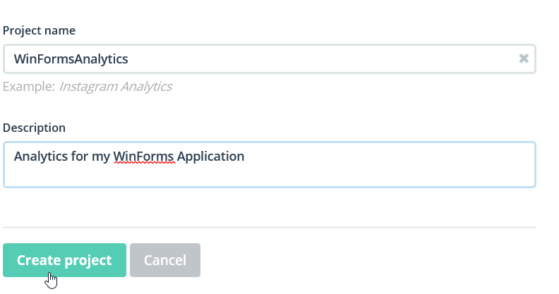
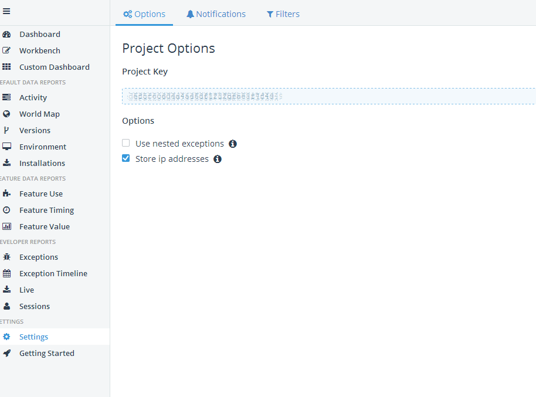
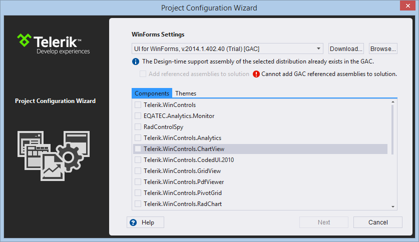
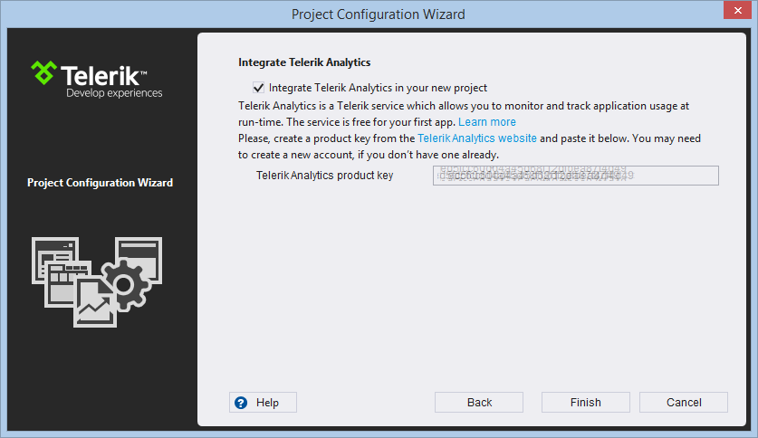

# Getting Started

## 

This article will demonstrate how to integrate Telerik Analytics in WinForms project and monitor your users activities.

1. First you should create Analytics project. To do that you should open your [Telerik Platform](https://platform.telerik.com/#workspaces) account and open (create) a workspace to host your project. Then just click "Create Analytics Project".

	

1. The next page allows you to select the target platform. Select .NET.
	
	

1. Give a name and description for your project and click "Create Project".
	
	

1. Obtain the project key. It can be found in the __Settings__ pane in the right side.
	
	

Now the project is ready and it can be used for monitoring the user activities in a WinForms project. For example you can take the following steps to create a project that uses this functionality.

1. To create a new project in Visual Studio select Telerik Windows Forms Application, give the project a name and click OK.
	
	

1. In the Telerik Project Configuration dialog you can select any desired controls and themes.
	
	

1. After clicking next you will be able to initialize the project with Application Analytics automatically integrated. Make sure that Integrate Telerik Analytics in the new project is checked. Then enter the previously obtained project key.
	

In the Program.cs file you will notice that the initialization code for the Analytics monitor is automatically added.	


This is all that is necessary to start monitoring your application. By default the controls that have integrated support for analytics willstart automatically to capture and send data. And when you start your application it will automatically send data to the Telerik Platform. In case you want to disable this for a particular control you can set its __EnableAnalytics__ property to *false*.

{{source=..\SamplesCS\Eqatec\Eqatec.cs region=disable}} 
{{source=..\SamplesVB\Eqatec\Eqatec.vb region=disable}} 

````C#
this.radButton1.EnableAnalytics = false;

````
````VB.NET
Me.RadButton1.EnableAnalytics = False

````

{{endregion}} 

You can verify that data is collected by navigating to the LiveData pane in your analytics project.


In the session details you can view where and how the application was used.


