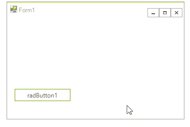

# Animations

Using the [Telerik Presentation Framework]() you can animate almost any element property. To achieve this you should use the __AnimatedPropertySetting__ class. The class constructors takes five arguments:

* The first argument of the __AnimatedPropertySetting__ is the __RadProperty__ to animate.

* The second one is the __start value__.

* Next is the __end value__.

* The forth argument takes the __number of frames__.

* And the last argument is the __time interval between frames__ in milliseconds

## Animate opacity

The following example animates the __Opacity__ property of the RadButton's FillPrimitive, changing it from 1 to 0 (full transparent) and vice versa:


#### Animate button's Opacity property

{{source=..\SamplesCS\TPF\Animations.cs region=AnimateOpacity}} 
{{source=..\SamplesVB\TPF\Animations.vb region=AnimateOpacity}} 

````C#
private void btnAnimateOpacity_Click(object sender, EventArgs e)
{
    if (btnAnimateOpacity.ButtonElement.ButtonFillElement.Opacity == 0)
    {
        AnimatedPropertySetting setting = new AnimatedPropertySetting(FillPrimitive.OpacityProperty, 0.0, 1.0, 20, 20);
        setting.ApplyValue(btnAnimateOpacity.ButtonElement.ButtonFillElement);
    }
    else
    {
        AnimatedPropertySetting setting = new AnimatedPropertySetting(FillPrimitive.OpacityProperty, 1.0, 0.0, 20, 20);
        setting.ApplyValue(btnAnimateOpacity.ButtonElement.ButtonFillElement);
    }
}

````
````VB.NET
Private Sub btnAnimateOpacity_Click(sender As System.Object, e As System.EventArgs) Handles btnAnimateOpacity.Click
    If btnAnimateOpacity.ButtonElement.ButtonFillElement.Opacity = 0 Then
        Dim setting As New AnimatedPropertySetting(FillPrimitive.OpacityProperty, 0.0, 1.0, 20, 20)
        setting.ApplyValue(btnAnimateOpacity.ButtonElement.ButtonFillElement)
    Else
        Dim setting As New AnimatedPropertySetting(FillPrimitive.OpacityProperty, 1.0, 0.0, 20, 20)
        setting.ApplyValue(btnAnimateOpacity.ButtonElement.ButtonFillElement)
    End If
End Sub

````

{{endregion}} 

## Animate margin

Here is how to animate the __Margin__ property of the RadButton's FillPrimitive:


#### Animate button's Margin property

{{source=..\SamplesCS\TPF\Animations.cs region=AnimateMargin}} 
{{source=..\SamplesVB\TPF\Animations.vb region=AnimateMargin}} 

````C#
private void btnAnimateMargin_Click(object sender, EventArgs e)
{
    AnimatedPropertySetting setting2 = new AnimatedPropertySetting();
    setting2.Property = RadElement.MarginProperty;
    setting2.StartValue = new Padding(0);
    setting2.EndValue = new Padding(10);
    setting2.NumFrames = 14;
    setting2.Interval = 30;
    setting2.ApplyValue(btnAnimateMargin.ButtonElement);
}

````
````VB.NET
Private Sub btnAnimateMargin_Click(sender As System.Object, e As System.EventArgs) Handles btnAnimateMargin.Click
    Dim setting2 As New AnimatedPropertySetting()
    setting2.Property = RadElement.MarginProperty
    setting2.StartValue = New Windows.Forms.Padding(0)
    setting2.EndValue = New Windows.Forms.Padding(10)
    setting2.NumFrames = 14
    setting2.Interval = 30
    setting2.ApplyValue(btnAnimateMargin.ButtonElement)
End Sub

````

{{endregion}} 

## Animate bounds

You can also animate the __Bounds__ property of a control. Here is how to create a fly-out animation with RadPanel:



#### Animate button's Bounds property

{{source=..\SamplesCS\TPF\Animations.cs region=AnimateBounds}} 
{{source=..\SamplesVB\TPF\Animations.vb region=AnimateBounds}} 

````C#
private void radButton1_Click(object sender, EventArgs e)
{
    RadPanel panel = new RadPanel();
    panel.BackColor = Color.Yellow;
    panel.AutoSize = true;
    panel.RootElement.StretchVertically = true;
    panel.RootElement.StretchHorizontally = true;
    panel.Location = new Point(10, 10);
    panel.Size = new Size(200, 1);
    panel.Text = "I am RadPanel";
    this.Controls.Add(panel);
    AnimatedPropertySetting setting = new AnimatedPropertySetting();
    setting.Property = RadElement.BoundsProperty;
    setting.StartValue = new Rectangle(0, 0, 200, 1);
    setting.EndValue = new Rectangle(0, 0, 200, 100);
    setting.Interval = 30;
    setting.NumFrames = 10;
    setting.ApplyValue(panel.RootElement);
}

````
````VB.NET
Private Sub RadButton1_Click(sender As System.Object, e As System.EventArgs) Handles RadButton1.Click
    Dim panel As New RadPanel()
    panel.BackColor = Color.Yellow
    panel.AutoSize = True
    panel.RootElement.StretchVertically = True
    panel.RootElement.StretchHorizontally = True
    panel.Location = New Point(10, 10)
    panel.Size = New Size(200, 1)
    panel.Text = "I am RadPanel"
    Me.Controls.Add(panel)
    Dim setting As New AnimatedPropertySetting()
    setting.[Property] = RadElement.BoundsProperty
    setting.StartValue = New Rectangle(0, 0, 200, 1)
    setting.EndValue = New Rectangle(0, 0, 200, 100)
    setting.Interval = 30
    setting.NumFrames = 10
    setting.ApplyValue(panel.RootElement)
End Sub

````

{{endregion}}

# See Also
* [Dependency Properties]()

* [Handling User Input]()

* [HTML-like Text Formatting]()

* [Inherit themes from RadControls derivatives]()


