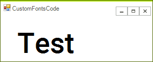

# Custom Fonts

Since R2 2017 Progress Telerik UI for WinForms supports custom fonts. This means that you can use your own fonts without installing them on the local machine. 

The following steps will show how you can load and use the new font:

1\. First you need to add the font as an embedded resource. Then you can load it with the following code: 

{{source=..\SamplesCS\TPF\CustomFontsCode.cs region=LoadAndGetFont}} 
{{source=..\SamplesVB\TPF\CustomFontsCode.vb region=LoadAndGetFont}}
````C#
var fontStream = Assembly.GetExecutingAssembly().GetManifestResourceStream(@"SamplesCS.Resources.Roboto-Medium.ttf");
var names = Assembly.GetExecutingAssembly().GetManifestResourceNames();
          
ThemeResolutionService.LoadFont(fontStream);
var font = ThemeResolutionService.GetCustomFont("Roboto Medium");

````
````VB.NET
Dim fontStream = System.Reflection.Assembly.GetExecutingAssembly().GetManifestResourceStream("SamplesCS.Resources.Roboto-Medium.ttf")
Dim names = System.Reflection.Assembly.GetExecutingAssembly().GetManifestResourceNames()
ThemeResolutionService.LoadFont(fontStream)
Dim font = ThemeResolutionService.GetCustomFont("Roboto Medium")

```` 


{{endregion}} 


2\. Use the following properties to set the font. 

{{source=..\SamplesCS\TPF\CustomFontsCode.cs region=SetCustomFont}} 
{{source=..\SamplesVB\TPF\CustomFontsCode.vb region=SetCustomFont}}
````C#
radLabel1.LabelElement.CustomFont = font.Name;
radLabel1.LabelElement.CustomFontSize = 42;
radLabel1.LabelElement.CustomFontStyle = FontStyle.Regular;

````
````VB.NET
radLabel1.LabelElement.CustomFont = font.Name
radLabel1.LabelElement.CustomFontSize = 42
radLabel1.LabelElement.CustomFontStyle = FontStyle.Regular

```` 


{{endregion}} 

The important part here is that the above properties are available for the __VisualElement__ ancestors (which are most of our elements).

The below image shows the result:

     

# See Also

* [Shadows]()