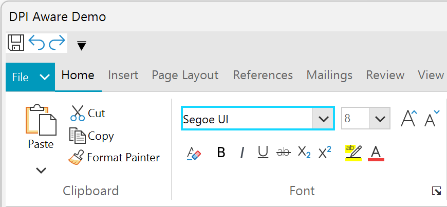

# DPI Support

UI for WinForms is giving your Windows apps a new power today - support for high resolution DPI monitors is now a built-in part of UI for WinForms.

In R2 2017 we are introducing built-in HDPI support in the Progress® Telerik® UI for WinForms suite. This coincides with the HDPI improvements [Microsoft is bringing with .NET 4.7](https://blogs.msdn.microsoft.com/dotnet/2017/04/05/announcing-the-net-framework-4-7/) and the Windows 10 Creators Update. The best part is that you will get this support no matter which .NET framework you are targeting (currently supported from .NET 2.0 and up).

All you will have to do is declare your application as DPI aware and RadControls will scale their UI elements in accordance to the current DPI settings automatically. To do that, you have to have an app.manifest file and/or an app.config file with several lines of code. You can see examples of that in our previous blog post on the [High DPI in WinForms](http://www.telerik.com/blogs/winforms-scaling-at-large-dpi-settings-is-it-even-possible-) matter and in this [Microsoft blog](https://blogs.msdn.microsoft.com/chuckw/2013/09/10/manifest-madness/) post. We will look into the technical details further down this article.

With the changes we are introducing, the common problem of bad scaling when your applications run on high resolution monitors goes away, so your app will ship with higher quality on more systems instantly. The problem with the blurry fonts and unreadable texts will be eliminated and the potential of modern hardware will be utilized fully.

Although it is a bit tricky to demonstrate HDPI support with a single image, here is an example with screenshots of the same application on two different monitors. You will notice that the first image will become blurry unlike the second one.

|Resolution: 3840 x 2160 - Scaling: 250%|
|----|
||
||

## How to Enable HDPI Support in Your Application

Here are the two ways you can make your application DPI aware:

The first way is to add an app.manifest file to your project. In that manifest file add the following XML:

````XML
<?xml version="1.0" encoding="utf-8"?>
<asmv1:assembly manifestVersion="1.0" xmlns="urn:schemas-microsoft-com:asm.v1"
                xmlns:asmv1="urn:schemas-microsoft-com:asm.v1"
                xmlns:asmv2="urn:schemas-microsoft-com:asm.v2"
                xmlns:xsi="http://www.w3.org/2001/XMLSchema-instance"
                xmlns:asmv3="urn:schemas-microsoft-com:asm.v3" >
  <assemblyIdentity version="1.0.0.0" name="MyApplication.app"/>

  <asmv3:application>
    <asmv3:windowsSettings xmlns="http://schemas.microsoft.com/SMI/2005/WindowsSettings">
      <dpiAware>true</dpiAware>
    </asmv3:windowsSettings>
  </asmv3:application>

  <compatibility xmlns="urn:schemas-microsoft-com:compatibility.v1">
    <application>
      <!-- A list of all Windows versions that this application is designed to work with. 
      Windows will automatically select the most compatible environment.-->
      <!-- Windows 10 -->
      <supportedOS Id="{8e0f7a12-bfb3-4fe8-b9a5-48fd50a15a9a}"/>
      <!-- Windows 8.1 -->
      <supportedOS Id="{1f676c76-80e1-4239-95bb-83d0f6d0da78}"/>
      <!-- Windows Vista -->
      <supportedOS Id="{e2011457-1546-43c5-a5fe-008deee3d3f0}"/>
      <!-- Windows 7 -->
      <supportedOS Id="{35138b9a-5d96-4fbd-8e2d-a2440225f93a}"/>
      <!-- Windows 8 -->
      <supportedOS Id="{4a2f28e3-53b9-4441-ba9c-d69d4a4a6e38}"/>

    </application>
  </compatibility>
</asmv1:assembly>

````

>important Applications not manifested for Windows 8.1 or Windows 10 will return the Windows 8 OS version value (6.2). It is mandatory to manifest your applications for Windows 8.1 or Windows 10. Please refer to [Targeting your application for Windows](https://msdn.microsoft.com/bg-bg/library/windows/desktop/dn481241.aspx).

Note that declaring DPI awareness in the app.manifest file breaks ClickOnce applications. The suggested way to avoid this brings us to the second option, which is only available if your project's target framework is **.NET 4.7** and your application run on a Windows 10 Creators update (1703). It requires you to have an app.manifest and an app.config files added to your project. Inside the config file you should have the following settings:

````XML
<?xml version="1.0" encoding="utf-8"?>
<configuration>
  <startup>
    <supportedRuntime version="v4.0" sku=".NETFramework,Version=v4.7"/>
  </startup>
  <System.Windows.Forms.ApplicationConfigurationSection>
    <add key="DPIAwareness" value="PerMonitorV2"/>
    <add key="DisableDpiChangedMessageHandling" value="True" />
  </System.Windows.Forms.ApplicationConfigurationSection>
</configuration>

````

and inside the manifest file you should declare your app is compatible with Windows 10:

````XML
<?xml version="1.0" encoding="utf-8"?>
<assembly manifestVersion="1.0" xmlns="urn:schemas-microsoft-com:asm.v1">
<assemblyIdentity version="1.0.0.0" name="MyApplication.app"/>
<compatibility xmlns="urn:schemas-microsoft-com:compatibility.v1">
  <application>
   <supportedOS Id="{8e0f7a12-bfb3-4fe8-b9a5-48fd50a15a9a}" />
  </application>
</compatibility>
</assembly>

````

>caution It is necessary to set the **AutoScaleMode** property for all **RadForms** to *AutoScaleMode.None* because they handle their own scaling. It is not needed the automatic Windows scaling to be performed.

# See Also 
* [WinForms Scaling at Large DPI Settings–Is It Even Possible?](http://www.telerik.com/blogs/winforms-scaling-at-large-dpi-settings-is-it-even-possible-)