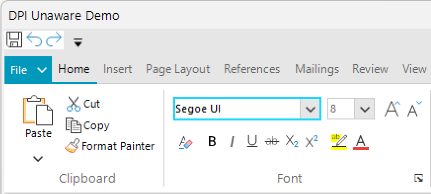

# DPI Support

Telerik UI for WinForms suite gives your Windows Forms applications a new power today - built-in support for high resolution DPI monitors.

In **R2 2017** we introduced built-in HDPI support in the Telerik UI for WinForms suite. This coincides with the HDPI improvements [Microsoft is bringing with .NET 4.7](https://blogs.msdn.microsoft.com/dotnet/2017/04/05/announcing-the-net-framework-4-7/) and the *Windows 10 Creators Update*. The best part is that you will get this support no matter which .NET framework you are targeting (currently supported from .NET 2.0 and up).

All you will have to do is to declare your application as DPI aware and all RadControls will scale their UI elements in accordance to the current DPI settings automatically. To do that, you have to add an **app.manifest** file and/or an **app.config** file with several lines of code. You can see examples of that in our blog post on the [High DPI in WinForms](http://www.telerik.com/blogs/winforms-scaling-at-large-dpi-settings-is-it-even-possible-) matter. We will look into the technical details further down this article.

With the changes we have introduced, the common problem of bad scaling when your applications run on high resolution monitors goes away. So, your app will ship with higher quality on more systems instantly. The problem with the blurry fonts and unreadable texts will be eliminated and the potential of modern hardware will be utilized fully.

>important In order to produce as good layout as possible when running your application on monitors with different DPI scaling, it is important to have some thoughts in mind before you start designing the application: [HDPI Tips and Tricks]().

Although it is a bit tricky to demonstrate HDPI support with a single image, here is an example with screen shots of the same application on two different monitors. You will notice that the first image will become blurry, unlike the second one.

|Resolution: 3840 x 2160 - Scaling: 250%|
|----|
||
||

There are four different DPI awareness modes in Windows.

* **Unaware** – bitmap stretching is used.
* **System** – Introduced in Windows Vista. The OS treats all displays with same DPI of the primary display. Bitmap stretching is used.
* **Per-Monitor** – Introduced in Windows 8.1. Every display has its own DPI and the application window is notified of DPI change.
* **Per-Monitor V2** – Introduced with Windows 10 Creators Update (1703). On top of the previous mode there is automatic scaling of the non-client area and certain controls and dialogs.

## How to Enable HDPI Support in Your Application

When building a DPI-aware application, firstly you must declare it as such, so the OS would know how to handle it. Furthermore, you can have DPI awareness per process or per thread.

There are two main approaches for making your application DPI aware:

### Application Manifest File

The most common way to declare an application as DPI aware is through the application manifest file. There are two settings that you can use - **&lt;dpiAware&gt;** and **&lt;dpiAwareness&gt;**. Here is a small table that describes the different states that you can use with each setting:

<table>
<th></th><th>Minimum Supported OS</th><th>States</th><th>DPI Mode</th>
<tr><td><b>&lt;dpiAware&gt;</b></td><td>Windows Vista</td><td><table><tr><td>false</td></tr><tr><td>true</td></tr><tr><td>true/pm</td></tr></table></td><td><table><tr><td>Unaware</td></tr><tr><td>System aware</td></tr><tr><td>Per-monitor aware</td></tr></table></td></tr>
<tr><td><b>&lt;dpiAwareness&gt;</b></td><td>Windows 10, version 1607</td><td><table><tr><td>unaware</td></tr><tr><td>system</td></tr><tr><td>PerMonitor</td></tr><tr><td>PerMonitorV2</td></tr></table></td><td><table><tr><td>Unaware</td></tr><tr><td>System aware</td></tr><tr><td>Per-monitor aware</td></tr><tr><td>Per-monitor-v2 aware</td></tr></table></td></tr>
<tr></tr>
</table>

You can use both settings in the manifest file. If so, Windows 10, version 1607, will ignore <b>&lt;dpiAware&gt;</b> and use only the newer <b>&lt;dpiAwareness&gt;</b>. Older versions will ignore <b>&lt;dpiAwareness&gt;</b>. Here is how the manifest should look if you want to configure DPI awareness for different Windows versions.

````XML

<?xml version="1.0" encoding="utf-8"?>
<asmv1:assembly manifestVersion="1.0" xmlns="urn:schemas-microsoft-com:asm.v1"
                xmlns:asmv1="urn:schemas-microsoft-com:asm.v1"
                xmlns:asmv2="urn:schemas-microsoft-com:asm.v2"
                xmlns:xsi="http://www.w3.org/2001/XMLSchema-instance"
                xmlns:asmv3="urn:schemas-microsoft-com:asm.v3" >
  <assemblyIdentity version="1.0.0.0" name="MyApplication.app"/>

  <asmv3:application>
    <asmv3:windowsSettings xmlns="http://schemas.microsoft.com/SMI/2005/WindowsSettings">
      <dpiAware xmlns="http://schemas.microsoft.com/SMI/2005/WindowsSettings">true/PM</dpiAware>
      <dpiAwareness xmlns="http://schemas.microsoft.com/SMI/2016/WindowsSettings">PerMonitorV2</dpiAwareness>
    </asmv3:windowsSettings>
  </asmv3:application>

  <compatibility xmlns="urn:schemas-microsoft-com:compatibility.v1">
    <application>
      <!-- A list of all Windows versions that this application is designed to work with. 
      Windows will automatically select the most compatible environment.-->
      <!-- Windows 10 -->
      <supportedOS Id="{8e0f7a12-bfb3-4fe8-b9a5-48fd50a15a9a}"/>
      <!-- Windows 8.1 -->
      <supportedOS Id="{1f676c76-80e1-4239-95bb-83d0f6d0da78}"/>
      <!-- Windows Vista -->
      <supportedOS Id="{e2011457-1546-43c5-a5fe-008deee3d3f0}"/>
      <!-- Windows 7 -->
      <supportedOS Id="{35138b9a-5d96-4fbd-8e2d-a2440225f93a}"/>
      <!-- Windows 8 -->
      <supportedOS Id="{4a2f28e3-53b9-4441-ba9c-d69d4a4a6e38}"/>

    </application>
  </compatibility>
</asmv1:assembly>

````

>important Applications not manifested for Windows 8.1 or Windows 10 will return the Windows 8 OS version value (6.2). It is mandatory to manifest your applications for Windows 8.1 or Windows 10. Please refer to [Targeting your application for Windows](https://msdn.microsoft.com/bg-bg/library/windows/desktop/dn481241.aspx).

>caution Note that declaring DPI awareness in the app.manifest file breaks ClickOnce applications. The following KB article demonstrates how to deal with this problem: [ClickOnce Application is Broken]().

### App.Config File

Another way that was introduced for Windows Forms in .NET Framework 4.7 is in the app.config file. Microsoft added a new element to add different features to a Windows Forms app called <System.Windows.Forms.ApplicationConfigurationSection>. In order to use it you need to do the following:

* Declare compatibility with Windows 10 in the **app.manifest** file:

````XML

 <compatibility xmlns="urn:schemas-microsoft-com:compatibility.v1">
  <application>
    <!-- Windows 10 compatibility -->
    <supportedOS Id="{8e0f7a12-bfb3-4fe8-b9a5-48fd50a15a9a}" />
  </application>
</compatibility>

````

* Use the new element in the **app.config** file:

````XML

<System.Windows.Forms.ApplicationConfigurationSection>
  <add key="DpiAwareness" value="PerMonitorV2" />
</System.Windows.Forms.ApplicationConfigurationSection>  

````

* Call the static method in your application’s entry point: [Application.EnableVisualStyles();](https://docs.microsoft.com/en-us/dotnet/api/system.windows.forms.application.enablevisualstyles?view=netcore-3.1)

With the <System.Windows.Forms.ApplicationConfigurationSection> element you can set other DPI features as well. For more information you can check [this article](https://docs.microsoft.com/en-us/dotnet/framework/configure-apps/file-schema/winforms/windows-forms-add-configuration-element).

>caution Using <b>&lt;dpiAware&gt;</b>/<b>&lt;dpiAwareness&gt;</b> in the manifest file overrides the settings defined in the app.config file.

>important In **R3 2017** we introduced the __EnableDpiScaling__ property that allows you to enable/disable this on a global level. This is a static property of __RadControl__ and must set before any controls are initialized. For example in the form's constructor. 

>important In **R2 2020 SP1** we introduced the **EnableImageDpiScaling** property indicating whether the RadControls scaling logic will be used to resize the images when the application is run in a high DPI environment. This is a static property of __RadControl__ and must set before any controls are initialized. For example in the form's constructor. 

### Native API 

Even though it is not a common approach, there are several native API calls that can set awareness. Additional information is available in [this](https://www.telerik.com/blogs/winforms-scaling-at-large-dpi-settings-is-it-even-possible-#dpiAwareness) blog post.

## Static Method in .NET Core 3.0/.NET5 Preview

With .NET Core 3.0 Microsoft introduced a new way to set a high DPI mode for Windows Forms. A static method called [Application.SetHighDpiMode(HighDpiMode)](https://docs.microsoft.com/en-us/dotnet/api/system.windows.forms.application.sethighdpimode), where [HighDpiMode](https://docs.microsoft.com/en-us/dotnet/api/system.windows.forms.highdpimode) is enum with the following values:

* DpiUnaware
* SystemAware
* PerMonitor
* PerMonitorV2
* DpiUnawareGdiScaled

The call must be done at the application entry point. If you have used a manifest file to set the DPI awareness mode, this method call will fail.

# See Also 
* [WinForms Scaling at Large DPI Settings–Is It Even Possible?](http://www.telerik.com/blogs/winforms-scaling-at-large-dpi-settings-is-it-even-possible-)
* [HDPI Tips and Tricks]()
