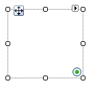

# RadRadioButtonElement

__RadRadioButtonlElement__ contains the logic and user interface for a single RadRadioButton.



{{source=..\SamplesCS\TPF\Elements\MyRadioButtonControl.cs region=myRadioButtonControl}} 
{{source=..\SamplesVB\TPF\Elements\MyRadioButtonControl.vb region=myRadioButtonControl}} 

````C#
public class MyRadioButtonControl : RadControl
{
    protected override void CreateChildItems(RadElement parent)
    {
        RadRadioButtonElement radRadioButtonElement = new RadRadioButtonElement();
        radRadioButtonElement.ToggleState = ToggleState.On;
        radRadioButtonElement.RadioCheckAlignment = ContentAlignment.BottomRight;
        this.RootElement.Children.Add(radRadioButtonElement);
        base.CreateChildItems(parent);
    }
}

````
````VB.NET
Public Class MyRadioButtonControl
    Inherits RadControl
    Protected Overrides Sub CreateChildItems(ByVal parent As RadElement)
        Dim radRadioButtonElement As New RadRadioButtonElement()
        radRadioButtonElement.ToggleState = ToggleState.On
        radRadioButtonElement.RadioCheckAlignment = ContentAlignment.BottomRight
        Me.RootElement.Children.Add(radRadioButtonElement)
        MyBase.CreateChildItems(parent)
    End Sub
End Class

````

{{endregion}}

# See Also
* [Elements Overview]()

* [RadTrackBarElement]()

