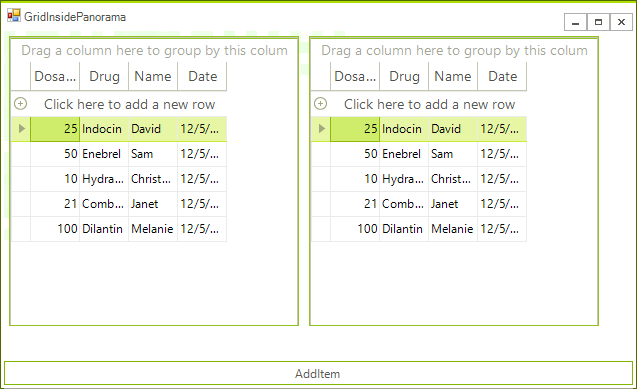

# Use Controls inside an Element

Please note that when you are creating custom controls, you can use the predefined elements that the control offers. Most of the controls in the suite have a corresponding element which can be used in the custom controls. However, in cases with complex controls, the respective elements cannot be used instead. In such cases you can use the __RadHostItem__  class which allows you to add controls to elements. 

### Example add RadgridView to a panorama tile.

The tiles are simple elements that can show image and text. The following code shows how you can add a tile at runtime. The tile will contain a bound RadGridView.

#### Add Grid to a panorama tile.

{{source=..\SamplesCS\TPF\Elements\GridInsidePanorama.cs region=AddGridToItem}} 
{{source=..\SamplesVB\TPF\Elements\GridInsidePanorama.vb region=AddGridToItem}}
````C#
int col = 0;
private void RadButton1_Click(object sender, EventArgs e)
{
    RadGridView grid = new RadGridView();
    grid.DataSource = GetTable();
    RadHostItem hostItem = new RadHostItem(grid);
    RadTileElement panoramaItem = new RadTileElement();
    panoramaItem.Column = col++;
    panoramaItem.Children.Add(hostItem);
    radPanorama1.Items.Add(panoramaItem);
}

````
````VB.NET
Private col As Integer = 0
Private Sub RadButton1_Click(ByVal sender As Object, ByVal e As EventArgs)
    Dim grid As New RadGridView()
    grid.DataSource = GetTable()
    Dim hostItem As New RadHostItem(grid)
    Dim panoramaItem As New RadTileElement()
    panoramaItem.Column = col
    col += 1
    panoramaItem.Children.Add(hostItem)
    radPanorama1.Items.Add(panoramaItem)
End Sub

````

{{endregion}}

>caption Figure 1: A Grid added to a panorama tile.

