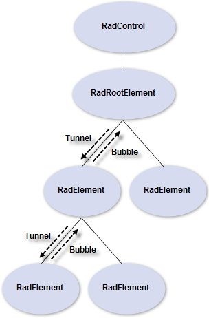

# Routed Events

Routed events are a structure that allows events to tunnel down the visual tree to a target element or bubble up to the root element. When the event is raised it travels up or down the tree, invoking event handlers that subscribe to the event. Routed events are supported through the __RadElement__ __RaiseTunnelEvent()__, __RaiseBubbleEvent()__ and __RaiseRoutedEvent()__ methods. The event can be canceled at any level so that tunneling or bubbling ceases to subsequent elements. The __RoutedEventArgs__ object contains a __Canceled__ property used by component code to stop routed events propagation. __RoutedEventArgs__ also defines __RoutingDirection__(values are __Tunnel__ or __Bubble__), the __RoutedEvent__ and a copy of the __OriginalEventArgs__.

# See Also
* [CLR Events]()

