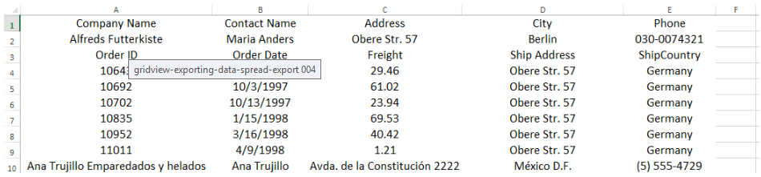

# SpreadExportRenderer


The __SpreadExportRenderer__ class gives you access to the exported document and provides you with the ability to change it before it is saved.
        

The __SpreadExportRenderer__ API gives you the ability to manipulate the document. The most important part is the __WorkbookCreated__ event. This event is triggered on the __SpreadExportRenderer__ object when the workbook is ready to be exported. Allows to introduce final customizations (for example you can add [header and footer]()). More information on how to work with Workbook is available here: [Working with Workbooks]().
        

The following example shows how you can subscribe to the event and use it to best fit the columns in the file:

{{source=..\SamplesCS\TPF\ExportData\SpreadExportRendererCode.cs region=AttachRenderer}} 
{{source=..\SamplesVB\TPF\ExportData\SpreadExportRendererCode.vb region=AttachRenderer}} 

````C#
          
            SpreadExportRenderer exportRenderer = new SpreadExportRenderer();
            exportRenderer.WorkbookCreated += exportRenderer_WorkbookCreated;
````
````VB.NET
        Dim exportRenderer As New SpreadExportRenderer()
        AddHandler exportRenderer.WorkbookCreated, AddressOf exportRenderer_WorkbookCreated
        '#End Region
    End Sub
    '#region WorbookCreated
    Private Sub exportRenderer_WorkbookCreated(ByVal sender As Object, ByVal e As WorkbookCreatedEventArgs)
        Dim worksheet As Worksheet = CType(e.Workbook.Sheets(0), Worksheet)
        worksheet.Columns(worksheet.UsedCellRange).AutoFitWidth()
    End Sub
    '
````

{{endregion}} 

{{source=..\SamplesCS\TPF\ExportData\SpreadExportRendererCode.cs region=WorbookCreated}} 
{{source=..\SamplesVB\TPF\ExportData\SpreadExportRendererCode.vb region=WorbookCreated}} 

````C#
        void exportRenderer_WorkbookCreated(object sender, WorkbookCreatedEventArgs e)
        {
            Worksheet worksheet = (Worksheet)e.Workbook.Sheets[0];
            worksheet.Columns[worksheet.UsedCellRange].AutoFitWidth();
        }
````
````VB.NET
    Private Sub exportRenderer_WorkbookCreated(ByVal sender As Object, ByVal e As WorkbookCreatedEventArgs)
        Dim worksheet As Worksheet = CType(e.Workbook.Sheets(0), Worksheet)
        worksheet.Columns(worksheet.UsedCellRange).AutoFitWidth()
    End Sub
    '
````

{{endregion}} 



