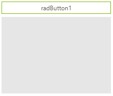

# Focus Border and Ripple Animations

The elements which build **RadControls** can display a focus border and ripple animations. These animations are defined and painted by the base **RadItem** class.

The following properties can be used to enable and control the appearances of the focus border and ripple animations:

* **EnableFocusBorder:** Enables focus border of a particular **RadItem** instance.

* **EnableFocusBorderAnimation:** Enables focus border animation of a particular **RadItem** instance.

* **FocusBorderWidth:** Gets or Sets the focus border width.

* **FocusBorderColor:** Gets or Sets the focus border color.

* **EnableRippleAnimation:** Enables ripple animation of a particular **RadItem** instance.

* **RippleAnimationColor:** Gets or Sets the ripple animation color.


The following example demonstrates how one can enable the focus border and ripple animations of a **RadButton** 
and a **RadTextBoxControl** using the **TelerikMetro** theme.

>caption Figure 1: Focus Border and Ripple Animations



#### RadTextBoxControl Focus Border and Ripple Animations

{{source=..\SamplesCS\TPF\FocusBorderAndRippleAnimationsForm.cs region=TextBoxElementAnimations}} 
{{source=..\SamplesVB\TPF\FocusBorderAndRippleAnimationsForm.vb region=TextBoxElementAnimations}}
````C#
this.radTextBoxControl1.TextBoxElement.EnableFocusBorder = true;
this.radTextBoxControl1.TextBoxElement.EnableFocusBorderAnimation = true;
this.radTextBoxControl1.TextBoxElement.FocusBorderWidth = 5;
this.radTextBoxControl1.TextBoxElement.FocusBorderColor = Color.DarkGreen;
this.radTextBoxControl1.TextBoxElement.EnableRippleAnimation = true;
this.radTextBoxControl1.TextBoxElement.RippleAnimationColor = Color.FromArgb(55, 144, 238, 144);

````
````VB.NET
Me.radTextBoxControl1.TextBoxElement.EnableFocusBorder = True
Me.radTextBoxControl1.TextBoxElement.EnableFocusBorderAnimation = True
Me.radTextBoxControl1.TextBoxElement.FocusBorderWidth = 5
Me.radTextBoxControl1.TextBoxElement.FocusBorderColor = Color.DarkGreen
Me.radTextBoxControl1.TextBoxElement.EnableRippleAnimation = True
Me.radTextBoxControl1.TextBoxElement.RippleAnimationColor = Color.FromArgb(55, 144, 238, 144)

````


{{endregion}}

#### RadButtton Ripple Animations

{{source=..\SamplesCS\TPF\FocusBorderAndRippleAnimationsForm.cs region=ButtonElementAnimations}} 
{{source=..\SamplesVB\TPF\FocusBorderAndRippleAnimationsForm.vb region=ButtonElementAnimations}}
````C#
this.radButton1.ButtonElement.EnableRippleAnimation = true;
this.radButton1.ButtonElement.RippleAnimationColor = Color.FromArgb(55, 144, 238, 144);

````
````VB.NET
Me.radButton1.ButtonElement.EnableRippleAnimation = True
Me.radButton1.ButtonElement.RippleAnimationColor = Color.FromArgb(55, 144, 238, 144)

````


{{endregion}} 
  
# See Also

* [Animations]()
* [Shadows]()
