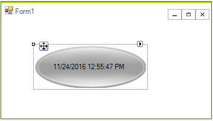

# Getting Started

The following tutorial demonstrates:

* Using primitives to build a custom panel element.

* Using the custom panel element to build a custom RadControl.

* Using dependency properties.

The example control will contain a filled area and a centered text primitive. A timer will update the text to reflect the current date and time.


## Create the Element Class

1. In Visual Studio, create a new __Windows Controls Library__. In this example the library will be named "RadControlLib001".

1. Add references to Telerik.WinControls.UI.dll, TelerikCommon.dll and Telerik.WinControls.dll

1. Delete the UserControl1, since we will not need it

1. In the controls library add a new class "MyPanelElement.cs".

1. Replace the MyPanelElement.cs code with the code below.

>note Notice in the code below:
* MyPanelElement descends from RadItem so that it can be used in the designer.
* In the CreateChildElements() method the Class property of each primitive is assigned. This allows Telerik Presentation Foundation to apply themes to specific parts of the control.
* In the CreateChildElements() method the TextPrimitive Text property is bound to the CurrentTimeProperty.
* A standard CLR style property is defined for CurrentTime that wraps the Dependency property.>The effect of this configuration of properties is that when the CurrentTime property is changed, either by a timer or elsewhere in the code, the dependency property CurrentTimeProperty value changes, the bound TextPrimitive Text property is assigned the CurrentTimeProperty value and the display updates to show the new time.
>

#### Creating MyPanelElement

{{source=..\SamplesCS\TPF\GettingStarted\MyPanelElement.cs region=myPanelElement}} 
{{source=..\SamplesVB\TPF\GettingStarted\MyPanelElement.vb region=myPanelElement}} 

````C#
public class MyPanelElement : RadElement
{
    TextPrimitive text;
    FillPrimitive background;
    Timer updateTime;
    protected override void CreateChildElements()
    {
        base.CreateChildElements();
        this.text = new TextPrimitive();
        this.text.ZIndex = 2;
        this.text.Margin = new Padding(39, 45, 0, 0);
        this.text.BindProperty(TextPrimitive.TextProperty, this,
        MyPanelElement.CurrentTimeProperty, PropertyBindingOptions.OneWay);
        this.background = new FillPrimitive();
        this.background.GradientStyle = GradientStyles.OfficeGlass;
        this.Children.Add(this.text);
        this.Children.Add(this.background);
        updateTime = new Timer();
        updateTime.Interval = 100;
        updateTime.Tick += new EventHandler(updateTime_Tick);
        updateTime.Start();
    }
    bool active = true;
    public bool Active
    {
        get { return active; }
        set
        {
            active = value;
            if (!value)
            {
                this.updateTime.Stop();
            }
            else
            {
                this.updateTime.Start();
            }
        }
    }
    void updateTime_Tick(object sender, EventArgs e)
    {
        this.SetValue(CurrentTimeProperty, DateTime.Now.ToString());
    }
    public static RadProperty CurrentTimeProperty = 
        RadProperty.Register("CurrentTimeProperty", typeof(string), typeof(MyPanelElement),
    new RadElementPropertyMetadata(null, ElementPropertyOptions.AffectsDisplay));
    public string CurrentTime
    {
        get { return (string)this.GetValue(CurrentTimeProperty); }
        set { this.SetValue(CurrentTimeProperty, value); }
    }
}

````
````VB.NET
Public Class MyPanelElement
    Inherits RadItem
    Private text_ As TextPrimitive
    Private background As FillPrimitive
    Private updateTime As Timer
    Protected Overloads Overrides Sub CreateChildElements()
        MyBase.CreateChildElements()
        Me.text_ = New TextPrimitive()
        Me.text_.ZIndex = 2
        Me.text_.Margin = New Padding(39, 45, 0, 0)
        Me.text_.BindProperty(TextPrimitive.TextProperty, Me, MyPanelElement.CurrentTimeProperty, PropertyBindingOptions.OneWay)
        Me.background = New FillPrimitive()
        Me.background.GradientStyle = GradientStyles.OfficeGlass
        Me.Children.Add(Me.text_)
        Me.Children.Add(Me.background)
        updateTime = New Timer()
        updateTime.Interval = 100
        AddHandler updateTime.Tick, AddressOf updateTime_Tick
        updateTime.Start()
    End Sub
    Private active As Boolean = True
    Public Property ActiveProp() As Boolean
        Get
            Return active
        End Get
        Set(ByVal value As Boolean)
            active = value
            If Not value Then
                Me.updateTime.[Stop]()
            Else
                Me.updateTime.Start()
            End If
        End Set
    End Property
    Sub updateTime_Tick(ByVal sender As Object, ByVal e As EventArgs)
        Me.SetValue(CurrentTimeProperty, DateTime.Now.ToString())
    End Sub
    Public Shared CurrentTimeProperty As RadProperty = RadProperty.Register("CurrentTimeProperty", GetType(String), GetType(MyPanelElement), New RadElementPropertyMetadata(Nothing, ElementPropertyOptions.AffectsDisplay))
    Public Property CurrentTime() As String
        Get
            Return DirectCast(Me.GetValue(CurrentTimeProperty), String)
        End Get
        Set(ByVal value As String)
            Me.SetValue(CurrentTimeProperty, value)
        End Set
    End Property
End Class

````

{{endregion}} 

## Create the Control Class

1. Add a second class to the control library and name it "MyPanel.cs".

1. Replace the MyPanel.cs code with the code below.

>note Notice in the code below:
>
* MyPanel descends from RadControl.
* The PanelElement property surfaces the underlying element for general purpose uses. In this example the PanelElement property is used in the theme designer.
* In the CreateChildItems() method, MyPanelElement is created and added to the root element Children collection.>

#### Creating MyPanel control

{{source=..\SamplesCS\TPF\GettingStarted\MyPanel.cs region=myPanel}} 
{{source=..\SamplesVB\TPF\GettingStarted\MyPanel.vb region=myPanel}} 

````C#
[ToolboxItem(true)]
public class MyPanel : RadControl
{
    private MyPanelElement panelElement;
    public MyPanel()
    {
        this.AutoSize = true;
    }
    public MyPanelElement PanelElement
    {
        get
        {
            return this.panelElement;
        }
    }
    public bool Active
    {
        get
        {
            return this.panelElement.Active;
        }
        set
        {
            this.panelElement.Active = value;
        }
    }
    protected override Size DefaultSize
    {
        get
        {
            return new Size(200, 100);
        }
    }
    protected override void CreateChildItems(RadElement parent)
    {
        this.panelElement = new MyPanelElement();
        this.RootElement.Children.Add(panelElement);
        base.CreateChildItems(parent);
    }
}

````
````VB.NET
<ToolboxItem(True)> _
Public Class MyPanel
    Inherits RadControl
    Private panelElement As MyPanelElement
    Public Sub New()
        Me.AutoSize = True
    End Sub
    Public ReadOnly Property PanelElementProp() As MyPanelElement
        Get
            Return Me.panelElement
        End Get
    End Property
    Public Property ActiveProp() As Boolean
        Get
            Return Me.panelElement.ActiveProp
        End Get
        Set(ByVal value As Boolean)
            Me.panelElement.ActiveProp = value
        End Set
    End Property
    Protected Overloads Overrides ReadOnly Property DefaultSize() As System.Drawing.Size
        Get
            Return New System.Drawing.Size(200, 100)
        End Get
    End Property
    Protected Overloads Overrides Sub CreateChildItems(ByVal parent As RadElement)
        Me.panelElement = New MyPanelElement()
        Me.RootElement.Children.Add(panelElement)
        MyBase.CreateChildItems(parent)
    End Sub
End Class

````

{{endregion}} 

## Testing the Control

1. Add a new __Windows Forms__ project to the solution to test the control library.
          

1. Add a reference to the control library.

     
          

1. Drop the __MyPanel__ control from the __ToolBox__ to the form.
          

1. In the Properties Window set the __Active__ property for MyPanel to __True__.
          

The control should now look something like this:


