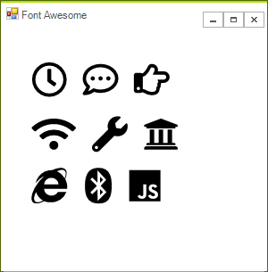

# Glyphs

With the new Material theme we have introduced a new approach to add icons and icon-like images. We are providing font "glyphs" via custom fonts. The glyphs are vector symbols that can be used as information-carrying icons or interaction indicators. The glyphs are vector paths which are easily scalable without loss of quality.

There is a wide range of different beautiful built-in glyphs to choose from. They are easily colored – since they are text shapes. It is achieved by setting a Foreground color, which allows their usage in scenarios where the background of the control changes between light and dark color in different interaction states – e.g. buttons.

They are all contained in the small font file and available for use with the inclusion of the Telerik.Windows.Controls assembly and merging the needed resource dictionary for easier referencing.

They are available for use in any of our themes. They are not specific for the Material theme.

# Font TelerikWebUI 

The **TelerikWebUI** font provides over 400 individual glyphs. We have chosen this approach to define the icons in the Material because it provides a number of advantages and benefits.

The recommended size for the TelerikWebUI glyphs is 16 or any multiple of it (e.g. 32, 48, 64 etc.) since they are designed for 16px height. However, they are vector paths and, like any font, would look clean, distinguishable, non-pixelated and beautiful in almost any size, which is their advantage to raster images and icons.

The available glyphs are separated in several groups, based on their usage:

* __Navigation and Layout__
* __Action__
* __Media__
* __Toggle__
* __Alert and Notification__
* __Image__
* __Editor__
* __Map__
* __Social__
* __File__

>note The following article lists all available glyphs from the TelerikWebUI font along with their names, number and string values: [Glyphs Reference](http://docs.telerik.com/devtools/winforms/telerik-presentation-framework/glyphs-reference-sheet).
>

As of R1 2022, it is possible to access the glyphs directly using their names from the table in the above referred help article.

{{source=..\SamplesCS\TPF\CustomFontsCode.cs region=AccessGlyphWebUIFont}} 
{{source=..\SamplesVB\TPF\CustomFontsCode.vb region=AccessGlyphWebUIFont}}

````C#

string fontName = TelerikWebUIFont.Name;
string glyphText= TelerikWebUIFont.GlyphMarkerPinTarget;

````
````VB.NET

Dim fontName As String = TelerikWebUIFont.Name
Dim glyphText As String = TelerikWebUIFont.GlyphMarkerPinTarget

````

{{endregion}} 


# Font Awesome 

This is an open source font consisting of close to 1400 icons. The Font Awesome pack has three different types.

* __Awesome-Brands-Regular__
* __Awesome-Regular__
* __Awesome-Solid__

>note The available Font Awesome icons are listed here: [Font Awesome](https://fontawesome.com/icons?d=gallery&m=free) 
>

# Using Glyphs

The glyphs are basically text shapes, so they need to be hosted in a control with a text contents. The following example shows how you can use the Glyphs with RadLabel

#### TelerikWebUI Example

{{source=..\SamplesCS\TPF\CustomFontsCode.cs region=GetWebUIFont}} 
{{source=..\SamplesVB\TPF\CustomFontsCode.vb region=GetWebUIFont}}

````C#

var font1 = ThemeResolutionService.GetCustomFont("TelerikWebUI");
radLabel1.LabelElement.CustomFont = font1.Name;
           
radLabel1.Text = "\ue920 | \ue812 | \ue13A";

````
````VB.NET

Dim font1 = ThemeResolutionService.GetCustomFont("TelerikWebUI")
radLabel1.LabelElement.CustomFont = font1.Name
radLabel1.Text = ChrW(&HE920).ToString() & " | " & ChrW(&HE812).ToString() & " | " & ChrW(&HE13A).ToString()

````

{{endregion}} 


The bellow image shows the results:

    

#### Font Awesome Example

{{source=..\SamplesCS\TPF\CustomFontsCode.cs region=GetFontAwesome}} 
{{source=..\SamplesVB\TPF\CustomFontsCode.vb region=GetFontAwesome}}
````C#
this.radLabel1.LabelElement.CustomFont = "Font Awesome 5 Free Regular";
this.radLabel2.LabelElement.CustomFont = "Font Awesome 5 Free Solid";
this.radLabel3.LabelElement.CustomFont = "Font Awesome 5 Brands Regular";
// The text below consists of Unicode glyphs which can be copied from the Font Awesome website:
// https://fontawesome.com/icons?d=gallery&m=free
this.radLabel1.Text = "\uF017 \uF4AD \uF0A4";
this.radLabel2.Text = "\uF1EB \uF0AD \uF19C";
this.radLabel3.Text = "\uF26B \uF293 \uF3B8";
this.radLabel1.LabelElement.CustomFontSize =
    this.radLabel2.LabelElement.CustomFontSize =
    this.radLabel3.LabelElement.CustomFontSize = 30;
this.radLabel1.LabelElement.LabelText.TextRenderingHint =
    this.radLabel2.LabelElement.LabelText.TextRenderingHint =
    this.radLabel3.LabelElement.LabelText.TextRenderingHint = System.Drawing.Text.TextRenderingHint.AntiAlias;

````
````VB.NET
Me.radLabel1.LabelElement.CustomFont = "Font Awesome 5 Free Regular"
Me.radLabel2.LabelElement.CustomFont = "Font Awesome 5 Free Solid"
Me.radLabel3.LabelElement.CustomFont = "Font Awesome 5 Brands Regular"
Me.radLabel1.Text = "\uF017 \uF4AD \uF0A4"
Me.radLabel2.Text = "\uF1EB \uF0AD \uF19C"
Me.radLabel3.Text = "\uF26B \uF293 \uF3B8"
Me.radLabel1.LabelElement.CustomFontSize = Me.radLabel2.LabelElement.CustomFontSize = Me.radLabel3.LabelElement.CustomFontSize = 30
Me.radLabel1.LabelElement.LabelText.TextRenderingHint = Me.radLabel2.LabelElement.LabelText.TextRenderingHint = Me.radLabel3.LabelElement.LabelText.TextRenderingHint = System.Drawing.Text.TextRenderingHint.AntiAlias

````


{{endregion}} 

The bellow image shows the results:

 

# See Also

* [Custom Fonts]()
* [Font Awesome on GitHub](https://github.com/FortAwesome/Font-Awesome)
* [Font Awesome Cheatsheet](https://fontawesome.com/cheatsheet)
* [How to insert glyphs easily at design time]()
* [Glyphs Reference Sheet]()
