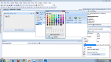
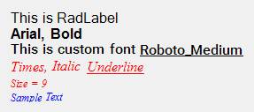
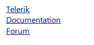

# HTML-like Text Formatting

| RELATED VIDEOS |  |
| ------ | ------ |
|[Enhanced HTML-like Markup Support](http://tv.telerik.com/watch/winforms/utility/enhanced-html-like-markup-support) <br>This video goes over the new text rendering tags provided with the R3 2009 release. It also shows the __RadMarkupEditor__ and gives an example of how to use it from within your own applications. (Runtime: 04:11)||

## Introduction

Telerik UI for WinForms provide an advanced text styling mechanism which can be applied to all Telerik WinForms controls and their elements, because it enhances one of the smallest element in Telerik Presentation Framework - the text primitive. The new rich text formatting mechanism uses plain HTML tags to display formatted text such as font style, font color, font size, etc.
        

Your text must start with the __\<html\>__ tag so that HTML-like formatting is activated. The list of supported markup tags is given below:

## Supported Tags 

| Tag | End Tag | Description |
| ------ | ------ | ------ |
| __\<font\>__ |N/A|Font Family. Please use the span tag since the font tag is not supported by RadMarkupEditor.|
| __\<color\>__ |N/A|Text color. Please use the span tag since the color tag is not supported by RadMarkupEditor.|
| __\<size\>__ |N/A|Font size. Please use the span tag since the size tag is not supported by RadMarkupEditor.|
| __\<b\>, \<strong\>__ | __\</b\>, \</strong\>__ |Bold|
| __\<i\>, \<em\>__ | __\</i\>, \</em\>__ |Italic|
| __\<u\>__ | __\</u\>__ |Underlined text|
| __\<br\>__ |N/A|Line break|
| __\<p\>__ | __\</p\>__ |Paragraph|
| __\<span\>__ | __\</span\>__ |Span. There is limited support of the style attribute and the CSS properties: font-family, font-size, color, and background-color. Refer to the example below. The *Span* tag is preferable to font, color, and size tags.|
| __\<ol\>__ | __\</ol\>__ |Ordered list|
| __\<ul\>__ | __\</ul\>__ |Unordered list|
| __\<li\>__ | __\</li\>__ |List item. Defines a list item in an ordered or unordered list.|
| __\<strike\>__ | __\</strike\>__ |Striked text.|
| __\<a\>__ | __\</a\>__ |Link|
| __\__ |N/A|Image|

* __Bold, italic, and underline__ In the example below the first word is italic and the second one is both, bold and italic. The third and the forth words are underlined.

````HTML
<html>
	<b>some <i> text </i></b><u> some text </u>
</html>
````

* __Paragraphs__

````HTML
<html>
	<p>First paragraph</p>
	<p>Second paragraph</p>
</html>
````


* __Font color__ Set the ForeColor using color name e.g. *red* or using hex color e.g. *0000FF*.

````HTML
<html>
	<span style="color:red">font color (color name) </span>
	<span style="color:#0000FF">font color (hex color) </span>
</html>
````


* __Font size__ Absolute and relative font sizes. The valid relative values are *larger* and *smaller*. The absolute valid values are: xx-small, x-small, small, medium, large, x-large, and xx-large. The default value is *medium*.  Font size can also be set in pt(s). The default font size in Windows Forms on most computers is *8.25pt* i.e. the font size returned by *SystemFonts.DefaultFont* property.

````HTML
<html>
    <span style="font-size:large">font size(absolute) </span>
	<span style="font-size:12">font size in pt(s) (absolute) </span>
	<span style="font-size:smaller">font size(absolute) </span>
</html>
````

* __Highlighted text__

````HTML
<html><span style="background-color:red">Highlighted Text</span></html>
````


* __Font family__

````HTML
<html><span style="font-family:georgia">Font Family</span></html>
````

* __Striked text__

````HTML
<html><strike> Some text </strike></html>
````


* __Links__

````HTML
<html><a href="<externalLink><linkText>www.telerik.com</linkText><linkUri>http://www.telerik.com</linkUri></externalLink>"> Telerik Corporation</a></html>
````

* __Images__

````HTML
<html></html>
````

The image path can be a resource or file on the disk.To specify a resource, you can use the __res__ keyword:

````HTML

````

To specify a file on the disk you have to specify the disk path e.g. src="C:\some path\image.png" or use the ~ to specify the current directory e.g. src= "~\some path\image.gif". All image types supported by .NET Framework class *Image* are supported by the "img" tag as well.
            

## RadMarkupEditor specifics

You can also use some tags that are not present in HTML but are currently supported by the TextPrimitive.
        

>note please refer to the[RadMarkupDialog]()article about the list of supported tags; *font* , *color* and *size* tags are not supported by RadMarkupDialog, but can be rendered by TextPrimitive.
>

You can use \<size=[+|-]value\> to set font size use, and __\<br\>__ to create new line feed. To set bold, underline, and italic text use the corresponding opening and closing tags. Font family is set through __\<font=Family\>__. 

The following code snippet will produce the result shown in the screen-shot below:

{{source=..\SamplesCS\TPF\HTMLFormatting.cs region=labelFormatting}} 
{{source=..\SamplesVB\TPF\HTMLFormatting.vb region=labelFormatting}} 

````C#
            
this.radLabel1.Text = "<html><size=12>This is RadLabel <br><b><font=Arial>Arial, Bold</b><br><i><color= Red><font=Times New Roman>Times, Italic <u>Underline</u><br><size=9>Size = 9<br><color= 0, 0, 255>Sample Text";

````
````VB.NET
Me.RadLabel1.Text = "<html><size=12>This is RadLabel <br><b><font=Arial>Arial, Bold</b><br><i><color= Red><font=Times New Roman>Times, Italic <u>Underline</u><br><size=9>Size = 9<br><color= 0, 0, 255>Sample Text"

````

{{endregion}} 



By using the HTML-like text formatting functionality, the __RadLabel__ can display several hyperlinks. Here is a sample code snippet:

{{source=..\SamplesCS\TPF\HTMLFormatting.cs region=Hyperlinks}} 
{{source=..\SamplesVB\TPF\HTMLFormatting.vb region=Hyperlinks}} 

````C#
                      
this.radLabel1.Text = "<html><size=12><a href=www.telerik.com>Telerik</a>" + Environment.NewLine +
                      "<a href=www.telerik.com/help/winforms>Documentation</a> " + Environment.NewLine +
                      "<a href=www.telerik.com/forums/winforms>Forum</a> ";

````
````VB.NET
Me.RadLabel1.Text = "<html><size=12><a href=www.telerik.com>Telerik</a>" & Environment.NewLine & _
"<a href=www.telerik.com/help/winforms>Documentation</a> " & Environment.NewLine & _
"<a href=www.telerik.com/forums/winforms>Forum</a> "

````

{{endregion}} 



It is possible to detect which link among several ones is clicked within the __RadLabel__. For this purpose we will use the TextPrimitiveHtmlImpl.TextBlock.__Lines__ collection, which represents the available text lines in the __RadLabel__. Each __TextLine__ consists of __FormattedText__  parts. This __FormattedText__ containing the mouse is associated with the clicked hyperlink:

{{source=..\SamplesCS\TPF\HTMLFormatting.cs region=MouseDown}} 
{{source=..\SamplesVB\TPF\HTMLFormatting.vb region=MouseDown}} 

````C#
        
private void RadLabel1_MouseDown(object sender, MouseEventArgs e)
{
    TextPrimitiveHtmlImpl text = this.radLabel1.LabelElement.LabelText.Impl as TextPrimitiveHtmlImpl;
    FormattedTextBlock textBlock = text.TextBlock;
    FormattedText clickedLink = IsMouseOverBlock(textBlock, e);
    if (clickedLink != null)
    {
        MessageBox.Show(clickedLink.Text + " pressed");
    }
}
        
private FormattedText IsMouseOverBlock(FormattedTextBlock textBlock, MouseEventArgs e)
{
    Point elementAtPoint = this.radLabel1.LabelElement.PointFromControl(e.Location);
    int linesCount = textBlock.Lines.Count;
    for (int i = 0; i <= linesCount - 1; i++)
    {
        TextLine textLine = textBlock.Lines[i];
        int textLineCount = textLine.List.Count;
        for (int j = 0; j <= textLineCount - 1; j++)
        {
            FormattedText formattedText = textLine.List[j];
            if (formattedText.DrawingRectangle.Contains(elementAtPoint))
            {
                //found link under mouse
                return formattedText;
            }
        }
    }
    
    return null;
}

````
````VB.NET
Private Sub RadLabel1_MouseDown(sender As Object, e As MouseEventArgs)
    Dim text As TextPrimitiveHtmlImpl = TryCast(Me.RadLabel1.LabelElement.LabelText.Impl, TextPrimitiveHtmlImpl)
    Dim textBlock As FormattedTextBlock = text.TextBlock
    Dim clickedLink As FormattedText = IsMouseOverBlock(textBlock, e)
    If clickedLink IsNot Nothing Then
        MessageBox.Show(clickedLink.Text + " pressed")
    End If
End Sub
Private Function IsMouseOverBlock(textBlock As FormattedTextBlock, e As MouseEventArgs) As FormattedText
    Dim elementAtPoint As Point = Me.RadLabel1.LabelElement.PointFromControl(e.Location)
    Dim linesCount As Integer = textBlock.Lines.Count
    For i As Integer = 0 To linesCount - 1
        Dim textLine As TextLine = textBlock.Lines(i)
        Dim textLineCount As Integer = textLine.List.Count
        For j As Integer = 0 To textLineCount - 1
            Dim formattedText As FormattedText = textLine.List(j)
            If formattedText.DrawingRectangle.Contains(elementAtPoint) Then
                'found link under mouse
                Return formattedText
            End If
        Next
    Next
    Return Nothing
End Function

````

{{endregion}}

# See Also
* [Animations]()

* [Dependency Properties]()

* [Handling User Input]()

* [Inherit themes from RadControls derivatives]()

* [Microsoft Active Accessibility Support]()

* [Override Theme Settings at Run Time]()

* [RadMarkupDialog]()

