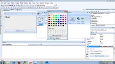
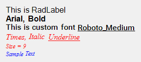
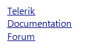

# HTML-like Text Formatting

Use HTML-like text formatting to display styled text in Telerik UI for WinForms controls that render text through the Telerik Presentation Framework (TPF). Start the text value with the `<html>` tag, and then apply supported tags to control font styling, links, lists, paragraphs, and images.

## Related Video

[Enhanced HTML-like Markup Support](http://tv.telerik.com/watch/winforms/utility/enhanced-html-like-markup-support) explains the text rendering tags introduced in the R3 2009 release, shows `RadMarkupEditor`, and demonstrates how to use it in your applications.



## How HTML-like Text Formatting Works

TPF extends the text primitive that Telerik UI for WinForms controls use to render text. As a result, many Telerik controls can display rich text by parsing a limited set of HTML-like tags. This formatting engine is intended for styled text output. It is not a full HTML or CSS renderer.

>note As of R1 2021, HTML-like formatting supports [custom fonts](https://docs.telerik.com/devtools/winforms/telerik-presentation-framework/custom-fonts).

To enable HTML-like formatting:

1. Set the text property of a Telerik control to a string that starts with `<html>`.
2. Add the supported tags that describe the formatting you want.
3. Use `<span>` when you need to apply color, font family, or font size in a way that is compatible with `RadMarkupEditor`.

The following example shows the minimum required structure:

````HTML
<html><b>Formatted text</b></html>
````

## Supported Tags

| Tag | End Tag | Description |
| ------ | ------ | ------ |
| `<font>` | N/A | Sets the font family. Prefer `<span>` because `RadMarkupEditor` does not support `<font>`. |
| `<color>` | N/A | Sets the text color. Prefer `<span>` because `RadMarkupEditor` does not support `<color>`. |
| `<size>` | N/A | Sets the font size. Prefer `<span>` because `RadMarkupEditor` does not support `<size>`. |
| `<b>`, `<strong>` | `</b>`, `</strong>` | Displays bold text. |
| `<i>`, `<em>` | `</i>`, `</em>` | Displays italic text. |
| `<u>` | `</u>` | Underlines text. |
| `<br>` | N/A | Inserts a line break. |
| `<p>` | `</p>` | Creates a paragraph. |
| `<span>` | `</span>` | Applies limited inline styling through `font-family`, `font-size`, `color`, and `background-color`. Use this tag when possible. |
| `<ol>` | `</ol>` | Creates an ordered list. |
| `<ul>` | `</ul>` | Creates an unordered list. |
| `<li>` | `</li>` | Creates a list item inside an ordered or unordered list. |
| `<strike>` | `</strike>` | Displays strikethrough text. |
| `<a>` | `</a>` | Creates a hyperlink. |
| `` | N/A | Displays an image. |

## Common Formatting Examples

The examples below cover the most common formatting tasks.

### Bold, Italic, and Underline

The following example combines bold, italic, and underlined text:

````HTML
<html>
	<b>some <i> text </i></b><u> some text </u>
</html>
````

### Paragraphs

Use `<p>` to separate text into paragraphs:

````HTML
<html>
	<p>First paragraph</p>
	<p>Second paragraph</p>
</html>
````

### Font Color

Set the text color by using a named color such as `red` or a hexadecimal value such as `#0000FF`:

````HTML
<html>
	<span style="color:red">font color (color name) </span>
	<span style="color:#0000FF">font color (hex color) </span>
</html>
````

### Font Size

You can use relative sizes such as `larger` and `smaller`, named absolute sizes such as `small` or `x-large`, or point values. The default font size in Windows Forms on most systems is `8.25pt`, which is the value returned by `SystemFonts.DefaultFont`.

````HTML
<html>
    <span style="font-size:large">font size(absolute) </span>
	<span style="font-size:12">font size in pt(s) (absolute) </span>
    <span style="font-size:smaller">font size(relative) </span>
</html>
````

### Highlighted Text

Use `background-color` to highlight text:

````HTML
<html><span style="background-color:red">Highlighted Text</span></html>
````

### Font Family

Set the font family through the `style` attribute of a `<span>` tag:

````HTML
<html><span style="font-family:georgia">Font Family</span></html>
````

### Strikethrough Text

Use `<strike>` to display strikethrough text:

````HTML
<html><strike> Some text </strike></html>
````

## Links and Images

Use hyperlinks when you want formatted text to navigate to another location, and use images when text alone is not enough.

### Links

The following example shows the Telerik hyperlink markup that opens an external link:

````HTML
<html><a href="<externalLink><linkText>www.telerik.com</linkText><linkUri>http://www.telerik.com</linkUri></externalLink>"> Telerik Corporation</a></html>
````

### Images

Use `` to display an image in the formatted text:

````HTML
<html></html>
````

The image path can point to an embedded resource or to a file on disk. To specify a resource, use the `res:` prefix:

````HTML

````

To specify a file on disk, provide the full path, for example `src="C:\some path\image.png"`, or use `~` to refer to the current directory, for example `src="~\some path\image.gif"`. All image formats supported by the .NET `Image` class are supported by the `` tag.
            

## RadMarkupEditor specifics

`RadMarkupEditor` and `TextPrimitive` share much of the same formatting model, but they do not support exactly the same tags. `TextPrimitive` also supports several non-standard tags.
        

>note See the [RadMarkupDialog](https://docs.telerik.com/devtools/winforms/telerik-presentation-framework/markup-dialog/radmarkupdialog) article for the list of supported tags. The `font`, `color`, and `size` tags are rendered by `TextPrimitive`, but they are not supported by `RadMarkupDialog`.

You can use `<size=[+|-]value>` to change the font size, `<br>` to insert a new line, and the matching opening and closing tags to apply bold, underline, or italic formatting. Set the font family through `<font=Family>`.

The following code snippet produces the formatted result shown in the screenshot:

{{source=..\SamplesCS\TPF\HTMLFormatting.cs region=labelFormatting}} 
{{source=..\SamplesVB\TPF\HTMLFormatting.vb region=labelFormatting}} 

````C#
            
this.radLabel1.Text = "<html><size=12>This is RadLabel <br><b><font=Arial>Arial, Bold</b><br><i><color= Red><font=Times New Roman>Times, Italic <u>Underline</u><br><size=9>Size = 9<br><color= 0, 0, 255>Sample Text";

````
````VB.NET
Me.RadLabel1.Text = "<html><size=12>This is RadLabel <br><b><font=Arial>Arial, Bold</b><br><i><color= Red><font=Times New Roman>Times, Italic <u>Underline</u><br><size=9>Size = 9<br><color= 0, 0, 255>Sample Text"

````

{{endregion}} 

>caption Figure 1: A RadLabel that displays multiple HTML-like text styles



## Display Multiple Hyperlinks in RadLabel

`RadLabel` can display multiple hyperlinks in a single formatted text block. The following example shows how to define several links:

{{source=..\SamplesCS\TPF\HTMLFormatting.cs region=Hyperlinks}} 
{{source=..\SamplesVB\TPF\HTMLFormatting.vb region=Hyperlinks}} 

````C#
                      
this.radLabel1.Text = "<html><size=12><a href=www.telerik.com>Telerik</a>" + Environment.NewLine +
                      "<a href=www.telerik.com/help/winforms>Documentation</a> " + Environment.NewLine +
                      "<a href=www.telerik.com/forums/winforms>Forum</a> ";

````
````VB.NET
Me.RadLabel1.Text = "<html><size=12><a href=www.telerik.com>Telerik</a>" & Environment.NewLine & _
"<a href=www.telerik.com/help/winforms>Documentation</a> " & Environment.NewLine & _
"<a href=www.telerik.com/forums/winforms>Forum</a> "

````

{{endregion}} 

The hyperlink colors are controlled by these static properties:

- `TinyHTMLParsers.LinkColor`: Default hyperlink color.
- `TinyHTMLParsers.LinkClickedColor`: Visited hyperlink color.

>caption Figure 2: A RadLabel that displays multiple hyperlinks



## Detect the Clicked Hyperlink

If a `RadLabel` contains multiple hyperlinks, you can detect which one the user clicked. The example below inspects the `TextPrimitiveHtmlImpl.TextBlock.Lines` collection and finds the `FormattedText` instance under the mouse pointer.

{{source=..\SamplesCS\TPF\HTMLFormatting.cs region=MouseDown}} 
{{source=..\SamplesVB\TPF\HTMLFormatting.vb region=MouseDown}} 

````C#
        
private void RadLabel1_MouseDown(object sender, MouseEventArgs e)
{
    TextPrimitiveHtmlImpl text = this.radLabel1.LabelElement.LabelText.Impl as TextPrimitiveHtmlImpl;
    FormattedTextBlock textBlock = text.TextBlock;
    FormattedText clickedLink = IsMouseOverBlock(textBlock, e);
    if (clickedLink != null)
    {
        MessageBox.Show(clickedLink.Text + " pressed");
    }
}
        
private FormattedText IsMouseOverBlock(FormattedTextBlock textBlock, MouseEventArgs e)
{
    Point elementAtPoint = this.radLabel1.LabelElement.PointFromControl(e.Location);
    int linesCount = textBlock.Lines.Count;
    for (int i = 0; i <= linesCount - 1; i++)
    {
        TextLine textLine = textBlock.Lines[i];
        int textLineCount = textLine.List.Count;
        for (int j = 0; j <= textLineCount - 1; j++)
        {
            FormattedText formattedText = textLine.List[j];
            if (formattedText.DrawingRectangle.Contains(elementAtPoint))
            {
                //found link under mouse
                return formattedText;
            }
        }
    }
    
    return null;
}

````
````VB.NET
Private Sub RadLabel1_MouseDown(sender As Object, e As MouseEventArgs)
    Dim text As TextPrimitiveHtmlImpl = TryCast(Me.RadLabel1.LabelElement.LabelText.Impl, TextPrimitiveHtmlImpl)
    Dim textBlock As FormattedTextBlock = text.TextBlock
    Dim clickedLink As FormattedText = IsMouseOverBlock(textBlock, e)
    If clickedLink IsNot Nothing Then
        MessageBox.Show(clickedLink.Text + " pressed")
    End If
End Sub
Private Function IsMouseOverBlock(textBlock As FormattedTextBlock, e As MouseEventArgs) As FormattedText
    Dim elementAtPoint As Point = Me.RadLabel1.LabelElement.PointFromControl(e.Location)
    Dim linesCount As Integer = textBlock.Lines.Count
    For i As Integer = 0 To linesCount - 1
        Dim textLine As TextLine = textBlock.Lines(i)
        Dim textLineCount As Integer = textLine.List.Count
        For j As Integer = 0 To textLineCount - 1
            Dim formattedText As FormattedText = textLine.List(j)
            If formattedText.DrawingRectangle.Contains(elementAtPoint) Then
                'found link under mouse
                Return formattedText
            End If
        Next
    Next
    Return Nothing
End Function

````

{{endregion}}

## See Also

- [Animations]()
- [Dependency Properties]()
- [Handling User Input]()
- [Inherit Themes from RadControls Derivatives]()
- [Microsoft Active Accessibility Support]()
- [Override Theme Settings at Run Time]()
- [RadMarkupDialog]()

