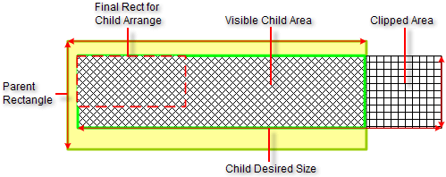

# Clipping

## 

Clipping refers to leaving out certain areas of an element that fall outside of a specified clipping rectangle. Unlike WPF, which uses the
        arrange rectangle as the clipping rectangle, the Telerik Presentation Framework uses the parent rectangle. This means that only the area denoted 
        by the rightmost thatched pattern is clipped. The area left visible is fully within the parent rectangle and is denoted by the thick light green 
        line. Generally, the part of a child located outside of its parent bounds will be clipped if the ClipDrawing property of the parent is set to true.

The diagram below shows a child with size greater than the size allocated for its display in order to show the clipping policy implemented by 
        the Telerik Presentation Framework.
