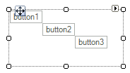

# Custom Layouts

## 

To create a custom layout class, create a __LayoutPanel__ descendant class and override the __MeasureOverride()__ and __ArrangeOverride()__ methods. The example below demonstrates custom [layout logic]():

* __MeasureOverride()__: This implementation iterates and sums the width and height of each child in the Children collection. The Measure() method is called for each child. In this example ten TextBoxPrimitive items are added to the CascadeLayoutPanel Children collection (code for adding primitives not shown). The total width and height for all child items together far exceeds the space allocated by the parent, so that "Element3" is only partially visible and the remaining elements are completely clipped.

* __ArrangeOverride()__: This __ArrangeOverride()__ implementation iterates the Children  collection and calls the child Arrange() method for each child instance. The local "leftTopCorner" __Point__  member is incremented by the width and height of each child, causing each child to be arranged down and to the right of the previous child. 



#### Cascade layout example

{{source=..\SamplesCS\TPF\Layouts\CascadeLayoutPanel.cs region=cascadeLayoutPanel}} 
{{source=..\SamplesVB\TPF\Layouts\CascadeLayoutPanel.vb region=cascadeLayoutPanel}} 

````C#
public class CascadeLayoutPanel : LayoutPanel
{
    protected override SizeF MeasureOverride(SizeF availableSize)
    {
        SizeF totalSize = SizeF.Empty;
        for (int i = 0; i < this.Children.Count; ++i)
        {
            RadElement child = this.Children[i];
            if (child != null)
            {
                child.Measure(availableSize);
                totalSize.Width += child.DesiredSize.Width;
                totalSize.Height += child.DesiredSize.Height;
            }
        }
        return totalSize;
    }
    protected override SizeF ArrangeOverride(SizeF finalSize)
    {
        PointF leftTopCorner = new Point();
        for (int i = 0; i < this.Children.Count; ++i)
        {
            RadElement child = this.Children[i];
            if (child != null)
            {
                child.Arrange(new RectangleF(leftTopCorner,
                    new SizeF(child.DesiredSize.Width, child.DesiredSize.Height)));
                leftTopCorner.X += child.DesiredSize.Width;
                leftTopCorner.Y += child.DesiredSize.Height;
            }
        }
        return finalSize;
    }
}

````
````VB.NET
Public Class CascadeLayoutPanel
    Inherits LayoutPanel
    Protected Overrides Function MeasureOverride(ByVal availableSize As SizeF) As SizeF
        Dim totalSize As SizeF = SizeF.Empty
        For i As Integer = 0 To Me.Children.Count - 1
            Dim child As RadElement = Me.Children(i)
            If child IsNot Nothing Then
                child.Measure(availableSize)
                totalSize.Width += child.DesiredSize.Width
                totalSize.Height += child.DesiredSize.Height
            End If
        Next i
        Return totalSize
    End Function
    Protected Overrides Function ArrangeOverride(ByVal finalSize As SizeF) As SizeF
        Dim leftTopCorner As PointF = New Point()
        For i As Integer = 0 To Me.Children.Count - 1
            Dim child As RadElement = Me.Children(i)
            If child IsNot Nothing Then
                child.Arrange(New RectangleF(leftTopCorner, New SizeF(child.DesiredSize.Width, child.DesiredSize.Height)))
                leftTopCorner.X += child.DesiredSize.Width
                leftTopCorner.Y += child.DesiredSize.Height
            End If
        Next i
        Return finalSize
    End Function
End Class

````

{{endregion}}
