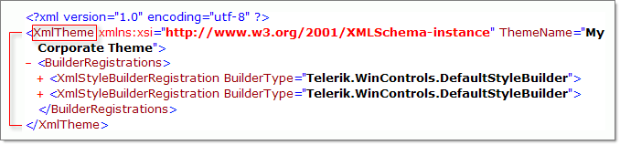
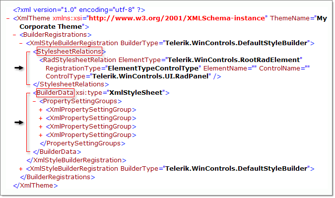

# Layout Structure

Telerik Presentation Foundation layout follows the [W3C](http://www.w3.org/)[box model](http://www.w3.org/TR/REC-CSS2/box.html) standard. The diagram below shows the basic structure and naming conventions of the box model.



## Content Area

Content is the rectangular area where an element renders itself and places child elements. The RadElement __FieldSize__ property provides the size of the content area.

## Padding

Padding is a rectangular area that surrounds the content rectangle and is typically filled with the background of the content area. The RadElement __Padding__ property provides the rectangle dimensions, includes helper functions to perform math on two Padding objects (adding and subtracting) and has dimension properties for each side of the rectangle. Padding properties __Vertical__ and __Horizontal__ provide the sum of top/bottom, left/right padding areas.

## Border

The border of an element is typically rendered by a [BorderPrimitive]() child of the element. The RadElement __BorderThickness__ property determines the area that is given for border rendering.

## Margin

Margin is the area outside an element. Margin affects the spacing between elements. For example, if an element with a non-zero left margin is next to an element with a non-zero right margin, the total margins is the sum of the two fields as shown in the figure below. Margins are always transparent. The RadElement __Margin__property is a Padding type and represents the rectangle dimensions. In the example below the control on the left has no margins. The control on the right has ten pixel margins. 



#### Two elements with margins

{{source=..\SamplesCS\TPF\Layouts\LayoutStructure.cs region=layoutStructure}} 
{{source=..\SamplesVB\TPF\Layouts\LayoutStructure.vb region=layoutStructure}} 

````C#
public class LayoutStructure : RadElement
{
    protected override void CreateChildElements()
    {
        StackLayoutPanel layoutPanel = new StackLayoutPanel();
        RadTextBoxElement text1 = new RadTextBoxElement();
        text1.ForeColor = Color.Red;
        text1.ShowBorder = true;
        text1.MinSize = new Size(60, 0);
        text1.Text = "Element 1";
        // Add twenty pixel margin
        text1.Margin = new Padding(20);
        RadTextBoxElement text2 = new RadTextBoxElement();
        text2.ForeColor = Color.Blue;
        text2.ShowBorder = true;
        text2.MinSize = new Size(60, 0);
        text2.Text = "Element 2";
        // Add twenty pixel margin
        text2.Margin = new Padding(20);
        layoutPanel.Children.Add(text1);
        layoutPanel.Children.Add(text2);
        this.Children.Add(layoutPanel);
        base.CreateChildElements();
    }
}

````
````VB.NET
Public Class LayoutStructure
    Inherits RadElement
    Protected Overrides Sub CreateChildElements()
        Dim layoutPanel As New StackLayoutPanel()
        Dim text1 As New RadTextBoxElement()
        text1.ForeColor = Color.Red
        text1.ShowBorder = True
        text1.MinSize = New Size(60, 0)
        text1.Text = "Element 1"
        ' Add twenty pixel margin
        text1.Margin = New Padding(20)
        Dim text2 As New RadTextBoxElement()
        text2.ForeColor = Color.Blue
        text2.ShowBorder = True
        text2.MinSize = New Size(60, 0)
        text2.Text = "Element 2"
        ' Add twenty pixel margin
        text2.Margin = New Padding(20)
        layoutPanel.Children.Add(text1)
        layoutPanel.Children.Add(text2)
        Me.Children.Add(layoutPanel)
        MyBase.CreateChildElements()
    End Sub
End Class

````

{{endregion}}
